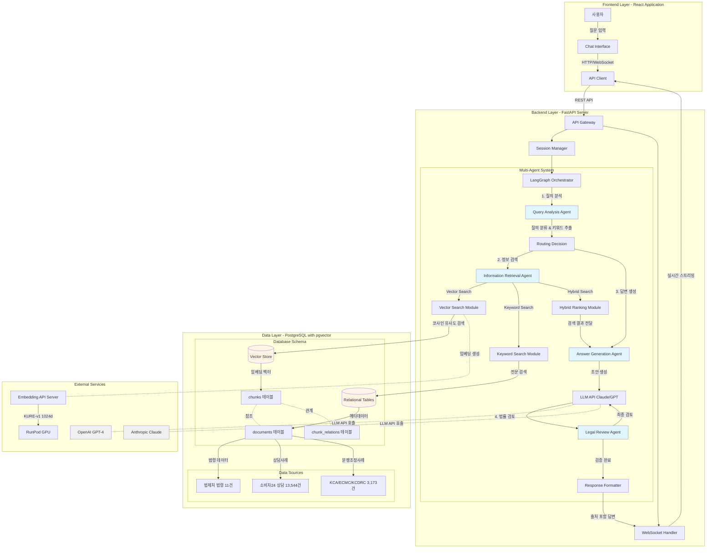
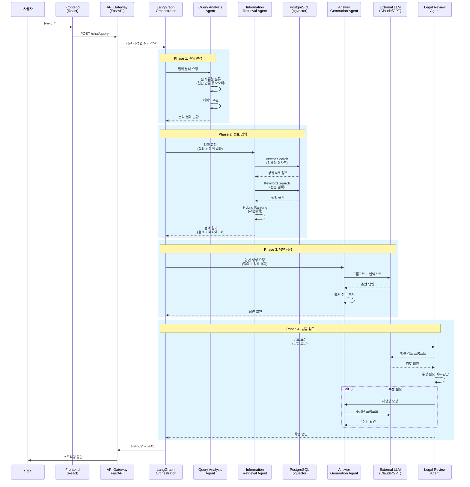
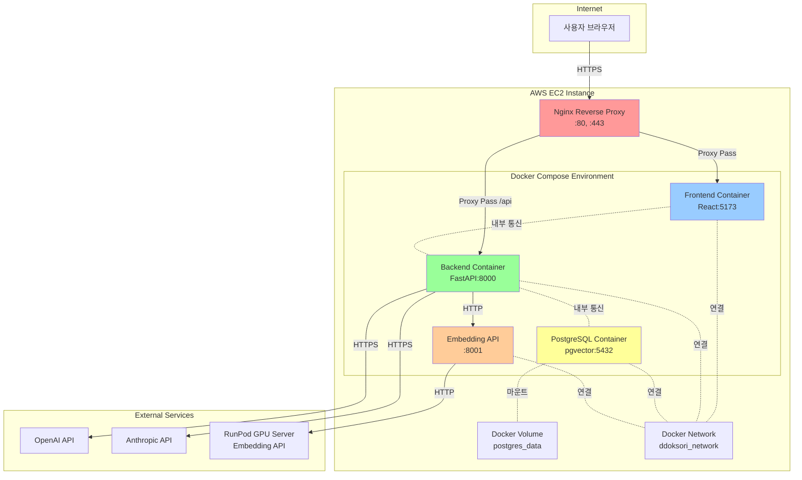

# 똑소리 (ddoksori_demo)

**한국 소비자 분쟁 조정을 위한 멀티 에이전트 챗봇 시스템**

## 1. 프로젝트 개요

본 프로젝트는 복잡하고 전문적인 한국의 소비자 분쟁 관련 문의에 대해 정확하고 신뢰도 높은 답변을 제공하는 MAS(Multi-Agent System) 챗봇을 개발하는 것을 목표로 합니다. React, FastAPI, LangGraph, PostgreSQL 등 현대적인 기술 스택을 활용하여, 4년제 컴퓨터공학과 졸업생 수준의 개발자가 이해하고 기여할 수 있는 모범적인 프로젝트 구조를 제시합니다.

**주요 데이터 소스:**

- KCA, ECMC, KCDRC의 분쟁조정사례집
- 한국소비자원, 소비자24의 상담사례
- 한국소비자원의 소비자분쟁조정기준
- 대한민국 법령

## 2. 시스템 아키텍처

### 2.1. 전체 시스템 아키텍처



### 2.2. 에이전트 간 데이터 흐름



### 2.3. 에이전트 역할 및 책임 분리

#### Orchestrator (LangGraph)

**역할**: 총괄 지휘자 (Conductor)

**책임**:

- 전체 워크플로우 정의 (에이전트 호출 순서, 조건부 분기)
- 상태 관리 (State): 각 에이전트의 결과를 공유 상태에 저장하고 다음 에이전트에게 전달
- 에러 처리 및 재시도 로직

**핵심 원칙**: Orchestrator는 "어떻게" (How) 에이전트들을 연결할지만 정의하며, 각 에이전트의 내부 구현에는 관여하지 않습니다.

#### Query Analysis Agent

**역할**: 질의 분석 전문가

**책임**:

- **의도 파악**: 질문의 유형 분류 (일반 문의, 법률 해석, 유사 사례 검색 등)
- **키워드 추출**: 검색에 사용할 핵심 키워드 식별
- **메타데이터 생성**: 검색 필터링에 사용할 메타데이터 생성

**필요성**: 사용자의 모호한 질문을 기계가 이해할 수 있는 구조화된 정보로 변환합니다.

#### Information Retrieval Agent

**역할**: 정보 검색 전문가

**책임**:

- **쿼리 증강**: HyDE, Multi-Query 등을 통해 원본 쿼리를 검색에 더 적합한 형태로 변환
- **다중 검색 전략**: Vector Search, Keyword Search, Hybrid Search 등 다양한 검색 방법 동원
- **재순위화 (Re-ranking)**: 여러 검색 결과를 종합하여 가장 관련성 높은 순서로 정렬

**핵심**: Orchestrator는 단순히 "검색해줘"라고 요청하며, 쿼리 증강과 검색 전략은 이 에이전트가 자율적으로 결정합니다.

#### Answer Generation Agent

**역할**: 답변 생성 전문가

**책임**:

- **프롬프트 엔지니어링**: 검색된 정보를 바탕으로 LLM에게 전달할 최적의 프롬프트 구성
- **LLM 호출**: 외부 LLM (Claude, GPT 등) API 호출
- **출처 관리**: 답변의 근거가 된 출처 정보를 명확히 정리하고 연결

**필요성**: 검색된 "날 것의 정보"를 사용자가 이해하기 쉬운 자연스러운 답변으로 가공합니다.

#### Legal Review Agent

**역할**: 법률 검토 전문가

**책임**:

- **사실 검증 (Fact-checking)**: 생성된 답변이 법률적으로 올바른지, 검색된 정보와 일치하는지 검증
- **환각 (Hallucination) 방지**: LLM이 만들어낸 허위 정보를 필터링
- **어조 및 표현 수정**: 법률 용어를 더 쉽고 정확하게 다듬음

**필요성**: 법률이라는 민감한 도메인에서 신뢰성과 안정성을 확보하기 위한 필수적인 장치입니다.

#### 설계 원칙

| 원칙 | 설명 |
|:---|:---|
| **단일 책임** | 각 에이전트는 하나의 명확한 책임만 가집니다 |
| **캡슐화** | 내부 구현은 숨기고, 인터페이스만 노출합니다 |
| **확장성** | 새로운 에이전트 추가 및 기존 에이전트 교체가 쉬워야 합니다 |
| **명확한 데이터 흐름** | State 객체를 통해 데이터 전달을 명확히 합니다 |

> 💡 **상세 설계 문서**: `docs/rag_architecture_expert_view.md`에서 각 에이전트의 상세 구현 가이드 및 코드 예시를 확인할 수 있습니다.

### 2.4. 추천 검색/데이터 설계(운영안)

법률/분쟁 도메인에서 “구현 난이도 대비 성능/설명가능성” 균형이 좋은 조합을 기준으로 설계를 구체화합니다.

#### 2.4.1. 공통 RAG 테이블(텍스트 근거 저장)

- **`documents`**: 원문 메타데이터(출처 URL, 기관, 문서종류, 발행/개정일, 사건번호 등)
- **`chunks`**: `chunk_text` + `embedding` + (`document_id`, `doc_type`, `section_path`, `page_span`, …)
- **`chunk_relations`**: (`parent_chunk_id`, `child_chunk_id`, `relation_type`)
  - 예: `law:article->paragraph`, `law:paragraph->item`, `standard:category->rule`, `doc:section->subsection` 등

#### 2.4.2. 법령/기준 “정형 테이블”(정답 계산/규칙 적용)

RAG로 “근거 텍스트”를 가져오는 것과 별개로, **규칙 테이블로 계산/비교 가능한 필드**를 유지하여 답변 신뢰도를 높입니다.

- **법령**
  - `law_node`: 조/항/호(필요 시 목) 단위 노드(계층 경로, 시행일, 상위/하위 관계)
  - `law_version`: 법령 버전/시행일 관리(동일 조문이라도 시점별 텍스트 차이를 추적)
  - `law_citation_map`: 사례/기준/상담 ↔ 조문 링크(출처 기반 수작업+반자동 병행)
- **분쟁해결기준**
  - `category_taxonomy`: 별표1(대분류/업종/품목그룹/구체품목) 트리
  - `criteria_rule`: 별표2/3/4를 규칙으로 정형화(기간, 책임비율, 예외조건 등)
  - `criteria_source_span`: 규칙의 근거 텍스트 위치(`document_id`, `page_span`, `section_path`) 연결

#### 2.4.3. 검색 인덱스 파이프라인(현실적인 운영 구성)

- **Dense 후보군**: `pgvector`(HNSW/IVFFlat)로 Top 100~300 후보 검색
- **Lexical 후보군**: (A) OpenSearch/Elastic(nori) 또는 (B) Postgres FTS/확장(PGroonga/pg_bigm 등) 중 택1
- **Fusion**: RRF(Reciprocal Rank Fusion)로 Dense/Lexical 결합
- **Rerank**: cross-encoder(권장) 또는 LLM rerank로 Top-n 정밀화

#### 2.4.4. CRAG-lite(재검색/되묻기/답변 제한 트리거)

Retrieval Evaluator로 검색 품질을 평가하여 다음 중 하나로 분기합니다.

- **재검색**: 쿼리 재작성/필터 변경 후 재검색
- **되묻기**: 필수 정보 누락 시 추가 질문
- **답변 제한**: 근거 부족 시 일반 안내로 제한(단정 금지)

#### 2.4.5. 평가/관측(필수)

RAG 품질은 “검색이 답변을 망치거나 살리는” 영향이 커서, 최소 아래 4축을 지속 측정합니다.

- Faithfulness / Context Precision / Context Recall / Answer Relevancy
- 운영 관측을 위해 “검색 후보/결합 점수/Rerank 결과/최종 근거 청크”를 트레이스로 저장(개인정보 마스킹 전제)

> **MVP 추천 조합**: Vanilla RAG + Hybrid(Dense+Lexical) + RRF + Rerank + Legal Review Agent

### 2.5. 배포 아키텍처 (AWS EC2 + Docker)



### 2.6. 기술 스택 상세

| 영역 | 기술 | 버전/상세 | 목적 |
|---|---|---|---|
| **프론트엔드** | React | 18+ | 사용자 인터페이스 |
| | TypeScript | 5+ | 타입 안전성 확보 |
| | TailwindCSS | 3+ | 유틸리티 기반 스타일링 |
| | Vite | 5+ | 빠른 개발 서버 및 빌드 |
| | React Query | - | 서버 상태 관리 |
| | WebSocket | - | 실시간 답변 스트리밍 |
| **백엔드** | FastAPI | 0.100+ | 비동기 API 서버 |
| | LangGraph | 0.0.40+ | Multi-Agent 오케스트레이션 |
| | LangChain | 0.1+ | LLM 통합 및 프롬프트 관리 |
| | Pydantic | 2+ | 데이터 검증 및 직렬화 |
| | psycopg2 | 2.9+ | PostgreSQL 연결 |
| **데이터베이스** | PostgreSQL | 16 | 관계형 데이터베이스 |
| | pgvector | 0.5+ | 벡터 유사도 검색 (IVFFlat) |
| | **데이터 규모** | 30,754개 청크 | 법령(5,455) + 상담(13,544) + 분쟁(11,755) |
| **AI/ML** | OpenAI GPT-4 | - | 답변 생성 |
| | Anthropic Claude 3 | - | 법률 검토 |
| | KURE-v1 | 1024차원 | 한국어 임베딩 모델 |
| | RunPod GPU | - | 임베딩 API 서버 |
| **인프라** | Docker Compose | - | 로컬 개발 환경 |
| | AWS EC2 | - | 프로덕션 배포 |
| | Nginx | - | 리버스 프록시 및 SSL 종료 |
| | Docker Volume | - | 데이터 영속성 |

## 3. PR 단위 개발 로드맵

본 프로젝트는 기능 단위로 Pull Request(PR)를 쪼개어 개발하고, 2개의 스프린트로 프로토타입 → 서버화까지 단계적으로 확장합니다.

- **사용자 온보딩 입력(공통 스키마)**: 구매일자(연/월/일), 구매처(판매자 상호/브랜드 + 구매 플랫폼), 구매 품목, 구매 금액, 분쟁 상세 내용
- **기관 라우팅 기본 원칙(초기 Rule-base)**: ECMC(개인-개인) / KCA(소비자-사업자) / KCDRC(게임·콘텐츠·문화생활 중심, 단 KCA에서 포괄 처리 가능)

### 3.1. 서비스 책임 범위(면책) 및 에스컬레이션

본 서비스는 **법률 자문/대리/결정을 제공하지 않으며**, 공공/기관 자료와 유사 사례를 기반으로 **정보 제공 및 다음 행동 안내**를 제공합니다.

**(필수) 답변 상단 고정 문구**

> 본 답변은 정보 제공 목적이며 법률 자문이 아닙니다. 최종 판단·결정은 관련 기관 또는 전문가와 상담하여 진행해 주세요.

**불확실/근거 부족 시 동작 원칙**

- 근거(출처)가 부족하거나 상충하는 경우, **추가 질문(필수 누락 정보 요청)**을 먼저 수행합니다.
- 여전히 판단이 어려우면 **“자료 부족으로 일반 안내만 가능”** 모드로 제한하고, 단정 표현을 금지합니다.

**에스컬레이션(다음 행동) 제공 원칙**

- 기관 추천(KCA/ECMC/KCDRC)과 함께 **이유 1~2줄**을 제시합니다.
- “다음 행동” 섹션으로 **접수 경로(공식 링크/전화/상담)**, **서류·증빙 체크리스트**, **제출 전 확인 포인트**를 제공합니다.
- 기관별 접수 URL/대표번호 등은 **공식 출처 링크로만** 안내하며, 운영 환경에서 최신성을 점검합니다.

### 3.2. 개인정보/프롬프트 처리 원칙(국외이전 포함)

온보딩 입력(구매일자/구매처/금액/분쟁 상세)은 **개인정보 또는 개인식별 가능 정보**를 포함할 수 있습니다. 따라서 MVP 단계부터 아래 운영 요구사항을 기본값으로 둡니다.

**데이터 최소 수집**

- 필수/선택 항목을 분리하고, “사례 검색/기관 안내”에 불필요한 정보는 기본 수집하지 않습니다.
- 분쟁 상세 입력에 주민등록번호/계좌/연락처 등 **직접식별정보 입력 금지**를 UI에서 안내합니다.

**보관/파기**

- 보관기간을 명시하고(기본: 최소 기간), 만료 시 자동 파기 정책을 둡니다.
- 서비스 품질 개선 목적의 저장이 필요하면 **별도 동의(옵트인)**로 분리합니다.

**로그/마스킹**

- 애플리케이션 로그에 원문 프롬프트/응답을 기본 저장하지 않습니다.
- 저장이 필요한 경우, 구매처/금액/연락처 등은 **마스킹/토큰화** 후 저장하고 접근 통제를 적용합니다.

**프롬프트/대화 데이터 처리방침**

- “프롬프트/대화 데이터가 어떤 목적/범위로 처리되는지”를 개인정보 처리방침에 명시합니다.
- 운영·품질 목적의 샘플링/리뷰가 있다면, 대상/보관기간/접근권한/파기 절차를 별도 문서로 관리합니다.

**외부 LLM 사용(국외이전/위탁) 고지 및 동의 UX**

- 외부 LLM API 사용 시, 입력 내용이 **국외 이전 또는 제3자 제공/처리위탁**에 해당할 수 있음을 고지합니다.
- 동의 UX(예: 최초 1회 체크 + 상세 보기)를 설계하고, **동의 없이도** 이용 가능한 “로컬/비저장 모드(제한 기능)”를 검토합니다.

**준거 체크리스트(운영 요구사항)**

- 국내 “생성형 AI 개인정보 안내서(가이드)”에 준거한 체크리스트(최소수집, 목적 제한, 국외이전 고지, 보관/파기, 접근통제, 사고 대응)를 운영 문서로 유지합니다.

### 3.3. 서비스 MVP 정의(Outcome 기준)

**MVP는 “구현 항목”이 아니라 사용자에게 제공되는 결과(Outcome)로 정의**합니다. Sprint 1 종료 시점에 아래 결과를 최소로 만족합니다.

- **기관 추천 + 이유**: 내 사건이 KCA/ECMC/KCDRC 중 어디에 가까운지 + 이유 1~2줄
- **유사 사례/상담 사례**: 내 상황과 유사한 분쟁조정/피해구제/상담 사례 2~3개 + 출처(링크/문서 식별자)
- **분쟁해결기준/법령 근거(가능 범위)**: 적용 가능성이 있는 분쟁조정기준(우선 제공) 및 관련 법령 항목 + 출처
- **다음 행동 체크리스트**: 증빙/서류 목록 + 접수 경로(공식 링크/전화) + 제출 전 확인 포인트
- **안전장치**: 근거 부족 시 추가 질문 또는 일반 안내로 제한(단정/법적 판단 금지)

### Sprint 1 — RAG 프로토타입(로컬): 정보검색 에이전트 + 답변생성 에이전트 + Frontend 연동

Sprint 1은 **데이터 트랙을 선행(D1~D3)**하여 “검색 가능한 형태”를 먼저 만들고, 이후 에이전트/프론트 연동을 진행합니다.

| PR | 목표 | 상세 범위(요약) | 완료 기준/데모 | 검토 Persona |
|:---|:---|:---|:---|:---|
| S1-D1 | **Dispute/Counsel 검색용 데이터 정규화** | - `backend/data/` 내 분쟁조정사례(dispute), 피해구제·상담사례(counsel) 정규화(문서ID/기관/품목/이슈/날짜 등 메타데이터 기준)<br>- 청킹 단위(사실관계/쟁점/조치 등) 가이드 확정 및 출처 표준화(문서 식별자/페이지/섹션) | - 로컬에서 데이터 타입별(dispute/counsel) Top-k 검색 결과에 출처/메타데이터가 일관되게 포함 | Data Scientist |
| S1-D2 | **법령(law) 계층 + 정형 테이블 초안** | - `law_node`(조/항/호/목), `law_version`(시행일/버전), `law_citation_map`(사례↔조문 링크) 최소 스키마 정의<br>- “조 후보 탐색 → 항/호/목 정밀검색” 2단계 검색이 가능하도록 청킹/인덱싱 및 `chunk_relations` 관계 타입 정의 | - 샘플 질의에서 관련 조/항(출처 포함)이 재현 가능(계층 경로 + 시행일 표기) | RAG Data Scientist |
| S1-D3 | **분쟁해결기준(standard) 별표1~4 정형화 초안** | - `category_taxonomy`(별표1) 트리 데이터화<br>- `criteria_rule`(별표2/3/4) 정형 필드 정의(기간/예외/조건 비교 가능)<br>- `criteria_source_span`(근거 텍스트 위치)로 RAG 근거 연결 | - 온보딩 품목 입력으로 “품목 후보 1~3개 + 연결된 기준/기간표(출처 포함)” 조회 가능 | Data Scientist |
| S1-D4 | **Hybrid Retrieval 운영안(MVP) 구현** | - Dense(pgvector) + Lexical(Postgres FTS 또는 검색엔진) 후보군 구성<br>- RRF로 결합, Rerank(cross-encoder 또는 LLM)로 Top-n 정밀화<br>- 검색 트레이스(후보/점수/근거 청크) 저장 포맷 정의(개인정보 마스킹 전제) | - 동일 쿼리에서 Dense-only 대비 Top-k 정합성 개선이 확인되고, 트레이스로 재현 가능 | AI/MAS System Engineer |
| S1-1 | **로컬 RAG 베이스라인 정리** | - `backend/data/` 기반으로 로컬에서 재현 가능한 데이터 로드/검색 실행 흐름 정리<br>- 검색 결과에 출처(문서/청크 메타데이터) 포함 규약 정의<br>- MVP 답변 템플릿(고정 면책 문구 + “다음 행동” 섹션) 초안 확정 | - 로컬에서 “질문 → Top-k 근거 텍스트”가 안정적으로 재현 | RAG Data Scientist |
| S1-2 | **Information Retrieval Agent 구현** | - 사용자 온보딩 입력 + 분쟁 상세를 하나의 “상황 요약 쿼리”로 구성<br>- 분쟁조정사례/피해구제/상담사례 중심으로 유사도 검색(벡터/하이브리드) 및 Top-k 반환 | - 입력 사례 3~5개에 대해 “가장 유사한 사례(출처 포함)”가 반환 | AI/MAS System Engineer |
| S1-3 | **Answer Generation Agent 구현(법적 판단 X)** | - 검색 결과를 근거로 유사 사례 요약 + 참고 포인트 제공<br>- “법적 판단/단정” 표현을 금지하고, 필요한 추가 질문(누락 정보)만 제안<br>- “기관 추천 + 이유” 및 “다음 행동 체크리스트” 섹션을 최소로 포함 | - 답변에 근거 출처가 포함되고, “법적 판단 불가” 가드레일이 적용 | AI/MAS System Engineer |
| S1-4 | **Frontend 온보딩/채팅 연결(로컬 E2E)** | - 온보딩 5개 입력 UI 및 세션 생성<br>- 백엔드 호출/스트리밍(가능 시) 연동 및 로컬 통합 테스트 | - 로컬에서 “온보딩 → 질문 → 답변 표시” 흐름이 동작 | Full-stack(또는 AI/MAS) |

### Sprint 2 — MAS 확장 + 서버화: 오케스트레이터 + 질의분석/검토 에이전트 + 배포 기반

| PR | 목표 | 상세 범위(요약) | 완료 기준/데모 | 검토 Persona |
|:---|:---|:---|:---|:---|
| S2-1 | **질의분석 에이전트(형식화/라우팅)** | - 사용자 입력을 구조화(구매정보/분쟁유형/핵심 키워드/필터)<br>- KCA/ECMC/KCDRC 라우팅(초기 Rule-base + 점진적 LLM 보조) | - 동일 케이스에 대해 기관 추천이 일관되고 근거(규칙)가 표시 | AI/MAS System Engineer |
| S2-2 | **검토 에이전트(가드레일/근거성)** | - 최종 답변에 대해 “근거 없는 주장”, “법적 판단/단정”, “데이터 기반 아닌 내용” 탐지<br>- 필요 시 답변 수정/반환(근거 부족 시 ‘모름’ 처리) | - 할루시네이션/법적 단정 방지 체크리스트 통과 | Data Scientist |
| S2-3 | **오케스트레이터(LangGraph) 및 상태관리** | - 질의분석 → 검색 → 답변생성 → 검토의 워크플로우 정의<br>- 멀티턴 상태(온보딩 정보/추가 질문) 유지 | - 멀티턴 2~3회 대화에서 일관된 상태 기반 응답 | AI/MAS System Engineer |
| S2-4 | **법령/분쟁조정기준 제공 확장** | - 유사 사례 제공 이후, 관련 법령 및 사용 상황에 해당하는 분쟁조정기준을 근거 기반으로 추가 제공 | - 답변에 “사례 + 법령/기준(출처 포함)” 섹션이 추가 | RAG Data Scientist |
| S2-5 | **기관별 절차/양식 기반 가이드 생성** | - 추천 기관에 맞는 분쟁조정 절차 안내<br>- 기관별 제출 양식(템플릿)에 맞춘 사용자 안내 가이드 출력 | - 동일 입력에 대해 기관별 포맷이 맞는 가이드 생성 | AI/MAS System Engineer |
| S2-6 | **Backend 서버화 및 배포(AWS EC2)** | - Chat Service Server + DB Server 분리 운영 전제의 구성 정리<br>- 환경변수/로그/헬스체크/보안(최소) 포함 배포 가이드 | - EC2에서 기본 채팅 플로우가 동작(검증 체크리스트) | Full-stack |

## 4. 평가 전략

### 4.1. 오프라인 RAG 품질 지표(자동화)

- **Faithfulness(환각률 관리)**: 답변의 주장 중 근거로 증명 불가한 문장 비율(예: RAGAS 축) 최소화
- **Answer Relevancy**: 사용자 질문 대비 답변의 관련성
- **Context Precision/Recall**: 검색 컨텍스트의 정밀도/재현율

### 4.2. 서비스 KPI(출시/개선 지표)

- **라우팅 정확도(F1)**: KCA/ECMC/KCDRC 분류 정답 라벨셋 기반 정확도/F1
- **근거 충실도(환각률)**: 근거 없는 주장 비율(4.1 Faithfulness와 연결)
- **사용자 행동 전환**: 체크리스트 저장률, 접수 링크 클릭률, 서류 가이드 생성 완료율

### 4.3. 운영 지표(SLO)

- **성능**: p95 응답시간, 스트리밍 시작 지연
- **안정성**: 실패율, 재시도율, 타임아웃 비율
- **비용**: 세션당 비용(LLM 토큰/검색 비용), 캐시 적중률

## 5. 실행 및 테스트 가이드 (Sprint 1 Prototype)

### 5.1 전체 시스템 실행 (Docker Compose) - 권장

가장 간편하게 백엔드, 프론트엔드, DB를 동시에 실행하는 방법입니다.

```bash
# 1. 환경 변수 설정 (최초 1회)
# .env.example을 복사하여 .env 생성 및 설정 (.env에는 실제 API Key 필요)
cp backend/.env.example backend/.env

# 2. 전체 서비스 빌드 및 실행
docker-compose up --build
```

**접속 정보:**

- **Frontend (사용자 UI)**: [http://localhost:5173](http://localhost:5173)
- **Backend API (Swagger)**: [http://localhost:8000/docs](http://localhost:8000/docs)
- **CloudBeaver (DB 관리)**: [http://localhost:8978](http://localhost:8978)

> **Note**: 최초 실행 시에는 DB 스키마 생성과 데이터 로딩이 필요할 수 있습니다. (5.2의 2단계, 3단계 참고)

---

### 5.2 수동 실행 (개발자 모드)

개발 및 디버깅을 위해 각 서비스를 개별적으로 실행하는 방법입니다.

#### 1단계: DB 컨테이너 실행

```bash
docker-compose up -d db
# DB가 완전히 뜰 때까지 잠시 대기
```

#### 2단계: 스키마 적용 (최초 1회)

```bash
docker exec -i ddoksori_db psql -U postgres -d ddoksori < backend/database/schema_v2_final.sql
```

#### 3단계: 테스트 데이터 로딩 (최초 1회)

```bash
conda activate dsr
cd backend/scripts/data_loading
python load_all_test_data.py --all
```

#### 4단계: 데이터 임베딩

데이터 로딩 후, 검색을 위한 벡터 임베딩을 생성해야 합니다. (백그라운드에서 실행 권장)

```bash
# 로컬 임베딩 서버를 사용하여 모든 데이터의 임베딩 생성
python backend/scripts/data_loading/embed_all_data.py
```

*참고: 데이터 양에 따라 시간이 소요될 수 있습니다 (약 30분~1시간). 터미널에 "Done"이 출력될 때까지 기다리거나, 별도 터미널에서 실행하세요.*

#### 5단계: 백엔드 서버 실행

```bash
cd ../../../backend
uvicorn app.main:app --host 0.0.0.0 --port 8000 --reload
```

#### 6단계: 프론트엔드 실행

새로운 터미널에서 실행합니다.

```bash
cd frontend
npm install  # (최초 1회만)
npm run dev
```

---

### 5.3 기능 테스트 시나리오 (S1-4 Verified)

프론트엔드([http://localhost:5173](http://localhost:5173))에 접속하여 다음 시나리오를 테스트해보세요.

#### ✅ 시나리오 1: 분쟁 상담 및 스트리밍 답변

- **Test**: 채팅창에 "헬스장 환불 규정 알려줘" 입력
- **Verify**:
  - 답변이 실시간으로 타이핑되는지 (Streaming UX)
  - 답변 최상단에 "본 답변은 정보 제공 목적..." 경고(Disclaimer)가 표시되는지

#### ✅ 시나리오 2: 인라인 출처 확인 (Citations)

- **Test**: 답변 내에 포함된 `[1]`, `[2]` 등 파란색 숫자 클릭
- **Verify**:
  - 화면 중앙에 **출처 상세 모달**이 뜨는지
  - **기관명(Source Org)**, **유사도(Similarity)**, 관련 법령/사례 제목이 표시되는지 확인

#### ✅ 시나리오 3: 안전 장치 (Safety Guardrails)

- **Test**: 모호한 질문 입력 (예: "그냥 환불해줘")
- **Verify**:
  - "정보가 충분하지 않습니다"라는 취지의 답변 생성
  - **오렌지색 경고 박스**에 "추가 확인이 필요한 사항" 역질문 리스트가 표시되는지 확인

#### ✅ 시나리오 4: 일반 대화 (General Chat)

- **Test**: "안녕", "반가워" 등 일상 대화 입력
- **Verify**:
  - 스트리밍 답변 동작 확인
  - 출처(Citations)가 붙지 않는지 확인
  - 채팅 말풍선 색상이 변경되는지 (Mint Green 테마) 확인

#### ✅ 시나리오 5: 에러 처리 (Error Handling)

- **Test**: 백엔드 서버 중지(`Ctrl+C`) 후 질문 입력
- **Verify**: "일시적인 오류가 발생했습니다" 또는 적절한 에러 메시지가 표시되는지 확인

#### ✅ 시나리오 6: 세션 유지 (Session Persistence)

##### 3. 임베딩 생성 (필수)

- **Test**: 대화 진행 중 브라우저 페이지 새로고침
- **Verify**: 기존 대화 내역(출처 포함)이 그대로 유지/복원되는지 확인

---

### 5.4 백엔드 자동화 테스트

RAG 파이프라인의 성능을 검증하는 자동화 스크립트입니다.

```bash
# 통합 테스트 러너 실행
./backend/run_local_rag_tests.sh all
```

- **api**: API 응답 및 포맷 검증
- **integration**: DB 연결 및 데이터 흐름 검증
- **data**: 로딩된 데이터 무결성 검증

> **RAGAS 정량 평가**: 현재 `scripts/evaluation/interactive_rag_test.py`를 통해 정성적 평가가 가능합니다. (정량 평가 스크립트는 추후 구현 예정)

### 5.5 DB 백업

매번 데이터를 로딩하고 임베딩하는 시간(30분 이상)을 절약하기 위해, 구축된 DB를 백업하고 복원하는 방법입니다.
데이터가 구축된 PC에서 다음 명령어를 실행하여 SQL 파일로 추출합니다.

```bash
# ddoksori_db 컨테이너의 데이터를 backup.sql 파일로 저장
docker exec -t ddoksori_db pg_dump -U postgres -d ddoksori -c > backup.sql
```

### 5.6 DB 복원

새로운 PC(예: 노트북)에서 Docker DB 컨테이너만 실행한 상태(`docker-compose up -d db`)에서 복원합니다.

```bash
# 주의: 기존 데이터는 초기화됩니다.
cat backup.sql | docker exec -i ddoksori_db psql -U postgres -d ddoksori
```

## 6. 문서 및 가이드

### 6.1 프론트엔드 설계 결정 (S1-4 Design Decisions)

Sprint 1 프로토타입의 빠른 배포와 사용자 경험(UX) 최적화를 위해 다음과 같은 설계가 적용되었습니다.

- **Client-Side Streaming**:
  - 백엔드 SSE(Server-Sent Events) 구현 복잡도를 줄이고 빠른 MVP 배포를 위해, 클라이언트(Frontend)에서 응답 텍스트를 단어 단위로 스트리밍 시뮬레이션하도록 구현했습니다.
  - 실제 사용자 경험은 SSE와 동일합니다.

- **Inline Citations (각주 스타일)**:
  - 답변의 신뢰도를 높이고 전문가스러운 느낌을 주기 위해 학술적 `[1]` 각주 스타일을 채택했습니다.
  - 각주 클릭 시 상세 모달을 통해 원문 확인이 가능하여, 독서 흐름을 끊지 않으면서 심층 정보 탐색이 가능합니다.

- **Safety Warning (안전 장치 분리)**:
  - 안전 문구(정보 부족 경고)가 일반 답변과 섞이지 않도록 별도의 오렌지색 경고 메시지로 분리했습니다.
  - 이는 사용자의 주의를 환기시키고 필요한 추가 정보를 명확히 요청하는 효과가 있습니다.

### 6.2 데이터베이스 및 임베딩

- **[pgvector Schema 생성 - 임베딩 - 데이터 로드 가이드](docs/guides/embedding_process_guide.md)**
  - PostgreSQL + pgvector 환경 설정
  - 스키마 생성 및 데이터 로드 프로세스
  - 임베딩 생성 및 검증 방법

- **[DB 시각화 및 접속 가이드 (DBeaver/CloudBeaver)](docs/guides/dbeaver_wsl2_guide.md)**
  - **CloudBeaver**: 웹 기반 DB 관리 도구 ([http://localhost:8978](http://localhost:8978))
  - **DBeaver**: Windows 클라이언트에서 WSL2 DB 접속 방법

### 6.2. RAG 시스템 테스트

- **[인터랙티브 RAG 테스트 도구](backend/scripts/evaluation/interactive_rag_test.py)**
  - CLI 기반 인터랙티브 테스트 인터페이스
  - 단일 검색 vs 멀티 스테이지 검색 비교 분석
  - 유사도 통계 및 기관 추천 결과 비교
  - 결과 저장 및 CSV 내보내기

**사용 방법**:

```bash
conda activate ddoksori
python backend/scripts/evaluation/interactive_rag_test.py
```

### 6.3. 기타 문서

- [RAG 아키텍처 전문가 뷰](docs/guides/rag_architecture_expert_view.md) - 에이전트 상세 설계
- [백엔드 스크립트 가이드](docs/backend/scripts/embedding_scripts.md) - 임베딩 스크립트 사용법
- [RAG 시스템 테스트 가이드](docs/backend/scripts/TEST_README.md) - 테스트 스크립트 사용법
