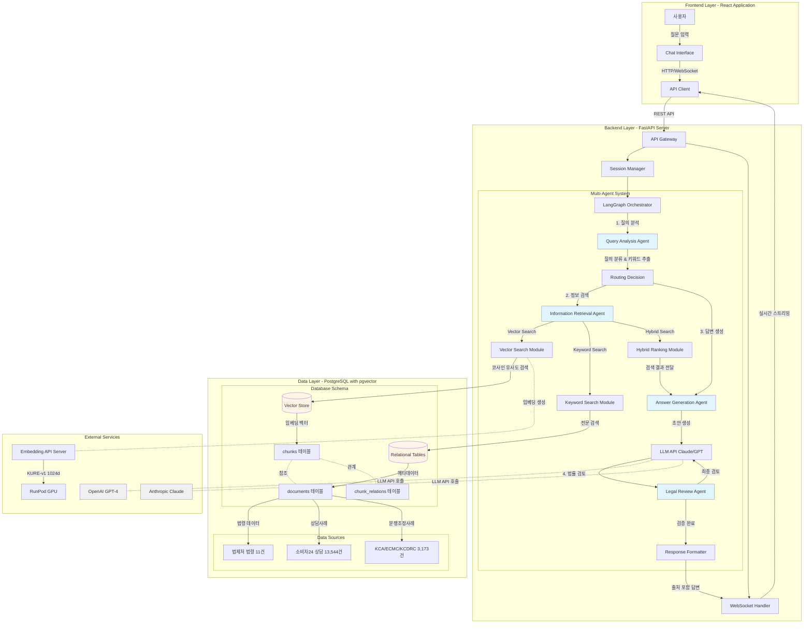
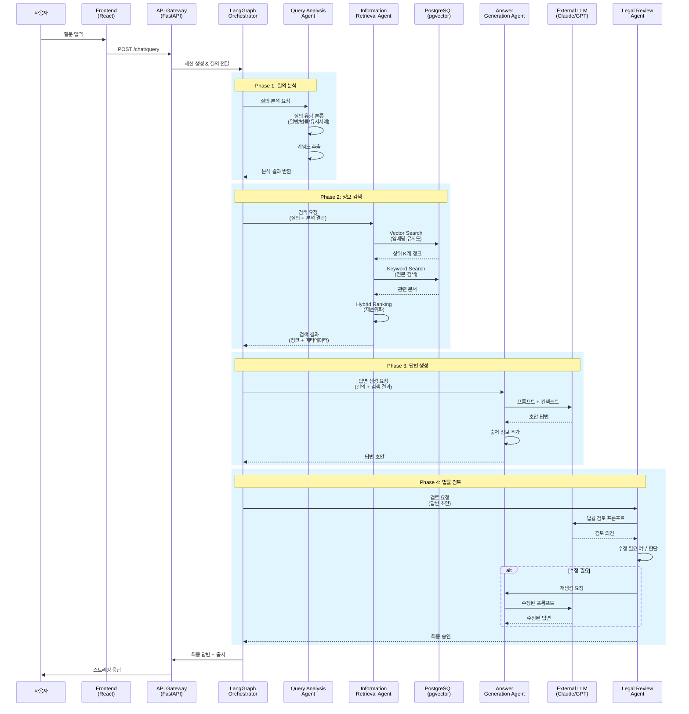
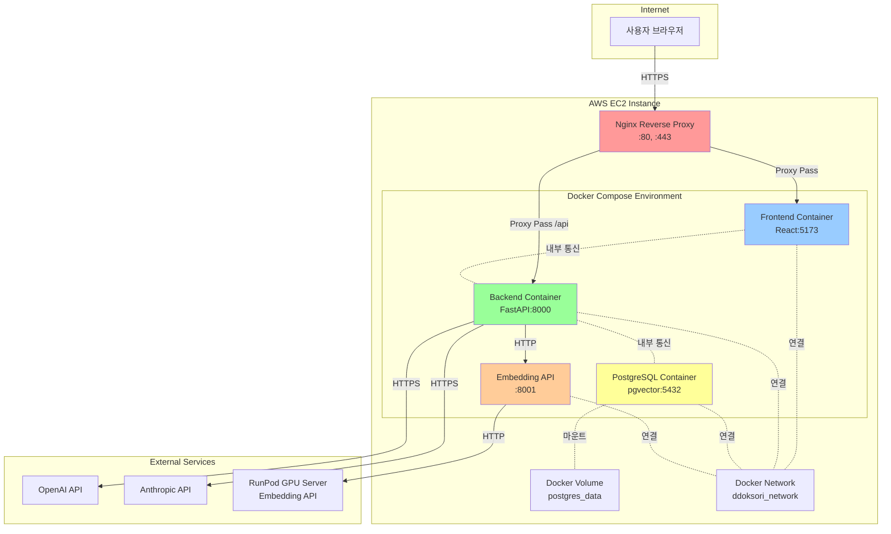

# 똑소리 (ddoksori_demo)

**한국 소비자 분쟁 조정을 위한 멀티 에이전트 챗봇 시스템**

## 1. 프로젝트 개요

본 프로젝트는 복잡하고 전문적인 한국의 소비자 분쟁 관련 문의에 대해 정확하고 신뢰도 높은 답변을 제공하는 MAS(Multi-Agent System) 챗봇을 개발하는 것을 목표로 합니다. React, FastAPI, LangGraph, PostgreSQL 등 현대적인 기술 스택을 활용하여, 4년제 컴퓨터공학과 졸업생 수준의 개발자가 이해하고 기여할 수 있는 모범적인 프로젝트 구조를 제시합니다.

**주요 데이터 소스:**
- KCA, ECMC, KCDRC의 분쟁조정사례집
- 한국소비자원, 소비자24의 상담사례
- 한국소비자원의 소비자분쟁조정기준
- 대한민국 법령

## 2. 시스템 아키텍처

### 2.1. 전체 시스템 아키텍처



### 2.2. 에이전트 간 데이터 흐름



### 2.3. 에이전트 역할 및 책임 분리

#### Orchestrator (LangGraph)

**역할**: 총괄 지휘자 (Conductor)

**책임**:
- 전체 워크플로우 정의 (에이전트 호출 순서, 조건부 분기)
- 상태 관리 (State): 각 에이전트의 결과를 공유 상태에 저장하고 다음 에이전트에게 전달
- 에러 처리 및 재시도 로직

**핵심 원칙**: Orchestrator는 "어떻게" (How) 에이전트들을 연결할지만 정의하며, 각 에이전트의 내부 구현에는 관여하지 않습니다.

#### Query Analysis Agent

**역할**: 질의 분석 전문가

**책임**:
- **의도 파악**: 질문의 유형 분류 (일반 문의, 법률 해석, 유사 사례 검색 등)
- **키워드 추출**: 검색에 사용할 핵심 키워드 식별
- **메타데이터 생성**: 검색 필터링에 사용할 메타데이터 생성

**필요성**: 사용자의 모호한 질문을 기계가 이해할 수 있는 구조화된 정보로 변환합니다.

#### Information Retrieval Agent

**역할**: 정보 검색 전문가

**책임**:
- **쿼리 증강**: HyDE, Multi-Query 등을 통해 원본 쿼리를 검색에 더 적합한 형태로 변환
- **다중 검색 전략**: Vector Search, Keyword Search, Hybrid Search 등 다양한 검색 방법 동원
- **재순위화 (Re-ranking)**: 여러 검색 결과를 종합하여 가장 관련성 높은 순서로 정렬

**핵심**: Orchestrator는 단순히 "검색해줘"라고 요청하며, 쿼리 증강과 검색 전략은 이 에이전트가 자율적으로 결정합니다.

#### Answer Generation Agent

**역할**: 답변 생성 전문가

**책임**:
- **프롬프트 엔지니어링**: 검색된 정보를 바탕으로 LLM에게 전달할 최적의 프롬프트 구성
- **LLM 호출**: 외부 LLM (Claude, GPT 등) API 호출
- **출처 관리**: 답변의 근거가 된 출처 정보를 명확히 정리하고 연결

**필요성**: 검색된 "날 것의 정보"를 사용자가 이해하기 쉬운 자연스러운 답변으로 가공합니다.

#### Legal Review Agent

**역할**: 법률 검토 전문가

**책임**:
- **사실 검증 (Fact-checking)**: 생성된 답변이 법률적으로 올바른지, 검색된 정보와 일치하는지 검증
- **환각 (Hallucination) 방지**: LLM이 만들어낸 허위 정보를 필터링
- **어조 및 표현 수정**: 법률 용어를 더 쉽고 정확하게 다듬음

**필요성**: 법률이라는 민감한 도메인에서 신뢰성과 안정성을 확보하기 위한 필수적인 장치입니다.

#### 설계 원칙

| 원칙 | 설명 |
|:---|:---|
| **단일 책임** | 각 에이전트는 하나의 명확한 책임만 가집니다 |
| **캡슐화** | 내부 구현은 숨기고, 인터페이스만 노출합니다 |
| **확장성** | 새로운 에이전트 추가 및 기존 에이전트 교체가 쉬워야 합니다 |
| **명확한 데이터 흐름** | State 객체를 통해 데이터 전달을 명확히 합니다 |

> 💡 **상세 설계 문서**: `docs/rag_architecture_expert_view.md`에서 각 에이전트의 상세 구현 가이드 및 코드 예시를 확인할 수 있습니다.

### 2.3. 배포 아키텍처 (AWS EC2 + Docker)



### 2.4. 기술 스택 상세

| 영역 | 기술 | 버전/상세 | 목적 |
|---|---|---|---|
| **프론트엔드** | React | 18+ | 사용자 인터페이스 |
| | TypeScript | 5+ | 타입 안전성 확보 |
| | TailwindCSS | 3+ | 유틸리티 기반 스타일링 |
| | Vite | 5+ | 빠른 개발 서버 및 빌드 |
| | React Query | - | 서버 상태 관리 |
| | WebSocket | - | 실시간 답변 스트리밍 |
| **백엔드** | FastAPI | 0.100+ | 비동기 API 서버 |
| | LangGraph | 0.0.40+ | Multi-Agent 오케스트레이션 |
| | LangChain | 0.1+ | LLM 통합 및 프롬프트 관리 |
| | Pydantic | 2+ | 데이터 검증 및 직렬화 |
| | psycopg2 | 2.9+ | PostgreSQL 연결 |
| **데이터베이스** | PostgreSQL | 16 | 관계형 데이터베이스 |
| | pgvector | 0.5+ | 벡터 유사도 검색 (IVFFlat) |
| | **데이터 규모** | 30,754개 청크 | 법령(5,455) + 상담(13,544) + 분쟁(11,755) |
| **AI/ML** | OpenAI GPT-4 | - | 답변 생성 |
| | Anthropic Claude 3 | - | 법률 검토 |
| | KURE-v1 | 1024차원 | 한국어 임베딩 모델 |
| | RunPod GPU | - | 임베딩 API 서버 |
| **인프라** | Docker Compose | - | 로컬 개발 환경 |
| | AWS EC2 | - | 프로덕션 배포 |
| | Nginx | - | 리버스 프록시 및 SSL 종료 |
| | Docker Volume | - | 데이터 영속성 |

## 3. PR 단위 개발 로드맵

본 프로젝트는 주요 기능 단위로 Pull Request(PR)를 생성하여 체계적으로 개발을 진행합니다.

| PR # | 주요 기능 | 상세 개발 내용 |
|:---|:---|:---|
| 1 | **프로젝트 초기 설정 및 최소 기능 UI** | - Docker Compose 기반 개발 환경(FE, BE, DB) 구성<br>- 최소 채팅 UI 및 Echo 서버 구현 |
| 2 | **데이터 수집 및 임베딩 파이프라인** | - PostgreSQL에 데이터 저장 및 Vector DB 스키마 설계<br>- 한국어 임베딩 모델을 활용한 데이터 벡터화 |
| 3 | **기본 RAG 파이프라인 구현** | - pgvector를 이용한 유사 사례 검색 기능<br>- 검색된 컨텍스트 기반 답변 생성(RAG) 로직 완성 |
| 4 | **멀티 에이전트 아키텍처 전환** | - LangGraph를 이용해 질의 분석, 정보 검색, 답변 생성 에이전트 구현<br>- 에이전트 오케스트레이터(라우터) 구현 |
| 5 | **하이브리드 검색 기능 도입** | - Vector Search와 Keyword Search(Full-Text Search)를 결합<br>- 재랭킹 모델을 적용하여 검색 정확도 향상 |
| 6 | **법률 검토 에이전트 추가** | - 생성된 답변의 법률적 정확성과 표현의 적절성을 검토하는 에이전트<br>- 프롬프트 엔지니어링을 통한 법률 검토 기능 수행 |
| 7 | **답변 스트리밍 및 출처 표시** | - WebSocket/SSE를 이용한 답변 실시간 스트리밍<br>- 답변의 근거가 된 원문 출처 명시 기능 |
| 8 | **평가 및 로깅 시스템 구축** | - 사용자 피드백 수집 및 에이전트 처리 과정 로깅<br>- LangSmith 등 연동을 통한 디버깅 환경 마련 |
| 9 | **UI/UX 고도화 및 화면 구성** | - 채팅 인터페이스 디자인 개선 및 반응형 레이아웃 적용<br>- 로딩, 에러 등 사용자 피드백 요소 추가 |
| 10 | **사용자 관리, 자유게시판, 관리자 페이지** | - 사용자 인증, 자유게시판 CRUD, 관리자 대시보드 구현<br>- 역할 기반 접근 제어(RBAC) 적용 |

## 4. 평가 전략

- **정량 평가**: `Ragas` 라이브러리를 활용하여 Context Precision/Recall, Faithfulness, Answer Relevancy 등 RAG 파이프라인 성능 측정
- **정성 평가**: 법률 전문가 및 일반인 평가단을 통해 답변의 유용성, 명확성, 신뢰성 검증
- **테스트**: Golden Set(평가 데이터셋) 기반 자동화된 파이프라인 평가 및 A/B 테스트 진행

## 5. 시작하기 (Getting Started)

```bash
# 1. 리포지토리 클론
git clone https://github.com/Maroco0109/ddoksori_demo.git
cd ddoksori_demo

# 2. 환경 변수 설정
# .env 파일을 생성하고 필요한 API 키 등을 입력합니다.

# 3. Docker Compose를 사용하여 서비스 실행
docker-compose up --build
```

## 6. 문서 및 가이드

### 6.1. 데이터베이스 및 임베딩

- **[pgvector Schema 생성 - 임베딩 - 데이터 로드 가이드](docs/guides/embedding_process_guide.md)**
  - PostgreSQL + pgvector 환경 설정
  - 스키마 생성 및 데이터 로드 프로세스
  - 임베딩 생성 및 검증 방법

- **[pgvector 팀원 공유 가이드](docs/guides/pgvector_sharing_guide.md)**
  - 데이터베이스 백업 및 복원 방법
  - 팀원과 pgvector 공유하는 step-by-step 가이드
  - Docker 기반 공유 방법

- **[Vector DB 관리 가이드](docs/guides/Vector_DB_관리_가이드.md)**
  - Vector DB 상태 확인 및 관리
  - 백업 및 복원 전략
  - 품질 관리 및 트러블슈팅

### 6.2. RAG 시스템 테스트

- **[인터랙티브 RAG 테스트 도구](test/rag/interactive_rag_test.py)**
  - CLI 기반 인터랙티브 테스트 인터페이스
  - 단일 검색 vs 멀티 스테이지 검색 비교 분석
  - 유사도 통계 및 기관 추천 결과 비교
  - 결과 저장 및 CSV 내보내기

**사용 방법**:
```bash
conda activate ddoksori
python test/rag/interactive_rag_test.py
```

### 6.3. 기타 문서

- [RAG 아키텍처 전문가 뷰](docs/guides/rag_architecture_expert_view.md) - 에이전트 상세 설계
- [백엔드 스크립트 가이드](docs/backend/scripts/embedding_scripts.md) - 임베딩 스크립트 사용법
- [RAG 시스템 테스트 가이드](docs/backend/scripts/TEST_README.md) - 테스트 스크립트 사용법
