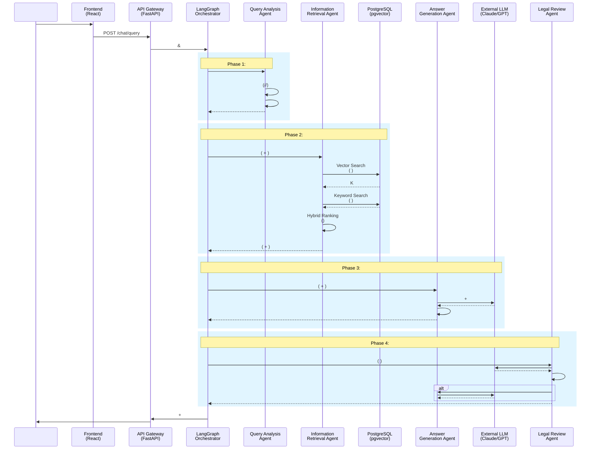

#  (ddoksori_demo)

**        **

## 1.  

               MAS(Multi-Agent System)     . React, FastAPI, LangGraph, PostgreSQL     , 4            .

**  :**
- KCA, ECMC, KCDRC 
- , 24 
-  
-  

## 2.  

### 2.1.   

```mermaid
graph TB
    subgraph "Frontend Layer - React Application"
        A[] -->| | B[Chat Interface]
        B -->|HTTP/WebSocket| C[API Client]
    end
    
    subgraph "Backend Layer - FastAPI Server"
        C -->|REST API| D[API Gateway]
        D --> E[Session Manager]
        D --> F[WebSocket Handler]
        
        E --> G[LangGraph Orchestrator]
        
        subgraph "Multi-Agent System"
            G -->|1.  | H[Query Analysis Agent]
            H -->|  &  | I[Routing Decision]
            
            I -->|2.  | J[Information Retrieval Agent]
            J -->|Vector Search| K[Vector Search Module]
            J -->|Keyword Search| L[Keyword Search Module]
            J -->|Hybrid Search| M[Hybrid Ranking Module]
            
            I -->|3.  | N[Answer Generation Agent]
            M -->|  | N
            N -->| | O[LLM API Claude/GPT]
            
            O -->|4.  | P[Legal Review Agent]
            P -->| | O
            P -->| | Q[Response Formatter]
        end
        
        Q -->|  | F
        F -->| | C
    end
    
    subgraph "Data Layer - PostgreSQL with pgvector"
        K -->|  | R[(Vector Store)]
        L -->| | S[(Relational Tables)]
        
        subgraph "Database Schema"
            R -->| | T[chunks ]
            S -->|| U[documents ]
            T -..- U
            T -..- V[chunk_relations ]
        end
        
        subgraph "Data Sources"
            U -->| | W[  11]
            U -->|| X[24  13,544]
            U -->|| Y[KCA/ECMC/KCDRC 3,173]
        end
    end
    
    subgraph "External Services"
        O -.LLM API .- Z[OpenAI GPT-4]
        O -.LLM API .- AA[Anthropic Claude]
        K -. .- AB[Embedding API Server]
        AB -->|KURE-v1 1024d| AC[RunPod GPU]
    end
    
    style H fill:#e1f5ff
    style J fill:#e1f5ff
    style N fill:#e1f5ff
    style P fill:#e1f5ff
    style R fill:#fff4e6
    style S fill:#fff4e6
    style Z fill:#f0f0f0
    style AA fill:#f0f0f0
```

### 2.2.    



### 2.3.     

#### Orchestrator (LangGraph)

****:   (Conductor)

****:
-    (  ,  )
-   (State):         
-     

** **: Orchestrator "" (How)   ,      .

#### Query Analysis Agent

****:   

****:
- ** **:    ( ,  ,    )
- ** **:     
- ** **:     

****:          .

#### Information Retrieval Agent

****:   

****:
- ** **: HyDE, Multi-Query         
- **  **: Vector Search, Keyword Search, Hybrid Search     
- ** (Re-ranking)**:         

****: Orchestrator  "" ,        .

#### Answer Generation Agent

****:   

****:
- ** **:    LLM    
- **LLM **:  LLM (Claude, GPT ) API 
- ** **:        

****:  "  "      .

#### Legal Review Agent

****:   

****:
- **  (Fact-checking)**:    ,    
- ** (Hallucination) **: LLM    
- **   **:      

****:         .

####  

|  |  |
|:---|:---|
| ** ** |       |
| **** |   ,   |
| **** |          |
| **  ** | State       |

>  **  **: `docs/rag_architecture_expert_view.md`           .

### 2.3.   (AWS EC2 + Docker)

```mermaid
graph TB
    subgraph "Internet"
        A[ ]
    end
    
    subgraph "AWS EC2 Instance"
        B[Nginx Reverse Proxy<br/>:80, :443]
        
        subgraph "Docker Compose Environment"
            C[Frontend Container<br/>React:5173]
            D[Backend Container<br/>FastAPI:8000]
            E[PostgreSQL Container<br/>pgvector:5432]
            F[Embedding API<br/>:8001]
        end
        
        G[Docker Volume<br/>postgres_data]
        H[Docker Network<br/>ddoksori_network]
    end
    
    subgraph "External Services"
        I[OpenAI API]
        J[Anthropic API]
        K[RunPod GPU Server<br/>Embedding API]
    end
    
    A -->|HTTPS| B
    B -->|Proxy Pass| C
    B -->|Proxy Pass /api| D
    
    C -. .- D
    D -. .- E
    D -->|HTTP| F
    F -->|HTTP| K
    
    D -->|HTTPS| I
    D -->|HTTPS| J
    
    E -..- G
    C -..- H
    D -..- H
    E -..- H
    F -..- H
    
    style B fill:#ff9999
    style C fill:#99ccff
    style D fill:#99ff99
    style E fill:#ffff99
    style F fill:#ffcc99
```

### 2.4.   

|  |  | / |  |
|---|---|---|---|
| **** | React | 18+ |   |
| | TypeScript | 5+ |    |
| | TailwindCSS | 3+ |    |
| | Vite | 5+ |      |
| | React Query | - |    |
| | WebSocket | - |    |
| **** | FastAPI | 0.100+ |  API  |
| | LangGraph | 0.0.40+ | Multi-Agent  |
| | LangChain | 0.1+ | LLM     |
| | Pydantic | 2+ |     |
| | psycopg2 | 2.9+ | PostgreSQL  |
| **** | PostgreSQL | 16 |   |
| | pgvector | 0.5+ |    (IVFFlat) |
| | ** ** | 30,754  | (5,455) + (13,544) + (11,755) |
| **AI/ML** | OpenAI GPT-4 | - |   |
| | Anthropic Claude 3 | - |   |
| | KURE-v1 | 1024 |    |
| | RunPod GPU | - |  API  |
| **** | Docker Compose | - |    |
| | AWS EC2 | - |   |
| | Nginx | - |    SSL  |
| | Docker Volume | - |   |

## 3. PR   

     Pull Request(PR)    .

| PR # |   |    |
|:---|:---|:---|
| 1 | **      UI** | - Docker Compose   (FE, BE, DB) <br>-   UI  Echo   |
| 2 | **    ** | - PostgreSQL    Vector DB  <br>-       |
| 3 | ** RAG  ** | - pgvector     <br>-     (RAG)   |
| 4 | **   ** | - LangGraph   ,  ,    <br>-  ()  |
| 5 | **   ** | - Vector Search Keyword Search(Full-Text Search) <br>-       |
| 6 | **   ** | -        <br>-        |
| 7 | **    ** | - WebSocket/SSE    <br>-        |
| 8 | **    ** | -        <br>- LangSmith       |
| 9 | **UI/UX    ** | -        <br>- ,       |
| 10 | ** , ,  ** | -  ,  CRUD,   <br>-    (RBAC)  |

## 4.  

- ** **: `Ragas`   Context Precision/Recall, Faithfulness, Answer Relevancy  RAG   
- ** **:        , ,  
- ****: Golden Set( )      A/B  

## 5.  (Getting Started)

```bash
# 1.  
git clone https://github.com/Maroco0109/ddoksori_demo.git
cd ddoksori_demo

# 2.   
# .env    API   .

# 3. Docker Compose   
docker-compose up --build
```

## 6.   

### 6.1.   

- **[pgvector Schema  -  -   ](docs/guides/embedding_process_guide.md)**
  - PostgreSQL + pgvector  
  -      
  -     

- **[pgvector   ](docs/guides/pgvector_sharing_guide.md)**
  -     
  -  pgvector  step-by-step 
  - Docker   

- **[Vector DB  ](docs/guides/Vector_DB__.md)**
  - Vector DB    
  -    
  -    

### 6.2. RAG  

- **[ RAG  ](tests/rag/interactive_rag_test.py)**
  - CLI    
  -   vs     
  -       
  -    CSV 

** **:
```bash
conda activate ddoksori
python tests/rag/interactive_rag_test.py
```

### 6.3.  

- [RAG   ](docs/guides/rag_architecture_expert_view.md) -   
- [  ](docs/backend/scripts/embedding_scripts.md) -   
- [RAG   ](docs/backend/scripts/TEST_README.md) -   
