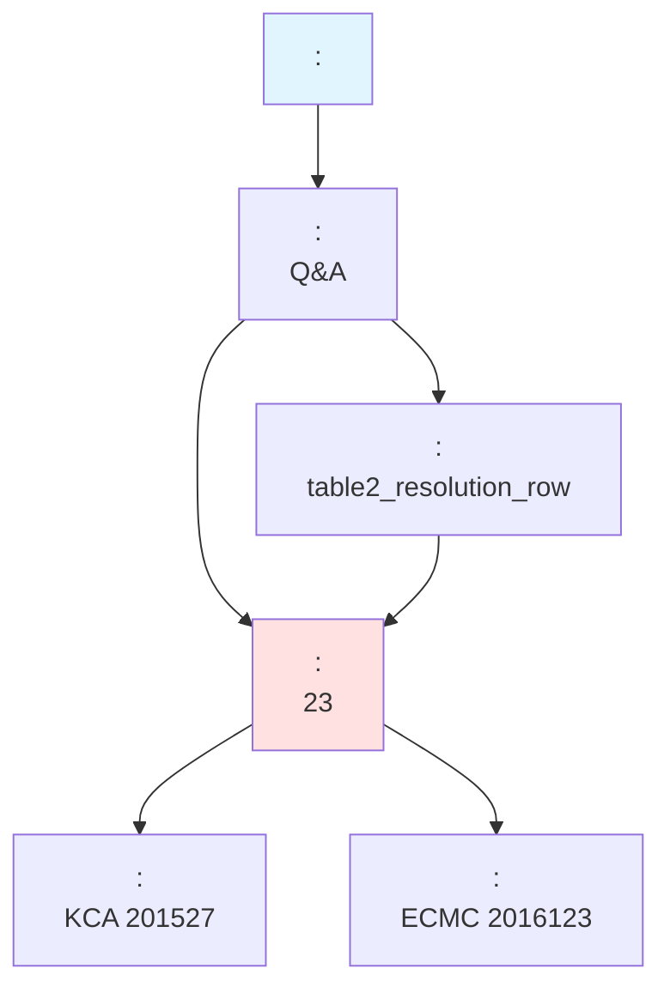
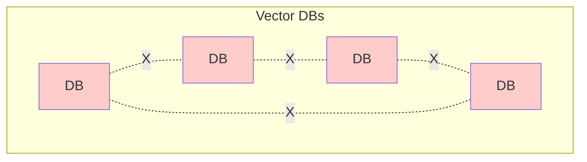

#   vs  Vector DB  

****: 2026-01-06  
****: RAG  MAS    
****: `schema_v2_final.sql`        

---

## 

0. [    ( )](#0------)
1. [  ](#1---)
2. [Cross-Reference :   ](#2-cross-reference----)
3. [Hybrid Filtering:  ](#3-hybrid-filtering--)
4. [Context Window Expansion:   ](#4-context-window-expansion---)
5. [Multi-Hop Reasoning:   ](#5-multi-hop-reasoning---)
6. [   ](#6----)
7. [RAG Performance ](#7-rag-performance-)
8. [ :   ](#8-----)
9. [](#9-)

---

## 0.     ( )

> **  **:     "        "    .

### 0.1  :   (Unified Schema)

####    (  )

```
     ?

law_documents        criteria_documents      case_documents
law_chunks           criteria_chunks         case_chunks
law_chunk_relations  criteria_chunk_relations case_chunk_relations
```

####    (  )

```
     !

documents ()      ← , ,   
chunks ()         ←   
chunk_relations () ←   
```

### 0.2    

####  Table 1: `documents` -  

****:     ""

```sql
CREATE TABLE documents (
    doc_id VARCHAR(255) PRIMARY KEY,           --   ID
    doc_type VARCHAR(50) NOT NULL,             --   : 'law', 'mediation_case', 'counsel_case', 'criteria_*'
    title TEXT NOT NULL,                       --  
    source_org VARCHAR(100),                   --  : 'KCA', 'ECMC', 'statute' 
    category_path TEXT[],                      --  : {'', ''}
    url TEXT,                                  --  URL
    collected_at TIMESTAMP,                    --  
    metadata JSONB,                            --   (referenced_laws, case_number )
    created_at TIMESTAMP DEFAULT NOW(),
    updated_at TIMESTAMP DEFAULT NOW()
);
```

** " "?**

`metadata JSONB` **        **.

####     

   :

```sql
--  :      
CREATE TABLE documents (
    doc_id VARCHAR(255) PRIMARY KEY,
    doc_type VARCHAR(50) NOT NULL,
    title TEXT NOT NULL,
    --   
    law_number VARCHAR(50),           --  
    enforcement_date DATE,             --  
    --   
    case_number VARCHAR(50),           --  
    decision_date DATE,                --  
    --   
    table_name VARCHAR(50),             --  
    part VARCHAR(100),                  --  
    -- ...   
);
```

****:
-    : `case_number`, `table_name`  NULL  ( )
-     :     (ALTER TABLE)
-  

####  JSONB  

```sql
--  :  JSONB     
CREATE TABLE documents (
    doc_id VARCHAR(255) PRIMARY KEY,
    doc_type VARCHAR(50) NOT NULL,
    title TEXT NOT NULL,
    metadata JSONB  --     
);
```

****:
1. **    **
   - : `{"law_number": "...", "enforcement_date": "..."}`
   - : `{"case_number": "...", "decision_date": "...", "referenced_laws": [...]}`
   - : `{"table_name": "...", "part": "..."}`

2. **   **
   -     JSON  

3. **PostgreSQL JSONB  **
   -   (GIN )
   -   (`@>`, `->`, `->>` )
   -    

####    

** **:

```sql
--  1:  
INSERT INTO documents VALUES (
    '001589',                                  -- doc_id
    'law',                                     -- doc_type
    '',                             -- title
    'statute',                                 -- source_org
    ARRAY['', ''],                  -- category_path
    'https://www.law.go.kr//',  -- url
    '2026-01-01 00:00:00',                     -- collected_at
    '{"law_number": "19357", "enforcement_date": "2024-01-01"}'::jsonb, -- metadata
    NOW(),
    NOW()
);

--  2:  
INSERT INTO documents VALUES (
    'kca_2015_case_27',                        -- doc_id
    'mediation_case',                          -- doc_type
    '    ',           -- title
    'KCA',                                     -- source_org
    ARRAY['()', '', ''],  -- category_path
    'https://www.kca.go.kr/case/2015/27',      -- url
    '2025-12-01 10:30:00',                     -- collected_at
    '{"case_number": "201527", "decision_date": "2015-03-15", "referenced_laws": ["001589|A10", "000422|A23"]}'::jsonb,
    NOW(),
    NOW()
);

--  3:  
INSERT INTO documents VALUES (
    'table2_agricultural',                     -- doc_id
    'criteria_resolution',                     -- doc_type
    ' ',                  -- title
    'KCA',                                     -- source_org
    ARRAY['()', ''],          -- category_path
    'https://www.kca.go.kr/criteria/table2',   -- url
    '2026-01-01 00:00:00',                     -- collected_at
    '{"table_name": "table2", "part": ""}'::jsonb,
    NOW(),
    NOW()
);
```

####  JSONB  

PostgreSQL JSONB    :

```sql
--  1:      
SELECT doc_id, title, metadata->>'case_number' AS case_number
FROM documents
WHERE doc_type = 'mediation_case'
  AND metadata @> '{"referenced_laws": ["001589|A10"]}'::jsonb;
-- @> : JSONB  -  

--  2:   
SELECT doc_id, title, metadata->>'decision_date' AS decision_date
FROM documents
WHERE metadata->>'case_number' = '201527';
-- -> : JSONB    (JSONB  )
-- ->> : JSONB    (TEXT  )

--  3: referenced_laws      
SELECT doc_id, title, metadata->'referenced_laws' AS laws
FROM documents
WHERE metadata->'referenced_laws' @> '["001589|A10"]'::jsonb;
--      

--  4:  
SELECT doc_id, title, metadata->>'law_number' AS law_number
FROM documents
WHERE doc_type = 'law'
  AND metadata->>'law_number' LIKE '%19357%';
```

**JSONB  **:

|  |  |  |
|--------|------|------|
| `->` |    (JSONB ) | `metadata->'case_number'` |
| `->>` |    (TEXT ) | `metadata->>'case_number'` |
| `@>` |    | `metadata @> '{"case_number": "201527"}'` |
| `?` |     | `metadata ? 'referenced_laws'` |
| `?\|` |      | `metadata ?\| array['case_number', 'law_number']` |

**  **:

1. **""** =       
2. **""** =    (, ,   )
3. **JSONB** = PostgreSQL JSON  (   )

---

####  Table 2: `chunks` -   

****:      ,   

```sql
CREATE TABLE chunks (
    chunk_id VARCHAR(255) PRIMARY KEY,         --   ID
    doc_id VARCHAR(255) NOT NULL               --  :   
        REFERENCES documents(doc_id) ON DELETE CASCADE,
    chunk_index INTEGER NOT NULL,              --   (0-based)
    chunk_total INTEGER NOT NULL,              --     
    chunk_type VARCHAR(50),                    --   : 'article', 'resolution_row', 'decision' 
    content TEXT NOT NULL,                     --   ( )
    content_length INTEGER,                    --  
    embedding vector(1024),                    --    (KURE-v1, 1024)
    embedding_model VARCHAR(50) DEFAULT 'KURE-v1',
    drop BOOLEAN DEFAULT FALSE,                --   ( )
    created_at TIMESTAMP DEFAULT NOW(),
    updated_at TIMESTAMP DEFAULT NOW(),
    UNIQUE(doc_id, chunk_index),               --      
    CHECK (chunk_index >= 0),                  -- 0-based indexing
    CHECK (chunk_total > 0),
    CHECK (chunk_index < chunk_total)
);
```

** **:

```sql
--  1:   
INSERT INTO chunks VALUES (
    '001589_A10_P1',                           -- chunk_id
    '001589',                                  -- doc_id ()
    9,                                         -- chunk_index (10 )
    50,                                        -- chunk_total ( 50 )
    'paragraph',                               -- chunk_type ()
    '10(  ) ①    ( "" )   ·       .',
    120,                                       -- content_length
    '[0.123, -0.456, 0.789, ...]'::vector(1024), -- embedding ( 1024)
    'KURE-v1',
    FALSE,
    NOW(),
    NOW()
);

--  2:   
INSERT INTO chunks VALUES (
    'kca_2015_case_27_decision',               -- chunk_id
    'kca_2015_case_27',                        -- doc_id ()
    2,                                         -- chunk_index (3 )
    5,                                         -- chunk_total ( 5 )
    'decision',                                -- chunk_type ()
    '   ()      ,     . :  23,  10.',
    150,                                       -- content_length
    '[0.234, -0.567, 0.890, ...]'::vector(1024),
    'KURE-v1',
    FALSE,
    NOW(),
    NOW()
);

--  3:  
INSERT INTO chunks VALUES (
    'table2_row_egg_spoilage',                 -- chunk_id
    'table2_agricultural',                     -- doc_id ( )
    0,                                         -- chunk_index (  )
    1,                                         -- chunk_total ( 1 )
    'resolution_row',                          -- chunk_type ( )
    ' 1, 2, 3, 4, 5, 6\n , \n o     \n  23',
    200,                                       -- content_length
    '[0.345, -0.678, 0.901, ...]'::vector(1024),
    'KURE-v1',
    FALSE,
    NOW(),
    NOW()
);
```

---

####  Table 3: `chunk_relations` -   

****:   , ,   

** **:   **"   "  !**  
 `chunks.doc_id`  .

```sql
CREATE TABLE chunk_relations (
    source_chunk_id VARCHAR(255) NOT NULL      --   
        REFERENCES chunks(chunk_id) ON DELETE CASCADE,
    target_chunk_id VARCHAR(255) NOT NULL      --   
        REFERENCES chunks(chunk_id) ON DELETE CASCADE,
    relation_type VARCHAR(50) NOT NULL,        --   :
                                               --   'next':   ()
                                               --   'prev':   ()
                                               --   'cited':   (A B )
                                               --   'related':   ( )
    confidence FLOAT DEFAULT 1.0,              --   (0.0~1.0)
                                               --  :     1.0
                                               -- 'related'     
    created_at TIMESTAMP DEFAULT NOW(),
    PRIMARY KEY (source_chunk_id, target_chunk_id, relation_type),
    CHECK (confidence >= 0.0 AND confidence <= 1.0)
);
```

** **:

```sql
--  1:     (  )
-- 10 1 → 10 2 (next)
INSERT INTO chunk_relations VALUES (
    '001589_A10_P1',                           -- source (10 1)
    '001589_A10_P2',                           -- target (10 2)
    'next',                                    -- relation_type ( )
    1.0,                                       -- confidence
    NOW()
);

-- 750 10 → 750 9 (prev, )
INSERT INTO chunk_relations VALUES (
    '001589_A750_P10',                         -- source (750 10)
    '001589_A750_P9',                          -- target (750 9)
    'prev',                                    -- relation_type ( )
    1.0,
    NOW()
);

--  2:    (  )
--  :     confidence = 1.0 
INSERT INTO chunk_relations VALUES (
    'kca_2015_case_27_decision',               -- source ( )
    '001589_A10_P1',                           -- target ( 10 1)
    'cited',                                   -- relation_type ()
    1.0,                                       -- confidence (  )
    NOW()
);

--  3:    (  )
INSERT INTO chunk_relations VALUES (
    'kca_2015_case_27_decision',               -- source ( )
    'table2_row_egg_spoilage',                 -- target ()
    'cited',                                   -- relation_type ( )
    1.0,                                       -- confidence (  )
    NOW()
);

--  4:      (  )
--  :       
--               confidence   
--                   
INSERT INTO chunk_relations VALUES (
    'kca_2015_case_27_decision',               -- source (  )
    'ecmc_2016_case_123_decision',             -- target (  )
    'related',                                 -- relation_type ( )
    0.75,                                      -- confidence (  , )
    NOW()
);
```

**  **:

1. **"   "  ** 
   - ! `chunk_relations`     .

2. **    **
   -    `chunk_index`    ,  `chunk_relations`   .
   - : `001589_A10_P1` → `001589_A10_P2` (next)
   - : `001589_A750_P10` → `001589_A750_P9` (prev)

3. **    ( )**
   -       **** `chunk_relations`  .
   - :  →  (cited)
   - :  →  (cited)
   - :  →  (related)

4. ** **
   - `next`:   () - confidence: 1.0 (  )
   - `prev`:   () - confidence: 1.0 (  )
   - `cited`:   (A B ) - confidence: 1.0 ( )
   - `related`:   ( ) - confidence: 0.0~1.0 ( ,     )

####  `confidence`    

**Q: `confidence`  ?**

**A: ,  !**

1. ****: `DEFAULT 1.0`    .
2. ** **: 
   - `next`, `prev`, `cited` :    `1.0` .
   - `related` :      , **         .**

3. ** **:
   - Graph RAG   `related`        confidence   .
   -       .

****: 
-      `confidence = 1.0` .
-  `related`     ,     .
-  ** ,      .**

####  Graph RAG   `confidence`   ?

**A: , ! Graph RAG   `confidence`    .**

****:

1. **   **:
   - `next`, `prev`:      →   `confidence = 1.0`
   - `cited`:    →   `confidence = 1.0`
   - **→    confidence   **

2. **Graph RAG   **:
   - `related` :      
   -     `confidence = 0.6~0.9`   
   - ** Graph RAG   `related`    **

3. ** **:
   -   Graph RAG **Phase 3 ( )**    
   - `chunk_relations`   INSERT  
   -  : " :  0"

** **:

|  | `confidence`    |
|---------|------------------------|
| **Graph RAG   ** |  ** ** (    1.0) |
| **Graph RAG ** |  **** (`related`    confidence ) |

****:
- Graph RAG    : `confidence`    ( DEFAULT 1.0   )
-  Graph RAG   :   
- ****: `DEFAULT 1.0`    (   )

---

### 0.3    

```mermaid
erDiagram
    documents ||--o{ chunks : "1:N (has)"
    chunks ||--o{ chunk_relations : "N:M (relates)"
    
    documents {
        varchar doc_id PK
        varchar doc_type "// "
        text title
        varchar source_org
        text[] category_path
        jsonb metadata
    }
    
    chunks {
        varchar chunk_id PK
        varchar doc_id FK
        int chunk_index " "
        varchar chunk_type "// "
        text content
        vector embedding "1024 "
        bool drop "  "
    }
    
    chunk_relations {
        varchar source_chunk_id FK
        varchar target_chunk_id FK
        varchar relation_type "next/prev/cited/related"
        float confidence
    }
```

** **:
1. `documents` ← `chunks`: **1:N ** (    )
2. `chunks` ↔ `chunks`: **N:M ** (`chunk_relations`   )

---

### 0.4    

#### : "  "  

```sql
-- Step 1:     
SELECT 
    c.chunk_id,
    c.content,
    c.chunk_type,
    d.doc_type,
    d.title
FROM chunks c
JOIN documents d ON c.doc_id = d.doc_id
WHERE c.embedding <=> '[query_vector]'::vector < 0.3  --  0.7 
  AND c.drop = FALSE
ORDER BY c.embedding <=> '[query_vector]'::vector
LIMIT 5;
```

****:
| chunk_id | content () | chunk_type | doc_type | title |
|----------|---------------|------------|----------|-------|
| table2_row_egg_spoilage |     | resolution_row | criteria_resolution |   |
| kca_2015_case_27_decision |     | decision | mediation_case |    |
| 001589_A10_P1 |    | paragraph | law |  |

```sql
-- Step 2:      
SELECT 
    cr.relation_type,
    c_target.content AS cited_law,
    d_target.title AS law_title
FROM chunk_relations cr
JOIN chunks c_target ON cr.target_chunk_id = c_target.chunk_id
JOIN documents d_target ON c_target.doc_id = d_target.doc_id
WHERE cr.source_chunk_id = 'table2_row_egg_spoilage'
  AND cr.relation_type = 'cited'
  AND d_target.doc_type = 'law';
```

****:
| relation_type | cited_law () | law_title |
|---------------|-----------------|-----------|
| cited | 23 ( ) |  |

→ **   JOIN  " → "   !**

---

### 0.5   ?

####    

```python
# 4   
law_results = search_law_db(query)
criteria_results = search_criteria_db(query)
case_results = search_case_db(query)
counsel_results = search_counsel_db(query)

#  :
# 1. 4 
# 2. 4 
# 3.    
# 4.    
```

####    

```python
# 1    
results = search_similar_chunks(
    query_embedding,
    doc_type_filter=None,  #   
    top_k=10
)

#  :
# 1. 1/4 
# 2. 1/4 
# 3.    
# 4. JOIN   
```

---

### 0.6     

#### Q1.    ?
- [ ] A.   `law_documents`  
- [x] B.   `documents`  `doc_type='law'` 

#### Q2.      ?
- [x] A. `chunks.doc_id` 
- [ ] B. `chunk_relations` 
- [ ] C. `chunks.chunk_type` 

#### Q3. `chunk_relations`  ?
- [ ] A.     
- [x] B.   //  
- [ ] C.   

#### Q4.       ?
- [ ] A.   75% 
- [ ] B.      
- [x] C.     

** **:
- Q1:   ** `documents` ** .
- Q2: `doc_id`  -  .
- Q3: `chunk_relations`   .
- Q4:   ** **  C  .

---

## 1.   

### 1.1   

```
backend/data/
 law/                    #  (11)
    Consumer_Basic_Law_chunks.jsonl
    E-Commerce_Consumer_Law_chunks.jsonl
    ...
 criteria/               #  (6)
    table2_resolution_row_chunks.jsonl
    table1_item_chunks.jsonl
    ...
 dispute_resolution/     #  (4)
    kca_final.jsonl
    ecmc_final_rag_chunks_normalized.jsonl
    ...
 compensation_case/      #    (3)
     cs_116_chunks_v2.jsonl
     ...
```

### 1.2    

```mermaid
graph TB
    ConsumerCase[<br/>cs_*.jsonl]
    Criteria[<br/>table2_resolution]
    DisputeCase[<br/>kca/ecmc/kcdrc]
    Law[<br/>11 ]
    
    ConsumerCase -->|| Law
    Criteria -->|laws | Law
    DisputeCase -->|| Law
    DisputeCase -->|| Criteria
    
    style Law fill:#e1f5ff
    style Criteria fill:#fff4e1
    style DisputeCase fill:#ffe1f5
    style ConsumerCase fill:#e1ffe1
```

** **:   "  "   .

---

## 2. Cross-Reference :   

### 2.1  Vector DB  

```python
#  : "     "

# Step 1:  DB 
result_1 = search_counseling_db(query)  
# Step 2:  DB  ( )
result_2 = search_law_db(query)  
# Step 3:  DB  ( )
result_3 = search_criteria_db(query)  
# Step 4:  DB  ( )
result_4 = search_dispute_db(query)

#  :
# 1.        
# 2. 4    (↑, ↑)
# 3.    
# 4.     
```

### 2.2    

```sql
--     " "   
SELECT 
    c.content AS chunk_content,
    c.chunk_type,
    d.doc_type,
    d.title,
    d.source_org,
    d.category_path,
    1 - (c.embedding <=> query_embedding) AS similarity
FROM chunks c
JOIN documents d ON c.doc_id = d.doc_id
WHERE 
    c.drop = FALSE
    AND c.embedding IS NOT NULL
    AND d.doc_type IN ('counsel_case', 'criteria_resolution', 'law', 'mediation_case')
ORDER BY c.embedding <=> query_embedding
LIMIT 10;
```

** :**
| chunk_type | doc_type | title | similarity |
|------------|----------|-------|------------|
| resolution_row | criteria_resolution |   | 0.89 |
| article | law |  17 | 0.85 |
| decision | mediation_case | 201527 | 0.83 |
| qa_combined | counsel_case |   | 0.81 |

→ **       **

---

## 3. Hybrid Filtering:  

### 3.1   

****: "      ?"

```python
#   :    
search_similar_chunks(
    query_embedding=embed("  "),
    source_org_filter='KCA',           #  
    doc_type_filter='mediation_case',  #   
    chunk_type_filter='decision',      #    ()
    top_k=5
)
```

### 3.2  


### 3.3  DB  

```python
#   DB:  DB 
kca_db = search_kca_vector_db(query)  # KCA  DB
# :   doc_type, chunk_type  
# : (post-processing) 
results = [r for r in kca_db if r['type'] == 'decision']
# : ↓ ( top-k      )
```

**  **:
- DB   →  
-   →  
-    (`idx_documents_type_org`, `idx_chunks_doc_type`)

---

## 4. Context Window Expansion:   

### 4.1   

```jsonl
{"unit_id": "001589|A9", "path": " 9", ...}
{"unit_id": "001589|A10|P1", "path": " 10 1", ...}
{"unit_id": "001589|A10|P2", "path": " 10 2", ...}
{"unit_id": "001589|A11", "path": " 11", ...}
```

→ ** **: `chunk_index`   

### 4.2    

```sql
--  RAG "10 1"  ,    
SELECT * FROM get_chunk_with_context(
    'consumer_law_001589_A10_P1',  --  
    window_size => 2                --  2  
);
```

** :**
```
chunk_index: 8  → 9 ( )
chunk_index: 9  → 10 1 ←   (is_target=true)
chunk_index: 10 → 10 2 ( )
chunk_index: 11 → 11 ( )
```

### 4.3 LLM    

```python
# RAG 
target_chunk = search_similar_chunks(query, top_k=1)[0]
context = get_chunk_with_context(target_chunk['chunk_id'], window_size=2)

prompt = f"""
    :

{context[0]['content']}  #  
{context[1]['content']}  # ←  
{context[2]['content']}  #  
{context[3]['content']}  #  

: {user_query}
"""
```

→ **LLM      **

### 4.4  DB 

```python
#   DB:   
result = search_law_db(query, top_k=1)
# :     
# :  JSONL     ()
```

---

## 5. Multi-Hop Reasoning:   

### 5.1 MAS(Multi-Agent System) 

```python
# Agent 1:  
case_chunks = search(
    query="  ",
    doc_type="counsel_case"
)

# Agent 2:     
case_doc = get_document(case_chunks[0]['doc_id'])
case_metadata = json.loads(case_doc['metadata'])
referenced_laws = case_metadata.get('referenced_laws', [])
# : ['001589|A10', '000422|A23']

# Agent 3:       
related_cases = """
    SELECT c.content, d.title, d.doc_type
    FROM chunks c
    JOIN documents d ON c.doc_id = d.doc_id
    WHERE d.metadata @> '{"referenced_laws": ["001589|A10"]}'::jsonb
      AND d.doc_type = 'mediation_case'
      AND c.chunk_type = 'decision'
    LIMIT 5;
"""
```

### 5.2   



→ **   "  "**

### 5.3  DB 

```python
#   DB:  
case_db_result = search_case_db(query)
# : referenced_laws   DB   
# :     
#   - mapping_table = {"case_id": ["law_id1", "law_id2"]}
#   -  ↑,   ↑
```

---

## 6.    

### 6.1 table2_resolution_row  

```json
{
  "chunk_id": "table2_row_p1_part1_4_2_...",
  "chunk_type": "resolution_row",
  "item": "1, 2, 3, 4, 5, 6",
  "dispute_type": ", ",
  "resolution": "o     ",
  "laws": [{
    "law_name": "",
    "law_id": "000422",
    "doc_id": "000422|A23",
    "path": " 23"
  }]
}
```

→ **     **

### 6.2    

```sql
--  : "     ?"

-- Step 1:  
WITH similar_criteria AS (
    SELECT chunk_id, doc_id, content
    FROM search_similar_chunks(
        $query_embedding,  -- "  "
        doc_type_filter => 'criteria_resolution',
        top_k => 3
    )
)
-- Step 2:      
SELECT 
    sc.content AS ,
    d_law.title AS ,
    c_law.content AS ,
    d_law.metadata AS 
FROM similar_criteria sc
JOIN documents d_criteria ON sc.doc_id = d_criteria.doc_id
CROSS JOIN LATERAL jsonb_array_elements(d_criteria.metadata->'laws') AS law_ref
JOIN documents d_law ON d_law.doc_id = (law_ref->>'doc_id')
JOIN chunks c_law ON c_law.doc_id = d_law.doc_id 
WHERE c_law.chunk_type IN ('article', 'paragraph')
ORDER BY c_law.chunk_index;
```

**:    " →  "  **

### 6.3    

```json
{
  "chunk_id": "consumer_relief_case:0f48...",
  "title": "    ",
  "text": "...\n※ \no 680( ) ...\no 686( ) ...\no 689(  ) ...",
  "metadata": {
    "url": "https://www.kca.go.kr/...",
    "referenced_laws": ["001589|A680", "001589|A686", "001589|A689"]
  }
}
```

→ **metadata `referenced_laws`   **

---

## 7. RAG Performance 

### 7.1  

|  |  Vector DB |   |  |
|------|------------------|-------------|--------|
|    | 4 (+++) | 1 | **75% ** |
|   | 4 | 1 | **75% ** |
|    | ~400ms | ~100ms | **75% ** |
|   () | 4 | 1 | **75% ** |
|   |  () |  (DB ) | **15-30% ** |
|    |   |   (JOIN) | **N/A** |
|   |   |   () | **N/A** |
|   |   |   (JSONB) | **N/A** |

### 7.2  

****: 1,000 queries/day

```
 Vector DB:
-  API : 1,000 queries × 4 DBs = 4,000 calls
- Vector DB : 4,000 queries × $0.001 = $4/day
-  : $120

 :
-  API : 1,000 queries × 1 = 1,000 calls
- Vector DB : 1,000 queries × $0.001 = $1/day
-  : $30

: $90/month (75% )
```

### 7.3 

```python
#   :     
#  (: ) 
INSERT INTO documents (doc_id, doc_type, source_org, ...)
VALUES ('fss_case_001', 'mediation_case', 'FSS', ...);

#     -    

#   DB:  DB     
fss_db = create_new_vector_db("fss_cases")
#    fss_db  
```

---

## 8.  :   

### 8.1    

```sql
--  : " 17" 

-- Step 1:    
SELECT 
    d.doc_type,
    d.source_org,
    COUNT(DISTINCT d.doc_id) AS affected_documents,
    COUNT(c.chunk_id) AS affected_chunks
FROM documents d
LEFT JOIN chunks c ON d.doc_id = c.doc_id
WHERE d.metadata @> '{"referenced_laws": ["001234|A17"]}'::jsonb
   OR d.doc_id = '001234'  --  
GROUP BY d.doc_type, d.source_org;
```

** :**
```
doc_type           | source_org | affected_documents | affected_chunks
-------------------|------------|-------------------|----------------
law                | statute    | 1                 | 3
criteria_resolution| KCA        | 8                 | 24
mediation_case     | KCA        | 43                | 43
mediation_case     | ECMC       | 12                | 12
counsel_case       | consumer   | 127               | 127
```

→ **     **

### 8.2  

```sql
--     
UPDATE chunks
SET 
    metadata = jsonb_set(
        COALESCE(metadata, '{}'::jsonb),
        '{outdated_law_ref}',
        'true'::jsonb
    )
WHERE doc_id IN (
    SELECT doc_id FROM documents
    WHERE metadata @> '{"referenced_laws": ["001234|A17"]}'::jsonb
);
```

### 8.3  DB 

```python
#   DB:   DB  
affected = []
affected += search_in_law_db("001234|A17")
affected += search_in_criteria_db("001234|A17")
affected += search_in_dispute_db("001234|A17")
affected += search_in_counsel_db("001234|A17")
# :  DB    
# :       
```

---

## 9. 

### 9.1 RAG/MAS  :      

####  1. **   (Cross-Reference)**
-  →  →    
- `documents.metadata` JSONB  
- `JOIN`   

####  2. **  (Context Window)**
-      
- `get_chunk_with_context()` 
- `chunk_index`   

####  3. **  (Hybrid Filtering)**
-  +  +   
- DB    
-    

####  4. **  (Metadata Queries)**
- JSONB     
- `@>`    
- GIN   

####  5. **  (Cost Efficiency)**
- 1   vs 4
- 75%  
- 75%  

####  6. **MAS  (Multi-Agent System)**
- Agent    
-   Agent   
-     

####  7. **  (Data Consistency)**
-     
-   
- ACID  

### 9.2      

####  **  **

1. **table2_resolution_row**: `laws`     
   ```json
   {"laws": [{"law_id": "000422", "doc_id": "000422|A23"}]}
   ```

2. ****:    (:  689)
   ```json
   {"metadata": {"referenced_laws": ["001589|A689"]}}
   ```

3. ****:    
   ```json
   {"chunk_type": "judgment", "referenced_criteria": [...], "referenced_laws": [...]}
   ```

→ **   "  " **

### 9.3  Vector DB  



→ **    =   **

### 9.4    

```mermaid
graph TB
    subgraph UnifiedSchema[ ]
        Documents[(documents)]
        Chunks[(chunks)]
        Relations[(chunk_relations)]
        
        Documents -->|JOIN| Chunks
        Chunks -->|| Relations
    end
    
    Documents -->|metadata.referenced_laws| Documents
    Chunks -->|get_chunk_with_context| Chunks
    
    style Documents fill:#ccffcc
    style Chunks fill:#ccffcc
    style Relations fill:#ccffcc
```

→ **    =   **

---

### 9.5      (3 )

####    !

1. **  **
   ```
    documents () →    (law, mediation_case, counsel_case, criteria_*)
    chunks ()    →    (article, decision, resolution_row, qa_combined, ...)
    chunk_relations  →    (next, prev, cited, related)
   ```

2. **-   **
   ```sql
   chunks.doc_id → documents.doc_id  --  "  " 
   ```

3. **  chunk_relations **
   ```sql
   chunk_relations  --  // 
   ```

####   

```
  =   
 documents =   ( )
     
     
     
 chunks =   (      )
      
      
      
 chunk_relations =    (, ,  )
     "10  11"
     "   689 "
     "    "
```

** **  ,  ,     .  
→     ,      .

** **     ,  (doc_type, chunk_type) .  
→       ,        .

####    

- [ ]  "     "
- [ ]  "chunk_relations     "
- [ ]  "     "
- [x]  " documents    "
- [x]  "chunks.doc_id  -  "
- [x]  "  RAG    "

####   :   

|  |  |   |
|--------|------|---------|
| **documents** |  "" | `doc_type`   |
| **chunks** |  "" | `doc_id` FK  , `chunk_type`    |
| **chunk_relations** |   "" | `source_chunk_id` → `target_chunk_id`, `relation_type`    |

####  PM 

> "         .  
> **'  ?'**  .  
>  2~8  .      ."

---

## :  RAG  

### A.1  RAG 

```python
def rag_pipeline(user_query: str) -> str:
    # Step 1: 
    query_embedding = embed_model.encode(user_query)
    
    # Step 2:   (  )
    results = search_similar_chunks(
        query_embedding,
        top_k=10
    )
    
    # Step 3:   (  )
    expanded_results = []
    for r in results:
        if r['chunk_type'] in ['article', 'paragraph']:
            context = get_chunk_with_context(r['chunk_id'], window_size=1)
            expanded_results.extend(context)
        else:
            expanded_results.append(r)
    
    # Step 4:   (  )
    for r in expanded_results:
        if r['doc_type'] == 'criteria_resolution':
            doc = get_document(r['doc_id'])
            laws = doc['metadata'].get('laws', [])
            for law in laws:
                law_chunks = get_chunks_by_doc_id(law['doc_id'])
                expanded_results.extend(law_chunks)
    
    # Step 5: LLM  
    context = "\n\n".join([r['content'] for r in expanded_results])
    prompt = f"""
       :
    
    {context}
    
    : {user_query}
    :
    """
    
    return llm.generate(prompt)
```

### A.2 Multi-Agent 

```python
# Agent 1:   Agent
case_agent = Agent(
    role=" ",
    tools=[search_similar_chunks],
    filters={"doc_type": ["counsel_case", "mediation_case"]}
)

# Agent 2:   Agent
law_agent = Agent(
    role=" ",
    tools=[search_similar_chunks, get_chunk_with_context],
    filters={"doc_type": "law"}
)

# Agent 3:   Agent
reasoning_agent = Agent(
    role=" ",
    tools=[query_metadata, get_related_chunks],
    #   metadata JOIN 
)

# Agent 4:   Agent
answer_agent = Agent(
    role=" ",
    tools=[llm.generate],
    inputs=[case_agent.output, law_agent.output, reasoning_agent.output]
)
```

---

##  

1. `schema_v2_final.sql` -   
2. `backend/data/` -   
3. PostgreSQL JSONB  
4. pgvector  
5. RAG   Best Practices

---

** **: 1.1  
** **: 2026-01-07  
****: AI Assistant (RAG/MAS  )
**  (v1.1)**:
-    "0.    "  
-       (documents, chunks, chunk_relations)
-     SQL   
- ERD      
-    
