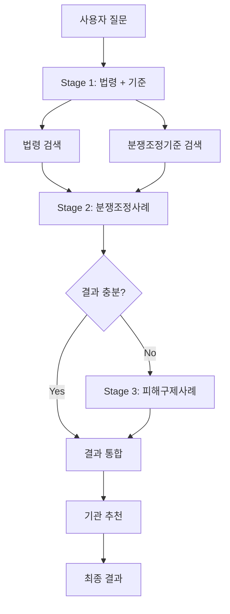

# 멀티 스테이지 RAG 시스템 사용 가이드

## 📋 목차

1. [개요](#개요)
2. [아키텍처](#아키텍처)
3. [모듈 구조](#모듈-구조)
4. [사용 방법](#사용-방법)
5. [테스트 실행](#테스트-실행)
6. [API 통합](#api-통합)

---

## 개요

멀티 스테이지 RAG 시스템은 3단계 계층적 검색을 통해 더욱 정확하고 풍부한 컨텍스트를 제공합니다.

### 주요 기능

- ✅ **3단계 계층적 검색**: 법령/기준 → 분쟁조정사례 → 피해구제사례
- ✅ **지능형 Fallback**: 분쟁조정사례 부족 시 자동으로 피해구제사례 검색
- ✅ **하이브리드 기관 추천**: 규칙 기반 + 검색 결과 통계 결합
- ✅ **구조화된 입력 지원**: 제품명, 금액, 구매처 등 구조화된 정보 활용

---

## 아키텍처



### 검색 단계별 상세

#### Stage 1: 법령 + 분쟁조정기준 (병렬 검색)
- **목적**: 기본 법적 근거와 품목별 기준 확인
- **검색 대상**:
  - 법령: `article` (조문), `paragraph` (항)
  - 기준: `item_classification` (품목분류), `resolution_row` (해결기준)
- **기본 top_k**: 법령 3개, 기준 3개

#### Stage 2: 분쟁조정사례 검색
- **목적**: 유사한 실제 분쟁조정 사례 찾기
- **검색 대상**: `decision` (결정), `parties_claim` (당사자주장), `judgment` (판단)
- **쿼리 확장**: Stage 1 결과의 핵심 키워드를 활용하여 컨텍스트 강화
- **기본 top_k**: 5개

#### Stage 3: 피해구제사례 검색 (Fallback)
- **목적**: 분쟁조정사례가 부족할 때 보완
- **검색 대상**: `qa_combined` (질의응답)
- **발동 조건**: 분쟁조정사례 < threshold (기본값: 2개)
- **기본 top_k**: 3개

---

## 모듈 구조

### 1. `MultiStageRetriever` (app/rag/multi_stage_retriever.py)

멀티 스테이지 검색의 핵심 클래스입니다.

```python
from app.rag import MultiStageRetriever

# 초기화
retriever = MultiStageRetriever(db_config)

# 전체 검색 실행
results = retriever.search_multi_stage(
    query="온라인에서 구매한 노트북이 불량입니다. 환불 받을 수 있나요?",
    law_top_k=3,
    criteria_top_k=3,
    mediation_top_k=5,
    counsel_top_k=3,
    mediation_threshold=2,
    enable_agency_recommendation=True
)

# 결과 구조
# {
#   'stage1': {'law': [...], 'criteria': [...]},
#   'stage2': [...],
#   'stage3': [...],
#   'all_chunks': [...],
#   'used_fallback': bool,
#   'agency_recommendation': {...},
#   'stats': {...}
# }
```

### 2. `AgencyRecommender` (app/rag/agency_recommender.py)

기관 추천 시스템입니다.

```python
from app.rag import AgencyRecommender

recommender = AgencyRecommender()

# 추천 받기
recommendations = recommender.recommend(
    user_input="쿠팡에서 옷을 샀는데 배송이 안 됩니다.",
    search_results=chunks,  # 선택적
    rule_weight=0.7,        # 규칙 기반 가중치
    result_weight=0.3       # 검색 결과 가중치
)

# 결과: [(기관코드, 점수, 기관정보), ...]
# [('ecmc', 0.85, {...}), ('kca', 0.32, {...}), ...]

# 최우선 기관만
top_agency, info = recommender.get_top_agency(user_input, search_results)

# 사람이 읽을 수 있는 형식으로
formatted = recommender.format_recommendations(recommendations)
print(formatted)
```

### 3. 구조화된 입력 모델 (app/models/user_input.py)

```python
from app.models import StructuredUserInput, extract_keywords, format_input_summary

# 구조화된 입력 생성
user_input = StructuredUserInput(
    query="노트북 화면이 안 켜집니다.",
    product_name="LG 그램 노트북",
    product_category="전자제품",
    purchase_amount=1500000,
    purchase_place="쿠팡",
    purchase_method="온라인",
    dispute_type="환불"
)

# 쿼리 확장 (검색에 활용)
enhanced_query = extract_keywords(user_input)

# 요약 출력 (UI에 표시)
summary = format_input_summary(user_input)
```

---

## 사용 방법

### 기본 사용

```python
import os
from dotenv import load_dotenv
from app.rag import MultiStageRetriever

load_dotenv()

# DB 설정
db_config = {
    'host': os.getenv('DB_HOST', 'localhost'),
    'port': int(os.getenv('DB_PORT', 5432)),
    'database': os.getenv('DB_NAME', 'ddoksori'),
    'user': os.getenv('DB_USER', 'postgres'),
    'password': os.getenv('DB_PASSWORD', 'postgres')
}

# 검색기 초기화
retriever = MultiStageRetriever(db_config)

# 검색 실행
results = retriever.search_multi_stage(
    query="온라인 쇼핑몰에서 산 옷이 불량인데 환불 거부당했습니다."
)

# 결과 활용
print(f"총 {results['stats']['total_chunks']}개 청크 검색")
print(f"추천 기관: {results['agency_recommendation']['top_agency'][0]}")

# 리소스 정리
retriever.close()
```

### 고급 사용 (파라미터 조정)

```python
# Stage별 결과 수 조정
results = retriever.search_multi_stage(
    query="...",
    law_top_k=5,              # 법령 5개
    criteria_top_k=5,         # 기준 5개
    mediation_top_k=10,       # 분쟁조정사례 10개
    counsel_top_k=5,          # 피해구제사례 5개
    mediation_threshold=3,    # Fallback 발동 기준 상향
    agencies=['kca'],         # 특정 기관만 검색
    enable_agency_recommendation=False  # 기관 추천 비활성화
)
```

### 구조화된 입력 활용

```python
from app.models import StructuredUserInput, extract_keywords

# 구조화된 입력 생성
structured_input = StructuredUserInput(
    query="구매한 노트북이 불량입니다.",
    product_name="LG 그램",
    product_category="전자제품",
    purchase_place="쿠팡",
    purchase_method="온라인",
    dispute_type="환불"
)

# 쿼리 확장
enhanced_query = extract_keywords(structured_input)

# 검색 실행
results = retriever.search_multi_stage(query=enhanced_query)
```

---

## 테스트 실행

### 1. 멀티 스테이지 RAG 테스트

```bash
cd /home/maroco/ddoksori_demo/backend
conda activate ddoksori
python scripts/test_multi_stage_rag.py
```

**테스트 케이스:**
1. 전자제품 환불 (노트북 불량)
2. 온라인 거래 분쟁 (배송 지연)
3. 서비스 환불 (학원 수강료)
4. 콘텐츠 분쟁 (음원 저작권)

**출력:**
- Stage별 검색 결과
- 기관 추천 결과
- 평가 지표 (유사도, 정확도, 시간)
- `test_results.json` 저장

### 2. 결과 분석

```bash
python scripts/analyze_rag_results.py
```

**분석 항목:**
- 검색 결과 분포 (소스별 청크 수)
- 유사도 통계 (평균, 최대, 최소)
- 기관 추천 정확도
- 성능 분석 (검색 시간)
- 개선 제안

---

## API 통합

FastAPI 엔드포인트에 멀티 스테이지 검색을 통합하는 방법:

### 1. main.py에 엔드포인트 추가

```python
from app.rag import MultiStageRetriever

# 초기화
multi_stage_retriever = MultiStageRetriever(db_config)

@app.post("/chat/multi-stage")
async def chat_multi_stage(request: ChatRequest):
    """
    멀티 스테이지 RAG 기반 챗봇 응답
    """
    try:
        # 멀티 스테이지 검색
        results = multi_stage_retriever.search_multi_stage(
            query=request.message,
            law_top_k=3,
            criteria_top_k=3,
            mediation_top_k=5,
            enable_agency_recommendation=True
        )
        
        # LLM 답변 생성
        answer_result = generator.generate_answer(
            query=request.message,
            chunks=results['all_chunks']
        )
        
        # 응답 구성
        return {
            "answer": answer_result['answer'],
            "chunks_used": len(results['all_chunks']),
            "stats": results['stats'],
            "agency_recommendation": results['agency_recommendation']['formatted'],
            "sources": [...]
        }
        
    except Exception as e:
        raise HTTPException(status_code=500, detail=str(e))
    finally:
        multi_stage_retriever.close()
```

### 2. 구조화된 입력 엔드포인트

```python
from app.models import StructuredUserInput, extract_keywords

@app.post("/chat/structured")
async def chat_structured(user_input: StructuredUserInput):
    """
    구조화된 입력을 받는 챗봇 엔드포인트
    """
    # 쿼리 확장
    enhanced_query = extract_keywords(user_input)
    
    # 검색 실행
    results = multi_stage_retriever.search_multi_stage(
        query=enhanced_query,
        agencies=user_input.preferred_agencies
    )
    
    # 답변 생성
    answer = generator.generate_answer(
        query=enhanced_query,
        chunks=results['all_chunks']
    )
    
    return {
        "answer": answer['answer'],
        "agency_recommendation": results['agency_recommendation']['formatted'],
        ...
    }
```

---

## 설정 가이드

### 파라미터 튜닝

| 파라미터 | 기본값 | 설명 | 권장 범위 |
|---------|-------|------|----------|
| `law_top_k` | 3 | 법령 검색 결과 수 | 2-5 |
| `criteria_top_k` | 3 | 기준 검색 결과 수 | 2-5 |
| `mediation_top_k` | 5 | 분쟁조정사례 검색 수 | 3-10 |
| `counsel_top_k` | 3 | 피해구제사례 검색 수 | 2-5 |
| `mediation_threshold` | 2 | Fallback 발동 기준 | 1-3 |
| `rule_weight` | 0.7 | 규칙 기반 가중치 | 0.5-0.9 |
| `result_weight` | 0.3 | 검색 결과 가중치 | 0.1-0.5 |

### 성능 최적화

1. **검색 결과 수 조정**: LLM 컨텍스트 길이 제한을 고려하여 top_k 조정
2. **Fallback 임계값**: 분쟁조정사례 데이터 양에 따라 조정
3. **기관 추천 가중치**: 규칙 vs 검색 결과의 비율 조정
4. **벡터 인덱스 최적화**: HNSW 파라미터 조정

---

## 문제 해결

### Q1: Fallback이 너무 자주 발동됩니다
- `mediation_threshold`를 낮추거나 (예: 1)
- 분쟁조정사례 데이터를 늘리거나
- `mediation_top_k`를 높입니다 (예: 10)

### Q2: 기관 추천이 부정확합니다
- `agency_recommender.py`의 키워드 규칙 강화
- `rule_weight`와 `result_weight` 비율 조정
- 특정 기관에 가중치 부여 (`AGENCY_KEYWORDS`의 `weight` 조정)

### Q3: 검색이 느립니다
- `top_k` 값들을 줄입니다
- DB 벡터 인덱스 최적화 (HNSW 파라미터)
- 불필요한 필터링 제거

### Q4: 유사도가 낮습니다
- 청킹 전략 재검토 (청크 크기, overlapping)
- 쿼리 확장 로직 개선
- 임베딩 모델 파인튜닝 고려

---

## 다음 단계

- [ ] FastAPI에 멀티 스테이지 엔드포인트 통합
- [ ] 프론트엔드에 기관 추천 UI 추가
- [ ] 구조화된 입력 폼 개발
- [ ] A/B 테스트로 기존 vs 멀티 스테이지 비교
- [ ] 사용자 피드백 수집 및 개선

---

## 참고 자료

- [RAG 시스템 검토 및 테스트 계획](../../.cursor/plans/rag_시스템_검토_및_테스트.plan.md)
- [데이터베이스 스키마](../database/schema_v2_final.sql)
- [임베딩 기준 및 프로세스](../rag/docs/임베딩_기준_및_프로세스.md)
