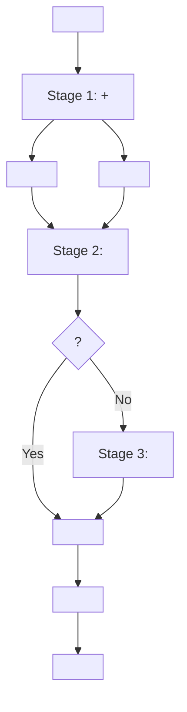

#   RAG   

##  

1. [](#)
2. [](#)
3. [ ](#-)
4. [ ](#-)
5. [ ](#-)
6. [API ](#api-)

---

## 

  RAG  3        .

###  

-  **3  **: / →  → 
-  ** Fallback**:      
-  **  **:   +    
-  **  **: , ,     

---

## 



###   

#### Stage 1:  +  ( )
- ****:      
- ** **:
  - : `article` (), `paragraph` ()
  - : `item_classification` (), `resolution_row` ()
- ** top_k**:  3,  3

#### Stage 2:  
- ****:     
- ** **: `decision` (), `parties_claim` (), `judgment` ()
- ** **: Stage 1      
- ** top_k**: 5

#### Stage 3:   (Fallback)
- ****:    
- ** **: `qa_combined` ()
- ** **:  < threshold (: 2)
- ** top_k**: 3

---

##  

### 1. `MultiStageRetriever` (app/rag/multi_stage_retriever.py)

    .

```python
from app.rag import MultiStageRetriever

# 
retriever = MultiStageRetriever(db_config)

#   
results = retriever.search_multi_stage(
    query="   .    ?",
    law_top_k=3,
    criteria_top_k=3,
    mediation_top_k=5,
    counsel_top_k=3,
    mediation_threshold=2,
    enable_agency_recommendation=True
)

#  
# {
#   'stage1': {'law': [...], 'criteria': [...]},
#   'stage2': [...],
#   'stage3': [...],
#   'all_chunks': [...],
#   'used_fallback': bool,
#   'agency_recommendation': {...},
#   'stats': {...}
# }
```

### 2. `AgencyRecommender` (app/rag/agency_recommender.py)

  .

```python
from app.rag import AgencyRecommender

recommender = AgencyRecommender()

#  
recommendations = recommender.recommend(
    user_input="     .",
    search_results=chunks,  # 
    rule_weight=0.7,        #   
    result_weight=0.3       #   
)

# : [(, , ), ...]
# [('ecmc', 0.85, {...}), ('kca', 0.32, {...}), ...]

#  
top_agency, info = recommender.get_top_agency(user_input, search_results)

#     
formatted = recommender.format_recommendations(recommendations)
print(formatted)
```

### 3.    (app/models/user_input.py)

```python
from app.models import StructuredUserInput, extract_keywords, format_input_summary

#   
user_input = StructuredUserInput(
    query="   .",
    product_name="LG  ",
    product_category="",
    purchase_amount=1500000,
    purchase_place="",
    purchase_method="",
    dispute_type=""
)

#   ( )
enhanced_query = extract_keywords(user_input)

#   (UI )
summary = format_input_summary(user_input)
```

---

##  

###  

```python
import os
from dotenv import load_dotenv
from app.rag import MultiStageRetriever

load_dotenv()

# DB 
db_config = {
    'host': os.getenv('DB_HOST', 'localhost'),
    'port': int(os.getenv('DB_PORT', 5432)),
    'database': os.getenv('DB_NAME', 'ddoksori'),
    'user': os.getenv('DB_USER', 'postgres'),
    'password': os.getenv('DB_PASSWORD', 'postgres')
}

#  
retriever = MultiStageRetriever(db_config)

#  
results = retriever.search_multi_stage(
    query="      ."
)

#  
print(f" {results['stats']['total_chunks']}  ")
print(f" : {results['agency_recommendation']['top_agency'][0]}")

#  
retriever.close()
```

###   ( )

```python
# Stage   
results = retriever.search_multi_stage(
    query="...",
    law_top_k=5,              #  5
    criteria_top_k=5,         #  5
    mediation_top_k=10,       #  10
    counsel_top_k=5,          #  5
    mediation_threshold=3,    # Fallback   
    agencies=['kca'],         #   
    enable_agency_recommendation=False  #   
)
```

###   

```python
from app.models import StructuredUserInput, extract_keywords

#   
structured_input = StructuredUserInput(
    query="  .",
    product_name="LG ",
    product_category="",
    purchase_place="",
    purchase_method="",
    dispute_type=""
)

#  
enhanced_query = extract_keywords(structured_input)

#  
results = retriever.search_multi_stage(query=enhanced_query)
```

---

##  

### 1.   RAG 

```bash
cd /home/maroco/ddoksori_demo/backend
conda activate ddoksori
python scripts/test_multi_stage_rag.py
```

** :**
1.   ( )
2.    ( )
3.   ( )
4.   ( )

**:**
- Stage  
-   
-   (, , )
- `test_results.json` 

### 2.  

```bash
python scripts/analyze_rag_results.py
```

** :**
-    (  )
-   (, , )
-   
-   ( )
-  

---

## API 

FastAPI      :

### 1. main.py  

```python
from app.rag import MultiStageRetriever

# 
multi_stage_retriever = MultiStageRetriever(db_config)

@app.post("/chat/multi-stage")
async def chat_multi_stage(request: ChatRequest):
    """
      RAG   
    """
    try:
        #   
        results = multi_stage_retriever.search_multi_stage(
            query=request.message,
            law_top_k=3,
            criteria_top_k=3,
            mediation_top_k=5,
            enable_agency_recommendation=True
        )
        
        # LLM  
        answer_result = generator.generate_answer(
            query=request.message,
            chunks=results['all_chunks']
        )
        
        #  
        return {
            "answer": answer_result['answer'],
            "chunks_used": len(results['all_chunks']),
            "stats": results['stats'],
            "agency_recommendation": results['agency_recommendation']['formatted'],
            "sources": [...]
        }
        
    except Exception as e:
        raise HTTPException(status_code=500, detail=str(e))
    finally:
        multi_stage_retriever.close()
```

### 2.   

```python
from app.models import StructuredUserInput, extract_keywords

@app.post("/chat/structured")
async def chat_structured(user_input: StructuredUserInput):
    """
        
    """
    #  
    enhanced_query = extract_keywords(user_input)
    
    #  
    results = multi_stage_retriever.search_multi_stage(
        query=enhanced_query,
        agencies=user_input.preferred_agencies
    )
    
    #  
    answer = generator.generate_answer(
        query=enhanced_query,
        chunks=results['all_chunks']
    )
    
    return {
        "answer": answer['answer'],
        "agency_recommendation": results['agency_recommendation']['formatted'],
        ...
    }
```

---

##  

###  

|  |  |  |   |
|---------|-------|------|----------|
| `law_top_k` | 3 |     | 2-5 |
| `criteria_top_k` | 3 |     | 2-5 |
| `mediation_top_k` | 5 |    | 3-10 |
| `counsel_top_k` | 3 |    | 2-5 |
| `mediation_threshold` | 2 | Fallback   | 1-3 |
| `rule_weight` | 0.7 |    | 0.5-0.9 |
| `result_weight` | 0.3 |    | 0.1-0.5 |

###  

1. **   **: LLM     top_k 
2. **Fallback **:     
3. **  **:  vs    
4. **  **: HNSW  

---

##  

### Q1: Fallback   
- `mediation_threshold`  (: 1)
-   
- `mediation_top_k`  (: 10)

### Q2:   
- `agency_recommender.py`   
- `rule_weight` `result_weight`  
-     (`AGENCY_KEYWORDS` `weight` )

### Q3:  
- `top_k`  
- DB    (HNSW )
-   

### Q4:  
-    ( , overlapping)
-    
-    

---

##  

- [ ] FastAPI    
- [ ]    UI 
- [ ]    
- [ ] A/B   vs   
- [ ]     

---

##  

- [RAG     ](../../.cursor/plans/rag____.plan.md)
- [ ](../database/schema_v2_final.sql)
- [   ](../rag/docs/___.md)
