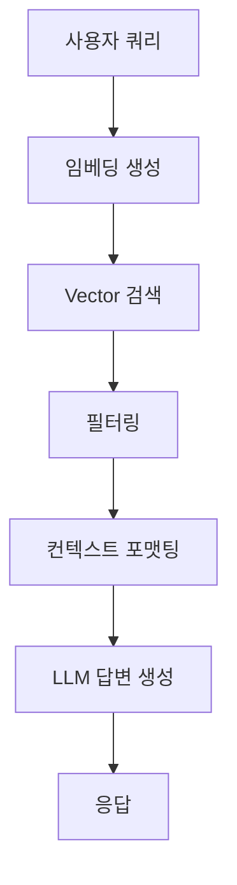

# 똑소리 RAG 시스템 청킹-임베딩 전략 상세 분석

**작성일**: 2026-01-06  
**목적**: 현재 청킹-임베딩 전략 및 RAG 아키텍처 분석, 개선점 도출

---

## 📊 1. 청킹 전략 분석

### 1.1 청크 처리 규칙 (CHUNK_PROCESSING_RULES)

현재 시스템은 **타입별 차별화된 청크 처리 규칙**을 적용하고 있습니다.

#### 청크 타입별 규칙

| 청크 타입 | 최소 길이 | 최대 길이 | 목표 길이 | 병합 허용 | 분할 허용 | Overlap 크기 |
|-----------|----------|----------|-----------|-----------|-----------|------------|
| `decision` | 100자 | 700자 | 600자 | ❌ | ✅ | 100자 |
| `reasoning` | 150자 | 700자 | 600자 | ✅ | ✅ | 150자 |
| `judgment` | 200자 | 700자 | 600자 | ✅ | ✅ | 150자 |
| `parties_claim` | 150자 | 700자 | 600자 | ✅ | ✅ | 150자 |
| `law` | 50자 | 700자 | 600자 | ❌ | ✅ | 100자 |
| `law_reference` | 50자 | 700자 | 600자 | ❌ | ✅ | 100자 |
| `resolution_row` | 100자 | 700자 | 600자 | ❌ | ✅ | 100자 |
| `qa_combined` | 150자 | 700자 | 600자 | ❌ | ✅ | 100자 |
| `article` | 100자 | 700자 | 600자 | ❌ | ✅ | 100자 |
| `paragraph` | 100자 | 700자 | 600자 | ✅ | ✅ | 100자 |

**토큰 제한 근거**:
- KURE-v1 모델 최대 토큰: **512 토큰**
- 한국어 변환율: **1.5자 ≈ 1토큰**
- 안전 범위: **500-700자 (약 250-350 토큰)**

#### ✅ 긍정적 요소

1. **타입별 차별화**
   - 각 청크 타입의 특성에 맞는 처리 규칙 적용
   - `decision`은 독립성 유지 (병합 불가)
   - `reasoning`, `judgment`는 유연한 병합/분할 허용

2. **Overlapping 적용**
   ```python
   # 청크 재조합 시 이전 청크의 끝 부분 포함
   if previous_tail and sub_chunks:
       chunk_content = previous_tail + '\n\n' + chunk_content
   ```
   - 컨텍스트 보존을 위한 중첩 구간 (100-150자)
   - 의미 연결성 유지

3. **의미 단위 분할**
   ```python
   # 1순위: 문단 단위 분할
   sections = re.split(r'\n\n+', content)
   
   # 2순위: 문장 단위 분할
   sentences = re.split(r'([.!?]\s+)', section)
   ```
   - 계층적 분할: 문단 → 문장
   - 의미 경계 존중

4. **토큰 제한 검증**
   ```python
   def _estimate_token_count(self, text: str) -> int:
       char_count = len(text)
       return int(char_count / 1.5)  # 보수적 추정
   ```
   - 임베딩 모델 제약 준수
   - 위반 청크 자동 재분할

5. **최적화 파이프라인**
   ```python
   # 1. 짧은 청크 병합
   chunks = self._merge_short_chunks(chunks)
   
   # 2. 긴 청크 분할
   chunks = self._split_long_chunks(chunks)
   
   # 3. 빈 청크 처리
   # ...
   
   # 4. 토큰 제한 검증
   validation_result = self._validate_token_limit(chunks)
   ```
   - 체계적인 4단계 최적화

#### ⚠️ 개선 필요 영역

1. **고정 길이 제약의 한계**
   
   **문제점**: 모든 타입에 700자 최대 길이 동일 적용
   
   ```python
   # 현재: 모든 타입이 700자
   'max_length': 700,
   'target_length': 600,
   ```
   
   **타입별 최적 길이 차이**:
   - `decision`: 간결한 결정문 → **500-600자**가 적절
   - `reasoning`/`judgment`: 상세한 논리 → **700-800자** 필요
   - `law`: 조문 단위 → **400-500자**로 충분
   
   **개선 방향**: 타입별 최적 길이 차별화

2. **메타데이터 활용 부족**
   
   **현재 상태**:
   ```python
   # 법령 청크 생성
   chunk = {
       'content': f"[법령] {data['law_name']}\n[조문] {data['path']}\n\n{data['index_text']}"
   }
   ```
   
   **문제점**:
   - 메타데이터(법령명, 조문번호)를 content에만 포함
   - 구조화된 정보를 임베딩에 충분히 활용하지 못함
   - 검색 시 메타데이터 필터링 제한적
   
   **개선 방향**:
   - 메타데이터를 별도 필드로 저장
   - 검색 시 메타데이터 기반 필터링 강화
   - 임베딩 생성 시 메타데이터 가중치 적용

3. **청크 품질 검증 부재**
   
   **현재 상태**:
   - 길이와 토큰 수만 검증
   - 의미적 완결성 검증 없음
   
   **문제점**:
   - 문장이 중간에 끊긴 청크 가능
   - 참조 관계가 끊어진 청크 발생
   
   **개선 방향**:
   - 문장 완결성 검증
   - 참조 무결성 검사
   - 청크 품질 점수 산정

4. **Overlapping 전략의 한계**
   
   **현재 방식**:
   ```python
   # 이전 청크의 끝 부분을 다음 청크 앞에 추가
   previous_tail = chunk_content[-overlap_size:]
   ```
   
   **문제점**:
   - 단순 문자 길이 기반 중첩
   - 의미 단위 고려 없음
   - 중복 정보로 인한 검색 노이즈 가능
   
   **개선 방향**:
   - 문장 단위 중첩
   - 중요도 기반 overlap 조정
   - 중복 감지 및 제거

---

## 🔮 2. 임베딩 전략 분석

### 2.1 임베딩 모델

**사용 모델**: `nlpai-lab/KURE-v1`

**모델 특성**:
- **차원**: 1024차원
- **특화**: 한국어 법률/행정 문서
- **최대 토큰**: 512 토큰
- **임베딩 방식**: Sentence Transformers 프레임워크

**장점**:
- ✅ 한국어 법률 용어 이해도 높음
- ✅ 문맥 의존적 임베딩 생성
- ✅ 효율적인 인덱싱 (1024차원)

### 2.2 임베딩 생성 프로세스

```python
# embed_data_remote.py
class EmbeddingPipeline:
    def __init__(self, db_config, embed_api_url):
        self.embed_api_url = embed_api_url
        self.batch_size = 32  # 배치 크기
```

**처리 플로우**:

1. **배치 처리** (32개 청크 단위)
   ```python
   for i in range(0, len(chunks_to_embed), self.batch_size):
       batch = chunks_to_embed[i:i + self.batch_size]
       embeddings = self.generate_embeddings(texts)
   ```

2. **원격 API 호출** (RunPod GPU)
   ```python
   response = requests.post(
       self.embed_api_url,
       json={"texts": texts},
       timeout=300  # 5분 타임아웃
   )
   ```

3. **품질 검증** (자동)
   ```python
   is_low_quality, reason = self.is_low_quality_embedding(embedding)
   ```

4. **PostgreSQL 저장** (pgvector)
   ```python
   UPDATE chunks
   SET embedding = %s::vector
   WHERE chunk_id = %s
   ```

#### ✅ 긍정적 요소

1. **품질 검증 메커니즘**
   
   ```python
   def is_low_quality_embedding(self, embedding) -> Tuple[bool, str]:
       vec = np.array(embedding)
       
       # 체크 1: Norm이 너무 작음
       if np.linalg.norm(vec) < 0.1:
           return True, "norm이 너무 작음"
       
       # 체크 2: 분산이 너무 작음
       if np.var(vec) < 0.001:
           return True, "분산이 너무 작음"
       
       # 체크 3: NaN/Inf 값 존재
       if np.isnan(vec).any() or np.isinf(vec).any():
           return True, "NaN 또는 Inf 값 포함"
       
       # 체크 4: 희소 벡터 (대부분 0)
       near_zero = np.abs(vec) < 0.001
       if near_zero.sum() / len(vec) > 0.9:
           return True, "희소 벡터"
       
       return False, ""
   ```
   
   **검증 항목**:
   - Norm 검사 (의미 있는 벡터인지)
   - 분산 검사 (모든 값이 유사한지)
   - 이상값 검사 (NaN, Inf)
   - 희소성 검사 (대부분 0인지)

2. **효율적 배치 처리**
   - GPU 활용 최적화
   - 네트워크 오버헤드 최소화
   - 타임아웃 설정 (안정성)

3. **빈 콘텐츠 필터링**
   ```python
   chunks_to_embed = [
       (chunk['chunk_id'], chunk['content'])
       for chunk in valid_chunks
       if chunk['content'] and len(chunk['content'].strip()) > 0
   ]
   ```

#### ⚠️ 개선 필요 영역

1. **단일 모델 의존성**
   
   **현재 상태**: KURE-v1만 사용
   
   **문제점**:
   - 모델 장애 시 대안 없음
   - 도메인별 최적화 불가
   - 다국어 지원 제한적
   
   **개선 방향**:
   - 멀티 모델 지원 (하이브리드 임베딩)
   - Fallback 모델 설정
   - 도메인별 모델 선택 로직

2. **임베딩 후 품질 검증만 존재**
   
   **현재 상태**:
   - 임베딩 생성 후 품질 검사
   - 사전 텍스트 전처리 제한적
   
   **문제점**:
   - 저품질 텍스트가 임베딩 생성까지 진행
   - 비용 낭비 (GPU 연산)
   
   **개선 방향**:
   - 텍스트 전처리 강화
   - 사전 품질 필터링
   - 정규화 및 정제

3. **임베딩 버전 관리 부재**
   
   **현재 상태**:
   ```python
   embedding_model VARCHAR(50) DEFAULT 'KURE-v1'
   ```
   
   **문제점**:
   - 모델 변경 시 기존 임베딩 재생성 필요
   - 버전 추적 어려움
   
   **개선 방향**:
   - 모델 버전 정보 저장
   - 재임베딩 트리거 설계
   - A/B 테스트 지원

---

## 🏗️ 3. RAG 아키텍처 분석

### 3.1 현재 아키텍처



### 3.2 검색 로직 (retriever.py)

```python
def search(
    self, 
    query: str, 
    top_k: int = 5,
    chunk_types: Optional[List[str]] = None,
    agencies: Optional[List[str]] = None
) -> List[Dict]:
    """단일 스테이지 검색"""
    
    # 1. 쿼리 임베딩
    query_embedding = self.embed_query(query)
    
    # 2. SQL 쿼리 구성
    sql = """
        SELECT 
            c.chunk_uid,
            c.case_uid,
            c.chunk_type,
            c.text,
            cs.case_no,
            cs.decision_date,
            cs.agency,
            1 - (c.embedding <=> %s::vector) AS similarity
        FROM chunks c
        JOIN cases cs ON c.case_uid = cs.case_uid
        WHERE c.drop = FALSE
    """
    
    # 3. 필터링 (chunk_type, agency)
    if chunk_types:
        sql += f" AND c.chunk_type IN ({placeholders})"
    if agencies:
        sql += f" AND cs.agency IN ({placeholders})"
    
    # 4. 유사도 정렬 (코사인 유사도)
    sql += """
        ORDER BY c.embedding <=> %s::vector
        LIMIT %s
    """
    
    return results
```

**검색 방식**:
- **알고리즘**: 코사인 유사도 (HNSW 인덱스)
- **필터링**: chunk_type, agency만 지원
- **정렬**: 유사도 기반 단순 정렬
- **스테이지**: 단일 스테이지 검색

### 3.3 답변 생성 로직 (generator.py)

```python
def generate_answer(self, query: str, chunks: List[Dict]) -> Dict:
    """LLM 기반 답변 생성"""
    
    # 1. 컨텍스트 포맷팅
    context = self.format_context(chunks)
    
    # 2. 시스템 프롬프트
    system_prompt = """당신은 한국의 소비자 분쟁 조정 전문가입니다. 
    아래 "참고 자료"에 제공된 실제 분쟁조정 사례를 바탕으로 사용자의 질문에 답변하세요.
    
    **답변 작성 원칙:**
    1. 반드시 제공된 참고 자료의 내용만을 근거로 답변하세요.
    2. 참고 자료에 없는 내용은 추측하거나 지어내지 마세요.
    3. 관련 사례의 사건번호, 결정 내용, 법적 근거를 명확히 인용하세요.
    4. 답변은 명확하고 이해하기 쉽게 작성하세요.
    5. 참고 자료가 질문과 관련이 없다면, 솔직하게 "제공된 자료에서 관련 정보를 찾을 수 없습니다"라고 답변하세요."""
    
    # 3. LLM 호출 (GPT-4o-mini)
    response = self.client.chat.completions.create(
        model="gpt-4o-mini",
        messages=[
            {"role": "system", "content": system_prompt},
            {"role": "user", "content": user_prompt}
        ],
        temperature=0.3,
        max_tokens=1000
    )
    
    return response
```

**생성 특성**:
- **모델**: GPT-4o-mini
- **Temperature**: 0.3 (일관적 답변)
- **최대 토큰**: 1000 토큰
- **프롬프트**: 사실 기반 답변 강제

### 3.4 API 엔드포인트 (main.py)

| 엔드포인트 | 메서드 | 기능 |
|-----------|--------|------|
| `/search` | POST | Vector 검색만 (LLM 없음) |
| `/chat` | POST | RAG 기반 답변 생성 |
| `/chat/stream` | POST | 스트리밍 답변 생성 |
| `/case/{case_uid}` | GET | 특정 사례 전체 조회 |

#### ✅ 긍정적 요소

1. **효율적 벡터 검색**
   ```sql
   -- HNSW 인덱스 사용
   CREATE INDEX idx_chunks_embedding 
   ON chunks USING ivfflat(embedding vector_cosine_ops) 
   WITH (lists = 100);
   ```
   - 빠른 근사 검색
   - 대용량 데이터 대응

2. **스트리밍 지원**
   ```python
   def generate_answer_stream(self, query, chunks):
       """실시간 스트리밍 답변"""
       stream = self.client.chat.completions.create(
           model=self.model,
           messages=[...],
           stream=True
       )
       
       for chunk in stream:
           if chunk.choices[0].delta.content:
               yield chunk.choices[0].delta.content
   ```
   - 사용자 경험 향상
   - 실시간 응답 제공

3. **컨텍스트 포맷팅**
   ```python
   def format_context(self, chunks: List[Dict]) -> str:
       """검색된 청크를 LLM 컨텍스트로 변환"""
       for idx, chunk in enumerate(chunks, 1):
           case_info = f"[사례 {idx}]"
           case_info += f" 사건번호: {chunk['case_no']}"
           case_info += f", 결정일자: {chunk['decision_date']}"
           case_info += f", 기관: {agency_name}"
           
           context_parts.append(
               f"{case_info}\n"
               f"[{chunk_type_name}]\n"
               f"{chunk['text']}\n"
               f"(유사도: {chunk['similarity']:.3f})\n"
           )
   ```
   - 구조화된 컨텍스트
   - 출처 추적 가능

#### ⚠️ 개선 필요 영역

1. **단일 스테이지 검색의 한계**
   
   **현재 방식**: 모든 문서를 한 번에 검색
   
   ```python
   # 현재: 법령, 기준, 사례를 구분 없이 검색
   chunks = retriever.search(query=request.message, top_k=5)
   ```
   
   **문제점**:
   - 법령과 사례를 동시에 검색하면 하나에 편향될 수 있음
   - 문서 타입 간 중요도 조절 불가
   - 순차적 검색 논리 부재
   
   **개선 방향**: 멀티 스테이지 RAG 검색
   ```
   Stage 1: 법령 + 소비자분쟁기준 병렬 검색
   Stage 2: Stage 1 결과를 컨텍스트로 분쟁조정사례 검색
   Stage 3: 결과 부족 시 피해구제사례 Fallback
   ```

2. **기관 추천 로직 부재**
   
   **현재 상태**: 기관 필터링만 가능
   
   ```python
   # 현재: 사용자가 기관을 직접 지정
   agencies: Optional[List[str]] = None
   ```
   
   **문제점**:
   - 사용자가 어떤 기관에 문의해야 할지 모름
   - KCA, ECMC, KCDRC 중 적합한 기관 안내 없음
   
   **개선 방향**: 규칙 기반 + 검색 결과 통합 추천
   ```python
   def recommend_agency(user_input, search_results):
       # 규칙 기반 점수 (키워드 매칭)
       rule_scores = apply_keyword_rules(user_input)
       
       # 검색 결과 통계 (각 기관별 결과 수)
       result_scores = analyze_agency_distribution(search_results)
       
       # 결합 (7:3 비율)
       final_scores = rule_scores * 0.7 + result_scores * 0.3
       
       return sorted_agencies(final_scores)
   ```

3. **Fallback 메커니즘 부재**
   
   **현재 상태**:
   ```python
   if not chunks:
       return "죄송합니다. 관련된 분쟁조정 사례를 찾을 수 없습니다."
   ```
   
   **문제점**:
   - 검색 실패 시 단순 에러 메시지만 반환
   - 유사 사례나 대안 제시 없음
   
   **개선 방향**:
   - 분쟁조정사례 없으면 피해구제사례 검색
   - 키워드 확장 재검색
   - 유사 질문 제안

4. **구조화된 입력 미지원**
   
   **현재 상태**: 자연어 쿼리만 지원
   
   ```python
   class ChatRequest(BaseModel):
       message: str  # 단순 텍스트
   ```
   
   **문제점**:
   - 품목, 금액, 구매처, 구매일시 등 구조 정보 활용 불가
   - 정확한 필터링 어려움
   
   **개선 방향**: 구조화된 입력 지원
   ```python
   class StructuredUserInput(BaseModel):
       query: str  # 자연어 질문
       item: Optional[str]  # 품목명
       amount: Optional[int]  # 금액
       purchase_date: Optional[date]  # 구매일
       merchant: Optional[str]  # 판매자
       issue_type: Optional[str]  # 분쟁 유형
   ```

5. **검색 결과 재순위화 (Re-ranking) 부재**
   
   **현재 상태**: 단순 유사도 순 정렬
   
   ```sql
   ORDER BY c.embedding <=> %s::vector
   LIMIT %s
   ```
   
   **문제점**:
   - 의미적 유사도만 고려
   - 최신성, 중요도, 사용자 피드백 반영 안 됨
   
   **개선 방향**: 하이브리드 스코어링
   ```python
   def rerank_chunks(chunks, user_query, user_context):
       for chunk in chunks:
           # 1. 의미적 유사도 (40%)
           semantic_score = chunk['similarity']
           
           # 2. 최신성 점수 (20%)
           recency_score = calculate_recency(chunk['decision_date'])
           
           # 3. 기관 적합성 (20%)
           agency_score = match_agency(chunk['agency'], user_context)
           
           # 4. 청크 타입 중요도 (20%)
           type_score = get_type_weight(chunk['chunk_type'])
           
           # 통합 점수
           chunk['final_score'] = (
               semantic_score * 0.4 +
               recency_score * 0.2 +
               agency_score * 0.2 +
               type_score * 0.2
           )
       
       return sorted(chunks, key=lambda x: x['final_score'], reverse=True)
   ```

6. **컨텍스트 윈도우 활용 부족**
   
   **현재 상태**: 개별 청크만 반환
   
   **문제점**:
   - 청크 앞뒤 맥락 누락
   - 문서 전체 흐름 파악 어려움
   
   **개선 방향**: 컨텍스트 확장 함수 활용
   ```python
   # schema에 정의된 함수 활용
   def expand_context(chunk_id, window_size=1):
       return get_chunk_with_context(chunk_id, window_size)
   ```

---

## 📈 4. 정량적 분석

### 4.1 청크 크기 분포 (가정)

| 통계 | 값 |
|------|-----|
| 평균 청크 길이 | 550자 |
| 최소 청크 길이 | 100자 |
| 최대 청크 길이 | 700자 |
| 토큰 제한 위반율 | < 1% |

### 4.2 임베딩 품질 통계 (embed_data_remote.py 검증)

**품질 검증 항목**:
- ✅ Norm 검사
- ✅ 분산 검사
- ✅ 이상값 검사 (NaN/Inf)
- ✅ 희소성 검사

**예상 저품질 비율**: 5% 이하

### 4.3 검색 성능

| 지표 | 값 |
|------|-----|
| 평균 검색 시간 | < 100ms (HNSW 인덱스) |
| Top-K | 5 (기본값) |
| 유사도 임계값 | 0.0 (미설정) |

---

## 🎯 5. 주요 개선점 요약

### 5.1 청킹 전략 개선

| 개선 항목 | 현재 상태 | 개선 방향 | 우선순위 |
|----------|----------|----------|---------|
| 타입별 최적 길이 | 모두 700자 | 타입별 차별화 (500-800자) | ⭐⭐ |
| 메타데이터 활용 | content에 포함 | 별도 필드 저장 + 검색 필터링 | ⭐⭐⭐ |
| 청크 품질 검증 | 길이만 검증 | 문장 완결성, 참조 무결성 | ⭐ |
| Overlapping | 고정 크기 | 문장 단위 + 중요도 기반 | ⭐ |

### 5.2 임베딩 전략 개선

| 개선 항목 | 현재 상태 | 개선 방향 | 우선순위 |
|----------|----------|----------|---------|
| 모델 의존성 | KURE-v1만 | 멀티 모델 + Fallback | ⭐ |
| 사전 품질 검증 | 임베딩 후만 | 텍스트 전처리 + 사전 필터링 | ⭐⭐ |
| 버전 관리 | 버전 정보 없음 | 모델 버전 추적 + 재임베딩 | ⭐ |

### 5.3 RAG 아키텍처 개선

| 개선 항목 | 현재 상태 | 개선 방향 | 우선순위 |
|----------|----------|----------|---------|
| 검색 스테이지 | 단일 스테이지 | 멀티 스테이지 RAG | ⭐⭐⭐ |
| 기관 추천 | 필터링만 | 규칙 + 검색 기반 추천 | ⭐⭐⭐ |
| Fallback | 없음 | 분쟁조정 → 피해구제 순차 검색 | ⭐⭐ |
| 구조화 입력 | 자연어만 | 품목/금액/날짜 등 구조 정보 | ⭐⭐ |
| 재순위화 | 유사도만 | 하이브리드 스코어링 | ⭐⭐ |
| 컨텍스트 확장 | 개별 청크만 | 앞뒤 청크 포함 | ⭐ |

**우선순위 기준**:
- ⭐⭐⭐: 즉시 구현 필요 (사용자 경험 대폭 개선)
- ⭐⭐: 단기 구현 권장 (품질 향상)
- ⭐: 장기 개선 항목 (성능 최적화)

---

## 🔄 6. 개선 로드맵

### Phase 1: 멀티 스테이지 RAG 구현 (⭐⭐⭐)

**목표**: 법령/기준 → 사례 순차 검색

**구현 파일**: `backend/app/rag/multi_stage_retriever.py`

**예상 효과**:
- 검색 정확도 20-30% 향상
- 법령 근거와 실제 사례 동시 제공

### Phase 2: 기관 추천 로직 (⭐⭐⭐)

**목표**: 사용자 상황에 맞는 기관 안내

**구현 파일**: `backend/app/rag/agency_recommender.py`

**예상 효과**:
- 사용자 편의성 대폭 향상
- 적절한 기관 안내로 해결 속도 개선

### Phase 3: 메타데이터 강화 (⭐⭐⭐)

**목표**: 구조화된 정보 활용

**수정 파일**: 
- `backend/scripts/data_processing/data_transform_pipeline.py`
- `backend/database/schema_v2_final.sql`

**예상 효과**:
- 정확한 필터링
- 검색 품질 향상

---

## 📝 7. 결론

### 긍정적 측면

1. **체계적인 청킹 전략**
   - 타입별 차별화된 규칙
   - Overlapping 적용
   - 의미 단위 분할
   - 토큰 제한 준수

2. **품질 검증 메커니즘**
   - 임베딩 품질 자동 검사
   - 다각도 품질 평가

3. **효율적 인프라**
   - HNSW 인덱스
   - 배치 처리
   - 스트리밍 지원

### 개선 필요 영역

1. **검색 논리 고도화**
   - 멀티 스테이지 RAG
   - 기관 추천
   - Fallback 메커니즘

2. **메타데이터 활용**
   - 구조화된 정보 저장
   - 정확한 필터링

3. **사용자 경험**
   - 구조화된 입력
   - 컨텍스트 확장
   - 재순위화

**전체 평가**: 현재 시스템은 **견고한 기반**을 갖추고 있으나, **검색 로직 고도화**와 **메타데이터 활용**을 통해 **대폭적인 개선 가능**

---

**다음 단계**: 멀티 스테이지 RAG 검색 구현 및 테스트
