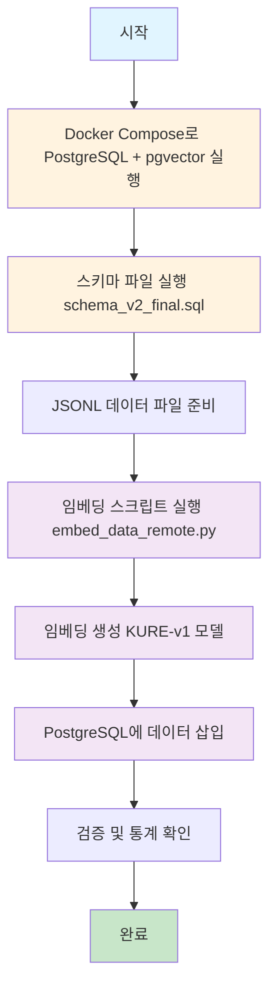

# pgvector Schema 생성 - 임베딩 - 데이터 로드 가이드

**작성일**: 2026-01-06  
**목적**: PostgreSQL + pgvector를 사용한 RAG 시스템 구축 전체 프로세스 가이드

---

## 📋 목차

1. [전체 프로세스 개요](#전체-프로세스-개요)
2. [1단계: Docker 환경 설정](#1단계-docker-환경-설정)
3. [2단계: 스키마 생성](#2단계-스키마-생성)
4. [3단계: 데이터 준비](#3단계-데이터-준비)
5. [4단계: 임베딩 생성 및 로드](#4단계-임베딩-생성-및-로드)
6. [5단계: 검증](#5단계-검증)
7. [트러블슈팅](#트러블슈팅)
8. [참고 문서](#참고-문서)

---

## 전체 프로세스 개요



### 프로세스 요약

1. **환경 설정**: Docker로 PostgreSQL + pgvector 컨테이너 실행
2. **스키마 생성**: `schema_v2_final.sql` 실행하여 테이블 및 인덱스 생성
3. **데이터 준비**: JSONL 형식의 변환된 데이터 파일 준비
4. **임베딩 생성**: KURE-v1 모델로 텍스트 임베딩 생성
5. **데이터 로드**: documents와 chunks 테이블에 데이터 삽입
6. **검증**: 삽입된 데이터 통계 확인

---

## 1단계: Docker 환경 설정

### 1.1 Docker Compose 실행

```bash
# 프로젝트 루트 디렉토리로 이동
cd "$(git rev-parse --show-toplevel 2>/dev/null || pwd)"

# PostgreSQL + pgvector 컨테이너 실행
docker-compose up -d db
```

### 1.2 컨테이너 상태 확인

```bash
# 컨테이너 실행 상태 확인
docker ps | grep ddoksori_db

# 또는 docker-compose 사용
docker-compose ps db

# 로그 확인
docker logs ddoksori_db

# 데이터베이스 연결 테스트 (스크립트 실행 시 -it 옵션 제거)
docker exec ddoksori_db psql -U postgres -d ddoksori -c "SELECT version();"
```

**참고**: 
- `docker exec -it`는 대화형 터미널에서 사용하며, 스크립트나 자동화에서는 `-it` 없이 `docker exec`만 사용합니다.
- `docker-compose ps`는 더 상세한 컨테이너 상태 정보를 제공합니다.

### 1.3 환경 변수 설정

`backend/.env` 파일 생성 및 설정:

```bash
cd backend
cat > .env << EOF
DB_HOST=localhost
DB_PORT=5432
DB_NAME=ddoksori
DB_USER=postgres
DB_PASSWORD=postgres

# 임베딩 API 설정 (원격 GPU 사용 시)
EMBED_API_URL=http://localhost:8001/embed
EOF
```

**참고**: 
- 로컬 임베딩 모델 사용 시 `EMBED_API_URL` 불필요
- 원격 GPU (RunPod 등) 사용 시 SSH 터널 설정 필요

---

## 2단계: 스키마 생성

### 2.1 스키마 파일 위치

- **스키마 파일**: `backend/database/schema_v2_final.sql`
- **초기화 스크립트**: `backend/database/init.sql` (Docker 자동 실행)

### 2.2 스키마 실행 방법

#### 방법 1: Docker 컨테이너에서 직접 실행 (권장)

```bash
# ⚠️ 중요: 프로젝트 루트 디렉토리에서 실행해야 합니다
cd "$(git rev-parse --show-toplevel 2>/dev/null || pwd)"

# 현재 디렉토리 확인
pwd

# 파일 존재 확인
ls -la backend/database/schema_v2_final.sql

# 방법 1-A: cat과 파이프 사용 (zsh/bash 모두 호환) - 권장
cat backend/database/schema_v2_final.sql | docker exec -i ddoksori_db psql -U postgres -d ddoksori

# 방법 1-B: 절대 경로 사용 (어느 디렉토리에서든 작동)
cat "$(pwd)/backend/database/schema_v2_final.sql" | docker exec -i ddoksori_db psql -U postgres -d ddoksori

# 방법 1-C: 리다이렉션 사용 (bash에서만 작동, zsh에서는 경로 문제 발생 가능)
# docker exec -i ddoksori_db psql -U postgres -d ddoksori < backend/database/schema_v2_final.sql
```

**참고**: 
- zsh 쉘에서는 `<` 리다이렉션이 `docker exec`와 함께 사용될 때 경로 해석 문제가 발생할 수 있습니다. `cat`과 파이프(`|`)를 사용하는 방법을 권장합니다.
- **"No such file or directory" 오류 발생 시**: 프로젝트 루트 디렉토리에서 실행했는지 확인하세요. 다른 디렉토리에서 실행하는 경우 절대 경로(`$(pwd)/backend/...`)를 사용하세요.

#### 방법 2: psql 클라이언트로 실행

```bash
# ⚠️ 중요: 프로젝트 루트 디렉토리에서 실행
cd "$(git rev-parse --show-toplevel 2>/dev/null || pwd)"

# 로컬에 PostgreSQL 클라이언트가 설치된 경우
PGPASSWORD=postgres psql -h localhost -U postgres -d ddoksori -f backend/database/schema_v2_final.sql

# 또는 절대 경로 사용
PGPASSWORD=postgres psql -h localhost -U postgres -d ddoksori -f "$(pwd)/backend/database/schema_v2_final.sql"
```

**참고**: 
- 로컬에 `psql` 클라이언트가 설치되어 있지 않은 경우 방법 1을 사용하세요.
- 설치 여부 확인: `which psql` 또는 `psql --version`
- **대부분의 경우**: 로컬에 `psql`이 없으므로 방법 1 (Docker exec)을 권장합니다.

#### 방법 3: Python 스크립트로 실행

```python
# ⚠️ 중요: 프로젝트 루트 디렉토리에서 실행
import psycopg2
from pathlib import Path

# 프로젝트 루트 기준으로 스키마 파일 경로 설정
project_root = Path(__file__).parent.parent.parent if '__file__' in globals() else Path.cwd()
schema_file = project_root / "backend" / "database" / "schema_v2_final.sql"

# 스키마 파일 읽기
with open(schema_file, 'r', encoding='utf-8') as f:
    schema_sql = f.read()

# 데이터베이스 연결
conn = psycopg2.connect(
    host="localhost",
    port=5432,
    database="ddoksori",
    user="postgres",
    password="postgres"
)

# 스키마 실행
cur = conn.cursor()
cur.execute(schema_sql)
conn.commit()
cur.close()
conn.close()

print("✅ 스키마 생성 완료")
```

**또는 명령줄에서 실행**:
```bash
# 프로젝트 루트에서 실행
cd "$(git rev-parse --show-toplevel 2>/dev/null || pwd)"
conda run -n dsr python << 'EOF'
import psycopg2
from pathlib import Path

schema_file = Path("backend/database/schema_v2_final.sql")
with open(schema_file, 'r', encoding='utf-8') as f:
    schema_sql = f.read()

conn = psycopg2.connect(
    host="localhost", port=5432, database="ddoksori",
    user="postgres", password="postgres"
)
cur = conn.cursor()
cur.execute(schema_sql)
conn.commit()
cur.close()
conn.close()
print("✅ 스키마 생성 완료")
EOF
```

### 2.3 생성되는 테이블 구조

#### documents 테이블
- 문서 메타데이터 저장
- 주요 컬럼: `doc_id`, `doc_type`, `title`, `source_org`, `category_path`, `metadata`

#### chunks 테이블
- 청크 텍스트 및 임베딩 벡터 저장
- 주요 컬럼: `chunk_id`, `doc_id`, `content`, `embedding vector(1024)`, `chunk_type`

#### 인덱스
- `idx_chunks_embedding`: IVFFlat 인덱스 (벡터 검색 최적화)
- `idx_documents_doc_type`: 문서 타입 인덱스
- 기타 복합 인덱스

### 2.4 스키마 생성 확인

```bash
# Docker exec를 통해 SQL 실행
docker exec ddoksori_db psql -U postgres -d ddoksori -c "\dt"

# pgvector 확장 확인
docker exec ddoksori_db psql -U postgres -d ddoksori -c "SELECT * FROM pg_extension WHERE extname = 'vector';"

# 테이블 구조 확인
docker exec ddoksori_db psql -U postgres -d ddoksori -c "\d documents"
docker exec ddoksori_db psql -U postgres -d ddoksori -c "\d chunks"
```

**또는 psql 대화형 모드**:
```bash
# Docker exec로 대화형 psql 접속
docker exec -it ddoksori_db psql -U postgres -d ddoksori

# psql 프롬프트에서:
# \dt
# SELECT * FROM pg_extension WHERE extname = 'vector';
# \d documents
# \d chunks
# \q (종료)
```

---

## 3단계: 데이터 준비

### 3.1 데이터 파일 위치

데이터 파일은 `backend/data/` 디렉토리 및 하위 디렉토리에 JSONL 형식으로 저장되어 있습니다.

```bash
# ⚠️ 중요: 프로젝트 루트 디렉토리에서 실행
cd "$(git rev-parse --show-toplevel 2>/dev/null || pwd)"

# 데이터 파일 검색 (하위 디렉토리 포함)
find backend/data -name "*.jsonl" -type f

# 또는 특정 디렉토리 확인
ls -la backend/data/dispute_resolution/
ls -la backend/data/criteria/
```

**실제 데이터 파일 위치**:
- `backend/data/dispute_resolution/ecmc_final_rag_chunks_normalized.jsonl`
- `backend/data/dispute_resolution/kca_final.jsonl`
- `backend/data/dispute_resolution/kcdrc_final_rag_chunks_normalized.jsonl`
- `backend/data/criteria/table4_lifespan_chunks.jsonl`
- 기타 하위 디렉토리의 JSONL 파일들

### 3.2 데이터 형식

각 JSONL 파일의 각 라인은 다음 형식을 따릅니다:

```json
{
  "doc_id": "kca_merged:1",
  "doc_type": "mediation_case",
  "title": "전자제품 환불 분쟁",
  "source_org": "KCA",
  "chunks": [
    {
      "chunk_id": "kca_merged:1:decision:0",
      "chunk_index": 0,
      "chunk_total": 3,
      "chunk_type": "decision",
      "content": "청약철회권 행사 가능...",
      "content_length": 250,
      "drop": false
    }
  ]
}
```

### 3.3 데이터 파일 예시

- `backend/data/dispute_resolution/ecmc_final_rag_chunks_normalized.jsonl`
- `backend/data/dispute_resolution/kca_final.jsonl`
- `backend/data/dispute_resolution/kcdrc_final_rag_chunks_normalized.jsonl`
- `backend/data/criteria/table4_lifespan_chunks.jsonl`

**참고**: 임베딩 스크립트는 `backend/data/` 디렉토리 전체를 재귀적으로 검색하여 모든 `.jsonl` 파일을 처리합니다.

---

## 4단계: 임베딩 생성 및 로드

### 4.1 Conda 환경 활성화

```bash
# Conda 가상환경 활성화 (프로젝트에서 사용하는 환경 이름 확인 필요)
conda activate dsr  # 또는 ddoksori (프로젝트 설정에 따라 다름)

# 또는 conda run 사용 (환경 이름 확인 필요)
conda run -n dsr python ...  # 또는 conda run -n ddoksori python ...

# 사용 가능한 환경 확인
conda env list
```

**참고**: 
- 프로젝트에서 사용하는 Conda 환경 이름은 `conda env list`로 확인할 수 있습니다.
- 일반적으로 `dsr` 또는 `ddoksori` 환경을 사용합니다.

### 4.2 임베딩 스크립트 실행

#### 방법 1: 원격 임베딩 API 사용 (권장 - GPU 활용)

```bash
# ⚠️ 중요: 프로젝트 루트 디렉토리에서 실행
cd "$(git rev-parse --show-toplevel 2>/dev/null || pwd)"

# SSH 터널 설정 (RunPod 등 원격 GPU 사용 시)
# ssh -L 8001:localhost:8000 user@remote-host

# 임베딩 스크립트 실행
conda run -n dsr python backend/scripts/embedding/embed_data_remote.py
```

#### 방법 2: 로컬 임베딩 모델 사용

```bash
# ⚠️ 중요: 프로젝트 루트 디렉토리에서 실행
cd "$(git rev-parse --show-toplevel 2>/dev/null || pwd)"

# 방법 2-A: embedding_tool.py 사용 (통합 도구)
conda run -n dsr python backend/scripts/embedding/embedding_tool.py --generate-local

# 방법 2-B: embed_data_remote.py를 로컬 모드로 사용
# (EMBED_API_URL을 설정하지 않으면 로컬 모델 사용)
conda run -n dsr python backend/scripts/embedding/embed_data_remote.py
```

**참고**: 
- `embed_data.py` 파일은 존재하지 않습니다. 대신 다음 스크립트를 사용하세요:
  - `embed_data_remote.py`: 원격 임베딩 API 또는 로컬 모델 모두 지원
  - `embedding_tool.py`: 통합 임베딩 도구 (로컬/원격 선택 가능)
- 모든 스크립트는 프로젝트 루트 디렉토리에서 실행해야 합니다.
- `embedding_tool.py` 사용법:
  ```bash
  # 임베딩 상태 확인
  conda run -n dsr python backend/scripts/embedding/embedding_tool.py --check
  
  # 로컬 모델로 임베딩 생성
  conda run -n dsr python backend/scripts/embedding/embedding_tool.py --generate-local
  
  # 원격 API로 임베딩 생성
  conda run -n dsr python backend/scripts/embedding/embedding_tool.py --generate-remote
  ```

### 4.3 임베딩 프로세스 상세

스크립트는 다음 작업을 수행합니다:

1. **데이터베이스 연결**
   - PostgreSQL 연결 확인
   - pgvector 확장 확인

2. **데이터 로드**
   - `backend/data/` 디렉토리의 모든 `.jsonl` 파일 읽기
   - 각 문서의 메타데이터 추출

3. **Documents 삽입**
   - `documents` 테이블에 문서 메타데이터 삽입
   - 중복 체크 (이미 존재하는 경우 스킵)

4. **Chunks 임베딩 및 삽입**
   - 각 청크의 `content` 필드 추출
   - 텍스트 전처리 (공백 정리, 특수문자 정규화)
   - KURE-v1 모델로 임베딩 생성 (1024차원)
   - 배치 처리 (기본 32개 청크 단위)
   - `chunks` 테이블에 삽입

5. **통계 출력**
   - 삽입된 문서 수
   - 삽입된 청크 수
   - 임베딩 완료율
   - 평균 청크 길이

### 4.4 실행 예시 출력

```
🔌 임베딩 API 연결 테스트: http://localhost:8001/embed
✅ API 연결 성공: {'status': 'healthy', 'model': 'nlpai-lab/KURE-v1', 'dimension': 1024}

📂 데이터 파일 검색 중...
✅ 발견된 파일: 3개
  - kca_final_rag_chunks_normalized.jsonl
  - ecmc_final_rag_chunks_normalized.jsonl
  - kcdrc_final_rag_chunks_normalized.jsonl

📊 데이터 로드 중...
✅ 문서 632개 로드 완료

📝 Documents 삽입 중...
✅ Documents 삽입 완료: 632개

🔢 Chunks 임베딩 및 삽입 중...
100%|████████████████| 5547/5547 [05:23<00:00, 17.15it/s]

✅ 임베딩 완료!
  - 총 청크: 5,547개
  - 임베딩 완료: 5,547개 (100.0%)
  - 평균 청크 길이: 457자
```

---

## 5단계: 검증

### 5.1 기본 통계 확인

```bash
# 임베딩 상태 확인 스크립트 실행 (스크립트가 존재하는 경우)
# conda run -n dsr python backend/scripts/check_embedding_status.py

# 또는 SQL로 직접 확인 (아래 5.2 섹션 참조)
```

### 5.2 SQL로 직접 확인

```bash
# Docker exec를 통해 SQL 실행
# 전체 통계
docker exec ddoksori_db psql -U postgres -d ddoksori -c "
SELECT 
    COUNT(DISTINCT doc_id) as total_docs,
    COUNT(*) as total_chunks,
    COUNT(embedding) as embedded_chunks,
    COUNT(embedding)::float / COUNT(*) * 100 as embed_rate
FROM chunks;
"

# 문서 타입별 분포
docker exec ddoksori_db psql -U postgres -d ddoksori -c "
SELECT 
    d.doc_type,
    COUNT(DISTINCT d.doc_id) as doc_count,
    COUNT(c.chunk_id) as chunk_count
FROM documents d
LEFT JOIN chunks c ON d.doc_id = c.doc_id
GROUP BY d.doc_type
ORDER BY doc_count DESC;
"

# 청크 타입별 분포
docker exec ddoksori_db psql -U postgres -d ddoksori -c "
SELECT 
    chunk_type,
    COUNT(*) as count,
    AVG(content_length) as avg_length
FROM chunks
WHERE drop = FALSE
GROUP BY chunk_type
ORDER BY count DESC;
"
```

### 5.3 벡터 검색 테스트

```python
# 간단한 검색 테스트
# ⚠️ 중요: 프로젝트 루트에서 실행하거나 sys.path에 backend 디렉토리를 추가해야 합니다
import sys
from pathlib import Path

# 프로젝트 루트를 경로에 추가
project_root = Path(__file__).parent.parent.parent if '__file__' in globals() else Path.cwd()
sys.path.insert(0, str(project_root / 'backend'))

from app.rag import VectorRetriever

db_config = {
    'host': 'localhost',
    'port': 5432,
    'database': 'ddoksori',
    'user': 'postgres',
    'password': 'postgres'
}

retriever = VectorRetriever(db_config)
results = retriever.search("환불 관련 문의", top_k=5)

print(f"검색 결과: {len(results)}개")
for i, chunk in enumerate(results, 1):
    print(f"{i}. 유사도: {chunk['similarity']:.3f}")
    print(f"   내용: {chunk['content'][:100]}...")

retriever.close()
```

**또는 명령줄에서 실행**:
```bash
# 프로젝트 루트에서 실행
cd "$(git rev-parse --show-toplevel 2>/dev/null || pwd)"
conda run -n dsr python -c "
import sys
sys.path.insert(0, 'backend')
from app.rag import VectorRetriever
db_config = {'host': 'localhost', 'port': 5432, 'database': 'ddoksori', 'user': 'postgres', 'password': 'postgres'}
retriever = VectorRetriever(db_config)
results = retriever.search('환불 관련 문의', top_k=3)
print(f'검색 결과: {len(results)}개')
retriever.close()
"
```

---

## 트러블슈팅

### 문제 1: pgvector 확장 오류

**증상**: `ERROR: extension "vector" does not exist`

**해결**:
```bash
# Docker exec를 통해 SQL 실행
docker exec ddoksori_db psql -U postgres -d ddoksori -c "CREATE EXTENSION IF NOT EXISTS vector;"

# 확인
docker exec ddoksori_db psql -U postgres -d ddoksori -c "SELECT * FROM pg_extension WHERE extname = 'vector';"
```

### 문제 2: 임베딩 API 연결 실패

**증상**: `❌ API 연결 실패: Connection refused`

**해결**:
1. SSH 터널 확인 (원격 GPU 사용 시)
   ```bash
   ssh -L 8001:localhost:8000 user@remote-host
   ```

2. 임베딩 서버 실행 확인
   ```bash
   # RunPod 등에서
   uvicorn runpod_embed_server:app --host 0.0.0.0 --port 8000
   ```

3. 로컬 모델 사용으로 전환
   ```bash
   # 프로젝트 루트에서 실행
   cd "$(git rev-parse --show-toplevel 2>/dev/null || pwd)"
   conda run -n dsr python backend/scripts/embedding/embedding_tool.py --generate-local
   ```

### 문제 3: 메모리 부족

**증상**: PostgreSQL OOM 에러 또는 임베딩 중단

**해결**:
1. 배치 크기 줄이기
   ```python
   # embed_data_remote.py에서
   self.batch_size = 16  # 기본 32 → 16
   ```

2. Docker 메모리 제한 증가
   ```yaml
   # docker-compose.yml
   services:
     db:
       deploy:
         resources:
           limits:
             memory: 4G
   ```

### 문제 4: 중복 데이터 삽입

**증상**: 같은 데이터가 여러 번 삽입됨

**해결**:
```bash
# 중복 데이터 확인
docker exec ddoksori_db psql -U postgres -d ddoksori -c "
SELECT doc_id, COUNT(*) 
FROM documents 
GROUP BY doc_id 
HAVING COUNT(*) > 1;
"

# 중복 제거 (주의: 백업 후 실행)
docker exec ddoksori_db psql -U postgres -d ddoksori -c "
DELETE FROM documents 
WHERE ctid NOT IN (
    SELECT MIN(ctid) 
    FROM documents 
    GROUP BY doc_id
);
"
```

### 문제 5: 임베딩 품질 문제

**증상**: 검색 결과가 부정확함

**해결**:
1. 임베딩 품질 확인
   ```bash
   python backend/scripts/inspect_vectordb.py --check-quality
   ```

2. 텍스트 전처리 확인
   - 빈 content 필터링 확인
   - 저품질 텍스트 제외 확인

3. 인덱스 재생성
   ```bash
   docker exec ddoksori_db psql -U postgres -d ddoksori -c "
   DROP INDEX IF EXISTS idx_chunks_embedding;
   CREATE INDEX idx_chunks_embedding 
   ON chunks USING ivfflat(embedding vector_cosine_ops) 
   WITH (lists = 100);
   "
   ```

---

## 참고 문서

### 관련 문서
- [데이터 임베딩 파이프라인](./../backend/scripts/embedding_scripts.md) - 임베딩 스크립트 상세 가이드
- [임베딩 기준 및 프로세스](./../backend/rag/임베딩_기준_및_프로세스.md) - 임베딩 전략 및 기준
- [Vector DB 관리 가이드](./Vector_DB_관리_가이드.md) - DB 관리 및 백업

### 스크립트 파일
- `backend/database/schema_v2_final.sql` - 데이터베이스 스키마
- `backend/scripts/embedding/embed_data_remote.py` - 원격/로컬 임베딩 파이프라인
- `backend/scripts/embedding/embedding_tool.py` - 통합 임베딩 도구 (로컬/원격 선택 가능)
- `backend/scripts/embedding/embedding_tool.py --check` - 임베딩 상태 확인

### 설정 파일
- `docker-compose.yml` - Docker Compose 설정
- `backend/.env` - 환경 변수 설정
- `backend/database/init.sql` - 데이터베이스 초기화 스크립트

---

## 요약 체크리스트

임베딩 프로세스 완료 확인:

- [ ] Docker 컨테이너 실행 확인
- [ ] 스키마 생성 완료 (documents, chunks 테이블 존재)
- [ ] pgvector 확장 활성화 확인
- [ ] 데이터 파일 준비 완료
- [ ] 임베딩 스크립트 실행 완료
- [ ] 임베딩 완료율 100% 확인
- [ ] 벡터 검색 테스트 성공
- [ ] 통계 확인 및 검증 완료

---

**업데이트**: 2026-01-06
