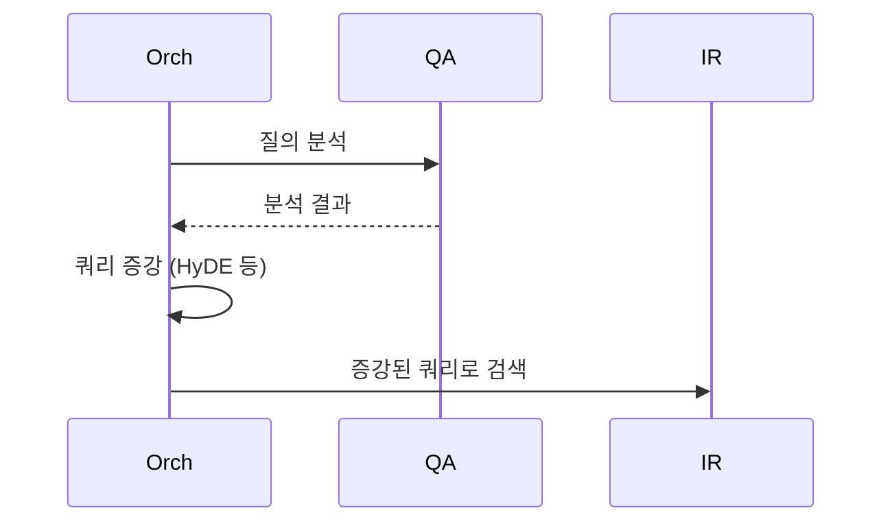
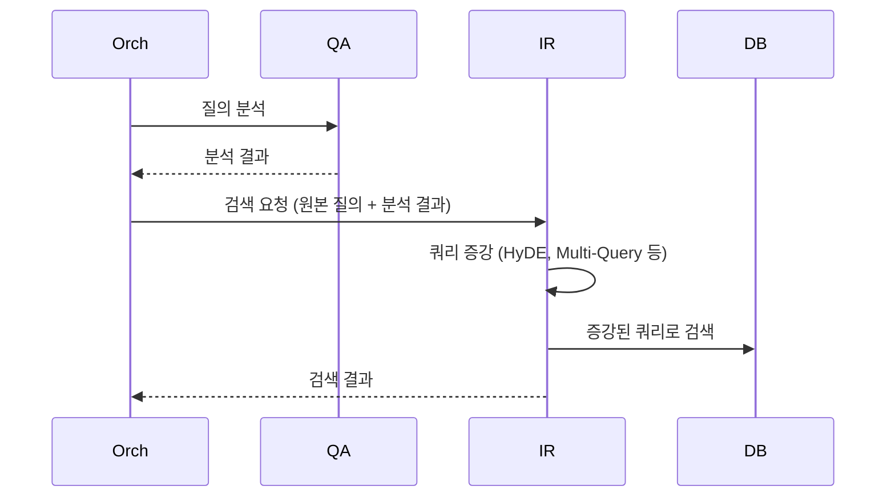
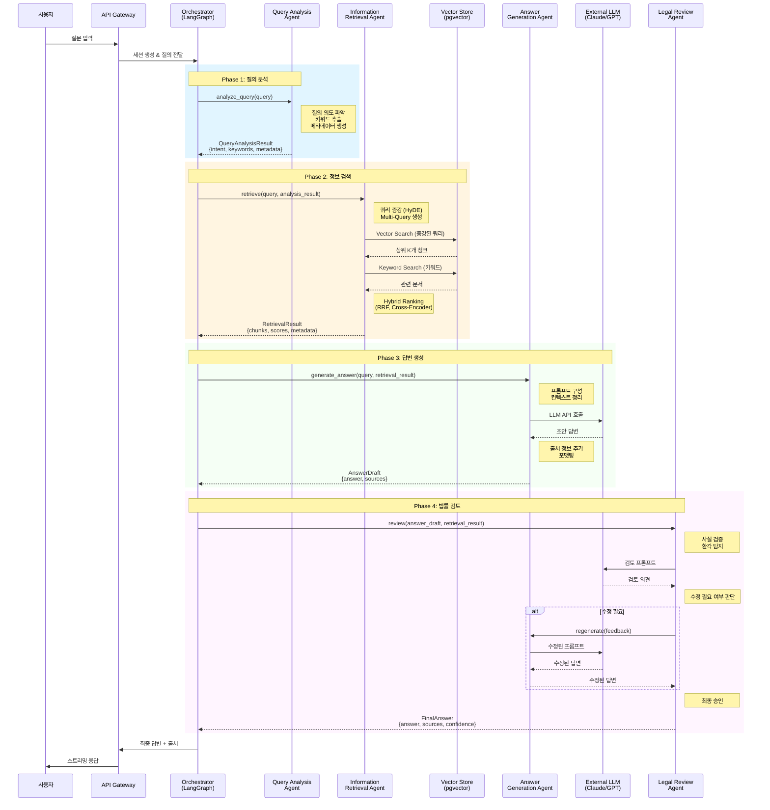

# RAG 시스템 아키텍처 전문가 관점의 역할 분리 설계

**작성일**: 2026-01-05  
**작성자**: Manus AI (RAG 시스템 아키텍처 전문가)

---

## 1. 질문에 대한 답변

### 1.1. 사용자 질의 분석: Orchestrator vs. Agent

**질문**: 사용자 질의 분석은 Orchestrator가 진행해야 하는가, 아니면 별도 Agent로 빼야 하는가?

**답변**: **별도 Agent로 분리하는 것이 정답입니다.**

**이유**:

| 구분 | Orchestrator (LangGraph) | Query Analysis Agent |
|---|---|---|
| **역할** | **지휘자 (Conductor)** | **전문가 (Specialist)** |
| **책임** | 상태 관리, 에이전트 호출, 워크플로우 제어 | 질의 의도 파악, 키워드 추출, 메타데이터 생성 |
| **관심사** | "어떻게" (How) - 에이전트 간의 흐름 | "무엇을" (What) - 질의의 의미 |
| **확장성** | 워크플로우 변경 (예: 에이전트 추가/삭제) | 질의 분석 모델 변경 (예: 키워드 추출 모델 개선) |
| **유지보수** | 워크플로우 로직 수정 | 질의 분석 로직 수정 |

**Orchestrator**는 각 에이전트의 **입출력**과 **상태**를 관리하는 것에 집중해야 합니다. 질의 분석이라는 "전문적인 작업"을 직접 수행하면, Orchestrator의 책임이 비대해지고 복잡성이 증가합니다. 이는 **단일 책임 원칙 (Single Responsibility Principle)**에 위배됩니다.

**Query Analysis Agent**는 질의 분석에 대한 모든 책임을 가집니다. 이를 통해:
- **모듈성**: 질의 분석 로직을 독립적으로 개발, 테스트, 개선할 수 있습니다.
- **대체 가능성**: 더 좋은 질의 분석 모델이 나오면 해당 에이전트만 교체하면 됩니다.
- **명확성**: Orchestrator는 "질의 분석"이라는 추상적인 작업을 호출할 뿐, 내부 구현을 알 필요가 없습니다.

### 1.2. 쿼리 증강: Orchestrator vs. Agent

**질문**: 검색 에이전트가 쿼리 증강을 수행해야 하는가, 아니면 Orchestrator가 해야 하는가?

**답변**: **검색 에이전트 (Information Retrieval Agent)가 수행해야 합니다.**

**이유**:

- **컨텍스트**: 쿼리 증강은 **검색 성능을 높이기 위한 전략**입니다. 따라서 검색을 책임지는 에이전트가 가장 잘 수행할 수 있습니다.
- **정보**: 검색 에이전트는 벡터 저장소, 키워드 인덱스 등 검색 대상에 대한 정보를 가장 잘 알고 있습니다. 어떤 방식으로 쿼리를 증강해야 효과적인지 판단할 수 있습니다.
- **캡슐화**: 쿼리 증강은 검색 에이전트의 **내부 구현**입니다. Orchestrator는 "이 정보를 찾아줘"라고 요청할 뿐, "어떻게" 찾는지는 검색 에이전트의 책임입니다.

**잘못된 흐름**:

- **문제**: Orchestrator가 검색 전략을 알고 있어야 함. 검색 에이전트의 자율성 침해.

**올바른 흐름**:

- **장점**: 검색 에이전트가 자율적으로 최적의 검색 전략을 수행. Orchestrator는 검색의 내부 구현을 알 필요 없음.

---

## 2. 각 에이전트의 역할과 필요성 (전문가 관점)

### 2.1. Orchestrator (LangGraph)

- **역할**: **총괄 지휘자**
- **책임**: 
  - 전체 워크플로우 정의 (에이전트 호출 순서, 조건부 분기)
  - 상태 관리 (State): 각 에이전트의 결과를 공유 상태에 저장하고 다음 에이전트에게 전달
  - 에러 처리 및 재시도 로직
- **필요성**: 에이전트들을 유기적으로 연결하고, 복잡한 상호작용을 관리하기 위해 필수적입니다. Orchestrator가 없다면, 각 에이전트는 독립적으로 존재할 뿐, 협업을 통한 시너지를 낼 수 없습니다.

### 2.2. Query Analysis Agent

- **역할**: **질의 분석 전문가**
- **책임**:
  - **의도 파악**: 질문의 유형 분류 (일반 문의, 법률 해석, 유사 사례 검색 등)
  - **키워드 추출**: 검색에 사용할 핵심 키워드 식별
  - **메타데이터 생성**: 검색 필터링에 사용할 메타데이터 생성 (예: 카테고리, 날짜 범위 등)
- **필요성**: 사용자의 모호한 질문을 기계가 이해할 수 있는 **구조화된 정보**로 변환합니다. 이 에이전트의 성능이 전체 RAG 시스템의 방향을 결정합니다.

### 2.3. Information Retrieval Agent

- **역할**: **정보 검색 전문가**
- **책임**:
  - **쿼리 증강**: 원본 쿼리를 검색에 더 적합한 형태로 변환 (HyDE, Multi-Query 등)
  - **다중 검색 전략**: Vector Search, Keyword Search, Hybrid Search 등 다양한 검색 방법을 동원
  - **재순위화 (Re-ranking)**: 여러 검색 결과를 종합하여 가장 관련성 높은 순서로 정렬
- **필요성**: 방대한 데이터베이스에서 가장 관련성 높은 정보를 **정확하고 빠르게** 찾아내는 핵심적인 역할을 합니다. RAG의 "Retrieval" 부분을 책임집니다.

### 2.4. Answer Generation Agent

- **역할**: **답변 생성 전문가**
- **책임**:
  - **프롬프트 엔지니어링**: 검색된 정보를 바탕으로 LLM에게 전달할 최적의 프롬프트 구성
  - **LLM 호출**: 외부 LLM (Claude, GPT 등) API 호출
  - **출처 관리**: 답변의 근거가 된 출처 정보를 명확히 정리하고 연결
- **필요성**: 검색된 "날 것의 정보"를 사용자가 이해하기 쉬운 **자연스러운 답변**으로 가공합니다. RAG의 "Generation" 부분을 책임집니다.

### 2.5. Legal Review Agent

- **역할**: **법률 검토 전문가**
- **책임**:
  - **사실 검증 (Fact-checking)**: 생성된 답변이 법률적으로 올바른지, 검색된 정보와 일치하는지 검증
  - **환각 (Hallucination) 방지**: LLM이 만들어낸 허위 정보를 필터링
  - **어조 및 표현 수정**: 법률 용어를 더 쉽고 정확하게 다듬음
- **필요성**: 법률이라는 민감한 도메인에서 **신뢰성과 안정성**을 확보하기 위한 필수적인 장치입니다. 이 에이전트가 없다면, 잘못된 법률 정보 제공으로 인한 심각한 문제가 발생할 수 있습니다.

---

## 3. 개선된 아키텍처 제안

현재 아키텍처는 이미 훌륭하지만, 역할 분리를 더 명확히 하기 위해 다음과 같이 수정할 것을 제안합니다.

**주요 변경점**:
1. **Orchestrator의 역할 명확화**: "지휘자"로서의 역할 강조
2. **Information Retrieval Agent의 책임 확장**: 쿼리 증강을 내부 책임으로 명시
3. **각 에이전트의 입출력 명시**: State 객체 구조를 통해 데이터 흐름을 더 명확하게 표현

다음 단계에서 이 제안을 반영한 다이어그램과 문서를 작성하겠습니다.

---

## 4. 개선된 아키텍처 다이어그램

### 4.1. 역할 분리가 명확한 시퀀스 다이어그램



### 4.2. Orchestrator의 State 관리

Orchestrator는 각 에이전트의 결과를 **State 객체**에 저장하고, 다음 에이전트에게 전달합니다.

```python
from typing import TypedDict, List, Optional

class RAGState(TypedDict):
    """Orchestrator가 관리하는 전체 상태"""
    
    # 입력
    query: str  # 사용자 질문
    session_id: str  # 세션 ID
    
    # Phase 1: 질의 분석 결과
    query_intent: str  # "general_inquiry" | "legal_interpretation" | "similar_case"
    keywords: List[str]  # ["환불", "온라인 쇼핑몰", "배송 지연"]
    metadata: dict  # {"category": "전자상거래", "priority": "high"}
    
    # Phase 2: 검색 결과
    retrieved_chunks: List[dict]  # [{chunk_id, content, score}, ...]
    retrieval_metadata: dict  # {"method": "hybrid", "total_results": 10}
    
    # Phase 3: 답변 초안
    answer_draft: str  # 생성된 답변
    sources: List[dict]  # [{doc_id, title, url}, ...]
    
    # Phase 4: 검토 결과
    review_passed: bool  # True | False
    review_feedback: Optional[str]  # 수정 필요 시 피드백
    final_answer: str  # 최종 승인된 답변
    confidence_score: float  # 0.0 ~ 1.0
```

**Orchestrator의 워크플로우 정의**:
```python
from langgraph.graph import StateGraph, END

def create_rag_workflow():
    workflow = StateGraph(RAGState)
    
    # 노드 추가
    workflow.add_node("query_analysis", query_analysis_agent)
    workflow.add_node("information_retrieval", information_retrieval_agent)
    workflow.add_node("answer_generation", answer_generation_agent)
    workflow.add_node("legal_review", legal_review_agent)
    
    # 엣지 추가 (흐름 정의)
    workflow.set_entry_point("query_analysis")
    workflow.add_edge("query_analysis", "information_retrieval")
    workflow.add_edge("information_retrieval", "answer_generation")
    workflow.add_edge("answer_generation", "legal_review")
    
    # 조건부 분기
    workflow.add_conditional_edges(
        "legal_review",
        lambda state: "regenerate" if not state["review_passed"] else "end",
        {
            "regenerate": "answer_generation",  # 재생성
            "end": END  # 종료
        }
    )
    
    return workflow.compile()
```

**핵심 포인트**:
- Orchestrator는 **"어떻게"** (워크플로우)만 정의합니다.
- 각 에이전트는 **"무엇을"** (작업 내용)을 수행합니다.
- State 객체를 통해 에이전트 간 데이터 전달이 명확합니다.

---

## 5. 각 에이전트의 상세 구현 가이드

### 5.1. Query Analysis Agent

**입력**: `query: str`

**출력**: `QueryAnalysisResult`
```python
{
    "intent": "similar_case",  # 질의 유형
    "keywords": ["환불", "배송 지연", "온라인 쇼핑"],  # 핵심 키워드
    "metadata": {
        "category": "전자상거래",
        "sub_category": "배송",
        "priority": "high"
    }
}
```

**내부 로직**:
1. **의도 분류**: Zero-shot 분류 모델 또는 Few-shot LLM 프롬프트
2. **키워드 추출**: KeyBERT, RAKE 등의 키워드 추출 알고리즘
3. **메타데이터 생성**: 규칙 기반 또는 분류 모델

**구현 예시**:
```python
def query_analysis_agent(state: RAGState) -> RAGState:
    query = state["query"]
    
    # 1. 의도 분류
    intent = classify_intent(query)
    
    # 2. 키워드 추출
    keywords = extract_keywords(query)
    
    # 3. 메타데이터 생성
    metadata = generate_metadata(query, intent)
    
    # State 업데이트
    state["query_intent"] = intent
    state["keywords"] = keywords
    state["metadata"] = metadata
    
    return state
```

### 5.2. Information Retrieval Agent

**입력**: `query: str`, `query_intent: str`, `keywords: List[str]`

**출력**: `RetrievalResult`
```python
{
    "chunks": [
        {
            "chunk_id": "law:001::chunk5",
            "content": "전자상거래법 제17조...",
            "score": 0.92,
            "metadata": {...}
        },
        ...
    ],
    "retrieval_metadata": {
        "method": "hybrid",
        "vector_results": 10,
        "keyword_results": 5,
        "reranked": True
    }
}
```

**내부 로직** (핵심!):
1. **쿼리 증강**:
   - **HyDE (Hypothetical Document Embeddings)**: 가상의 답변을 생성하고, 그 답변의 임베딩으로 검색
   - **Multi-Query**: 원본 질문을 여러 각도에서 재구성하여 다양한 쿼리 생성
2. **다중 검색**:
   - **Vector Search**: 임베딩 유사도 기반 검색
   - **Keyword Search**: BM25 등의 전문 검색
3. **재순위화**:
   - **RRF (Reciprocal Rank Fusion)**: 여러 검색 결과를 융합
   - **Cross-Encoder**: 질의-문서 쌍의 관련성을 더 정확히 평가

**구현 예시**:
```python
def information_retrieval_agent(state: RAGState) -> RAGState:
    query = state["query"]
    intent = state["query_intent"]
    keywords = state["keywords"]
    
    # 1. 쿼리 증강
    augmented_queries = augment_query(query, method="hyde")
    
    # 2. 다중 검색
    vector_results = vector_search(augmented_queries)
    keyword_results = keyword_search(keywords)
    
    # 3. 재순위화
    reranked_chunks = rerank(
        query=query,
        candidates=vector_results + keyword_results,
        method="cross_encoder"
    )
    
    # State 업데이트
    state["retrieved_chunks"] = reranked_chunks[:10]
    state["retrieval_metadata"] = {
        "method": "hybrid",
        "vector_results": len(vector_results),
        "keyword_results": len(keyword_results),
        "reranked": True
    }
    
    return state
```

**핵심**: Orchestrator는 `retrieve()`만 호출하면 됩니다. 쿼리 증강, 다중 검색, 재순위화는 모두 **Information Retrieval Agent의 내부 구현**입니다.

### 5.3. Answer Generation Agent

**입력**: `query: str`, `retrieved_chunks: List[dict]`

**출력**: `AnswerDraft`
```python
{
    "answer": "전자상거래법 제17조에 따르면...",
    "sources": [
        {
            "doc_id": "law:001",
            "title": "전자상거래 등에서의 소비자보호에 관한 법률",
            "url": "https://...",
            "relevance": 0.92
        },
        ...
    ]
}
```

**내부 로직**:
1. **프롬프트 구성**: 검색된 청크를 컨텍스트로 정리
2. **LLM 호출**: Claude/GPT API 호출
3. **출처 정리**: 답변에 사용된 청크의 출처 정보 추출

**구현 예시**:
```python
def answer_generation_agent(state: RAGState) -> RAGState:
    query = state["query"]
    chunks = state["retrieved_chunks"]
    
    # 1. 프롬프트 구성
    context = format_context(chunks)
    prompt = f"""
    다음 정보를 바탕으로 질문에 답변하세요.
    
    질문: {query}
    
    참고 정보:
    {context}
    
    답변:
    """
    
    # 2. LLM 호출
    answer = call_llm(prompt)
    
    # 3. 출처 정리
    sources = extract_sources(chunks)
    
    # State 업데이트
    state["answer_draft"] = answer
    state["sources"] = sources
    
    return state
```

### 5.4. Legal Review Agent

**입력**: `answer_draft: str`, `retrieved_chunks: List[dict]`

**출력**: `ReviewResult`
```python
{
    "review_passed": True,
    "review_feedback": None,
    "final_answer": "전자상거래법 제17조에 따르면...",
    "confidence_score": 0.95
}
```

**내부 로직**:
1. **사실 검증**: 답변의 내용이 검색된 정보와 일치하는지 확인
2. **환각 탐지**: LLM이 만들어낸 허위 정보 탐지
3. **수정 필요 여부 판단**: 통과/재생성 결정

**구현 예시**:
```python
def legal_review_agent(state: RAGState) -> RAGState:
    answer = state["answer_draft"]
    chunks = state["retrieved_chunks"]
    
    # 1. 사실 검증
    verification_result = verify_facts(answer, chunks)
    
    # 2. 환각 탐지
    hallucination_score = detect_hallucination(answer, chunks)
    
    # 3. 수정 필요 여부 판단
    if verification_result["passed"] and hallucination_score < 0.3:
        state["review_passed"] = True
        state["final_answer"] = answer
        state["confidence_score"] = verification_result["confidence"]
    else:
        state["review_passed"] = False
        state["review_feedback"] = verification_result["feedback"]
    
    return state
```

---

## 6. 설계 원칙 요약

### 6.1. 단일 책임 원칙 (Single Responsibility Principle)

각 에이전트는 **하나의 명확한 책임**만 가집니다.

| 에이전트 | 책임 |
|---|---|
| Query Analysis | 질의 분석 |
| Information Retrieval | 정보 검색 |
| Answer Generation | 답변 생성 |
| Legal Review | 법률 검토 |

### 6.2. 캡슐화 (Encapsulation)

각 에이전트의 **내부 구현**은 외부에 노출되지 않습니다. Orchestrator는 에이전트의 **인터페이스**만 알면 됩니다.

**예시**:
- Orchestrator: `retrieve(query, analysis_result)` 호출
- Information Retrieval Agent: 내부적으로 HyDE, Multi-Query, RRF 등을 수행
- Orchestrator는 이러한 세부 사항을 알 필요 없음

### 6.3. 확장성 (Extensibility)

새로운 에이전트를 추가하거나, 기존 에이전트를 교체하는 것이 쉬워야 합니다.

**예시**:
- **새로운 에이전트 추가**: "Fact-Checking Agent"를 Legal Review 이후에 추가
- **에이전트 교체**: Query Analysis Agent를 더 성능이 좋은 모델로 교체

### 6.4. 명확한 데이터 흐름 (Clear Data Flow)

State 객체를 통해 에이전트 간 데이터 전달이 명확해야 합니다.

**장점**:
- **디버깅 용이**: 각 단계의 입출력을 쉽게 추적
- **테스트 용이**: 각 에이전트를 독립적으로 테스트
- **모니터링 용이**: 각 단계의 성능 지표를 수집

---

## 7. 실전 팁

### 7.1. Orchestrator는 "얇게" 유지하세요

Orchestrator에 비즈니스 로직을 넣지 마세요. 워크플로우 정의와 상태 관리만 담당해야 합니다.

**나쁜 예**:
```python
def orchestrator(query):
    # Orchestrator가 직접 키워드 추출 (X)
    keywords = extract_keywords(query)
    results = search(keywords)
    answer = generate_answer(query, results)
    return answer
```

**좋은 예**:
```python
def orchestrator(state):
    # 에이전트 호출만 담당 (O)
    state = query_analysis_agent(state)
    state = information_retrieval_agent(state)
    state = answer_generation_agent(state)
    state = legal_review_agent(state)
    return state
```

### 7.2. 에이전트는 "두껍게" 만드세요

에이전트는 자신의 책임 영역 내에서 모든 것을 처리해야 합니다. 외부에 의존하지 마세요.

**예시**: Information Retrieval Agent
- 쿼리 증강, 다중 검색, 재순위화를 모두 내부에서 처리
- Orchestrator에게 "어떻게 검색할지" 물어보지 않음

### 7.3. State 객체를 명확히 정의하세요

State 객체는 **타입 힌트**를 사용하여 명확히 정의해야 합니다. 이를 통해:
- 각 에이전트가 어떤 데이터를 받고, 어떤 데이터를 반환하는지 명확해집니다.
- IDE의 자동 완성 기능을 활용할 수 있습니다.
- 타입 오류를 조기에 발견할 수 있습니다.

### 7.4. 에이전트 간 직접 통신을 피하세요

에이전트는 **Orchestrator를 통해서만** 통신해야 합니다. 에이전트 간 직접 통신은 복잡성을 증가시킵니다.

**나쁜 예**:
```python
# Information Retrieval Agent가 Query Analysis Agent를 직접 호출 (X)
def information_retrieval_agent(state):
    analysis = query_analysis_agent(state)  # 직접 호출
    results = search(analysis)
    return results
```

**좋은 예**:
```python
# Orchestrator가 순서대로 호출 (O)
state = query_analysis_agent(state)
state = information_retrieval_agent(state)
```

---

## 8. 결론

### 핵심 요약

1. **Orchestrator**: 지휘자 역할. 워크플로우 정의 및 상태 관리에만 집중.
2. **Query Analysis Agent**: 질의 분석 전문가. 별도 에이전트로 분리 필수.
3. **Information Retrieval Agent**: 검색 전문가. 쿼리 증강, 다중 검색, 재순위화를 내부에서 자율적으로 수행.
4. **Answer Generation Agent**: 답변 생성 전문가. 프롬프트 엔지니어링 및 LLM 호출.
5. **Legal Review Agent**: 법률 검토 전문가. 사실 검증 및 환각 탐지.

### 설계 철학

- **단일 책임**: 각 에이전트는 하나의 명확한 책임만 가집니다.
- **캡슐화**: 내부 구현은 숨기고, 인터페이스만 노출합니다.
- **확장성**: 새로운 에이전트 추가 및 기존 에이전트 교체가 쉬워야 합니다.
- **명확한 데이터 흐름**: State 객체를 통해 데이터 전달을 명확히 합니다.

이러한 설계 원칙을 따르면, **유지보수가 쉽고, 확장 가능하며, 테스트하기 쉬운** RAG 시스템을 구축할 수 있습니다.

---

**작성자**: Manus AI (RAG 시스템 아키텍처 전문가)  
**작성일**: 2026-01-05
