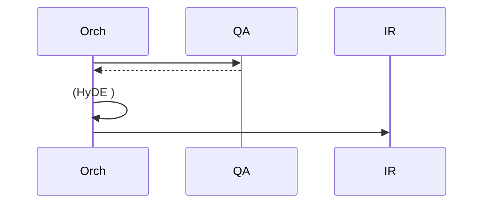
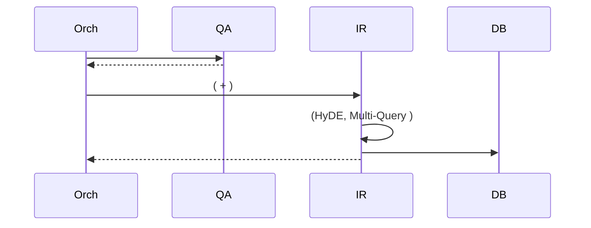

# RAG       

****: 2026-01-05  
****: Manus AI (RAG   )

---

## 1.   

### 1.1.   : Orchestrator vs. Agent

****:    Orchestrator  ,   Agent  ?

****: ** Agent   .**

****:

|  | Orchestrator (LangGraph) | Query Analysis Agent |
|---|---|---|
| **** | ** (Conductor)** | ** (Specialist)** |
| **** |  ,  ,   |   ,  ,   |
| **** | "" (How) -    | "" (What) -   |
| **** |   (:  /) |     (:    ) |
| **** |    |     |

**Orchestrator**   **** ****    .   " "  , Orchestrator    .  **   (Single Responsibility Principle)** .

**Query Analysis Agent**      .  :
- ****:     , ,   .
- ** **:          .
- ****: Orchestrator " "    ,     .

### 1.2.  : Orchestrator vs. Agent

****:      ,  Orchestrator  ?

****: **  (Information Retrieval Agent)  .**

****:

- ****:   **    **.         .
- ****:    ,           .        .
- ****:     ** **. Orchestrator "  "  , ""    .

** **:

- ****: Orchestrator     .    .

** **:

- ****:       . Orchestrator      .

---

## 2.     ( )

### 2.1. Orchestrator (LangGraph)

- ****: ** **
- ****: 
  -    (  ,  )
  -   (State):         
  -     
- ****:   ,     . Orchestrator ,     ,      .

### 2.2. Query Analysis Agent

- ****: **  **
- ****:
  - ** **:    ( ,  ,    )
  - ** **:     
  - ** **:      (: ,   )
- ****:        ** ** .     RAG   .

### 2.3. Information Retrieval Agent

- ****: **  **
- ****:
  - ** **:        (HyDE, Multi-Query )
  - **  **: Vector Search, Keyword Search, Hybrid Search     
  - ** (Re-ranking)**:         
- ****:       ** **    . RAG "Retrieval"  .

### 2.4. Answer Generation Agent

- ****: **  **
- ****:
  - ** **:    LLM    
  - **LLM **:  LLM (Claude, GPT ) API 
  - ** **:        
- ****:  "  "    ** ** . RAG "Generation"  .

### 2.5. Legal Review Agent

- ****: **  **
- ****:
  - **  (Fact-checking)**:    ,    
  - ** (Hallucination) **: LLM    
  - **   **:      
- ****:    ** **    .   ,          .

---

## 3.   

   ,           .

** **:
1. **Orchestrator  **: ""  
2. **Information Retrieval Agent  **:     
3. **   **: State        

       .

---

## 4.   

### 4.1.     

```mermaid
sequenceDiagram
    participant U as 
    participant API as API Gateway
    participant Orch as Orchestrator<br/>(LangGraph)
    participant QA as Query Analysis<br/>Agent
    participant IR as Information<br/>Retrieval Agent
    participant DB as Vector Store<br/>(pgvector)
    participant AG as Answer<br/>Generation Agent
    participant LLM as External LLM<br/>(Claude/GPT)
    participant LR as Legal Review<br/>Agent
    
    U->>API:  
    API->>Orch:   &  
    
    rect rgb(225, 245, 255)
        Note over Orch,QA: Phase 1:  
        Orch->>QA: analyze_query(query)
        Note right of QA:   <br/> <br/> 
        QA-->>Orch: QueryAnalysisResult<br/>{intent, keywords, metadata}
    end
    
    rect rgb(255, 245, 225)
        Note over Orch,DB: Phase 2:  
        Orch->>IR: retrieve(query, analysis_result)
        Note right of IR:   (HyDE)<br/>Multi-Query 
        IR->>DB: Vector Search ( )
        DB-->>IR:  K 
        IR->>DB: Keyword Search ()
        DB-->>IR:  
        Note right of IR: Hybrid Ranking<br/>(RRF, Cross-Encoder)
        IR-->>Orch: RetrievalResult<br/>{chunks, scores, metadata}
    end
    
    rect rgb(245, 255, 245)
        Note over Orch,LLM: Phase 3:  
        Orch->>AG: generate_answer(query, retrieval_result)
        Note right of AG:  <br/> 
        AG->>LLM: LLM API 
        LLM-->>AG:  
        Note right of AG:   <br/>
        AG-->>Orch: AnswerDraft<br/>{answer, sources}
    end
    
    rect rgb(255, 245, 255)
        Note over Orch,LR: Phase 4:  
        Orch->>LR: review(answer_draft, retrieval_result)
        Note right of LR:  <br/> 
        LR->>LLM:  
        LLM-->>LR:  
        Note right of LR:    
        alt  
            LR->>AG: regenerate(feedback)
            AG->>LLM:  
            LLM-->>AG:  
            AG-->>LR:  
        end
        Note right of LR:  
        LR-->>Orch: FinalAnswer<br/>{answer, sources, confidence}
    end
    
    Orch->>API:   + 
    API->>U:  
```

### 4.2. Orchestrator State 

Orchestrator    **State ** ,   .

```python
from typing import TypedDict, List, Optional

class RAGState(TypedDict):
    """Orchestrator   """
    
    # 
    query: str  #  
    session_id: str  #  ID
    
    # Phase 1:   
    query_intent: str  # "general_inquiry" | "legal_interpretation" | "similar_case"
    keywords: List[str]  # ["", " ", " "]
    metadata: dict  # {"category": "", "priority": "high"}
    
    # Phase 2:  
    retrieved_chunks: List[dict]  # [{chunk_id, content, score}, ...]
    retrieval_metadata: dict  # {"method": "hybrid", "total_results": 10}
    
    # Phase 3:  
    answer_draft: str  #  
    sources: List[dict]  # [{doc_id, title, url}, ...]
    
    # Phase 4:  
    review_passed: bool  # True | False
    review_feedback: Optional[str]  #    
    final_answer: str  #   
    confidence_score: float  # 0.0 ~ 1.0
```

**Orchestrator  **:
```python
from langgraph.graph import StateGraph, END

def create_rag_workflow():
    workflow = StateGraph(RAGState)
    
    #  
    workflow.add_node("query_analysis", query_analysis_agent)
    workflow.add_node("information_retrieval", information_retrieval_agent)
    workflow.add_node("answer_generation", answer_generation_agent)
    workflow.add_node("legal_review", legal_review_agent)
    
    #   ( )
    workflow.set_entry_point("query_analysis")
    workflow.add_edge("query_analysis", "information_retrieval")
    workflow.add_edge("information_retrieval", "answer_generation")
    workflow.add_edge("answer_generation", "legal_review")
    
    #  
    workflow.add_conditional_edges(
        "legal_review",
        lambda state: "regenerate" if not state["review_passed"] else "end",
        {
            "regenerate": "answer_generation",  # 
            "end": END  # 
        }
    )
    
    return workflow.compile()
```

** **:
- Orchestrator **""** () .
-   **""** ( ) .
- State       .

---

## 5.     

### 5.1. Query Analysis Agent

****: `query: str`

****: `QueryAnalysisResult`
```python
{
    "intent": "similar_case",  #  
    "keywords": ["", " ", " "],  #  
    "metadata": {
        "category": "",
        "sub_category": "",
        "priority": "high"
    }
}
```

** **:
1. ** **: Zero-shot    Few-shot LLM 
2. ** **: KeyBERT, RAKE    
3. ** **:     

** **:
```python
def query_analysis_agent(state: RAGState) -> RAGState:
    query = state["query"]
    
    # 1.  
    intent = classify_intent(query)
    
    # 2.  
    keywords = extract_keywords(query)
    
    # 3.  
    metadata = generate_metadata(query, intent)
    
    # State 
    state["query_intent"] = intent
    state["keywords"] = keywords
    state["metadata"] = metadata
    
    return state
```

### 5.2. Information Retrieval Agent

****: `query: str`, `query_intent: str`, `keywords: List[str]`

****: `RetrievalResult`
```python
{
    "chunks": [
        {
            "chunk_id": "law:001::chunk5",
            "content": " 17...",
            "score": 0.92,
            "metadata": {...}
        },
        ...
    ],
    "retrieval_metadata": {
        "method": "hybrid",
        "vector_results": 10,
        "keyword_results": 5,
        "reranked": True
    }
}
```

** ** (!):
1. ** **:
   - **HyDE (Hypothetical Document Embeddings)**:   ,    
   - **Multi-Query**:        
2. ** **:
   - **Vector Search**:    
   - **Keyword Search**: BM25   
3. ****:
   - **RRF (Reciprocal Rank Fusion)**:    
   - **Cross-Encoder**: -     

** **:
```python
def information_retrieval_agent(state: RAGState) -> RAGState:
    query = state["query"]
    intent = state["query_intent"]
    keywords = state["keywords"]
    
    # 1.  
    augmented_queries = augment_query(query, method="hyde")
    
    # 2.  
    vector_results = vector_search(augmented_queries)
    keyword_results = keyword_search(keywords)
    
    # 3. 
    reranked_chunks = rerank(
        query=query,
        candidates=vector_results + keyword_results,
        method="cross_encoder"
    )
    
    # State 
    state["retrieved_chunks"] = reranked_chunks[:10]
    state["retrieval_metadata"] = {
        "method": "hybrid",
        "vector_results": len(vector_results),
        "keyword_results": len(keyword_results),
        "reranked": True
    }
    
    return state
```

****: Orchestrator `retrieve()`  .  ,  ,   **Information Retrieval Agent  **.

### 5.3. Answer Generation Agent

****: `query: str`, `retrieved_chunks: List[dict]`

****: `AnswerDraft`
```python
{
    "answer": " 17 ...",
    "sources": [
        {
            "doc_id": "law:001",
            "title": "    ",
            "url": "https://...",
            "relevance": 0.92
        },
        ...
    ]
}
```

** **:
1. ** **:    
2. **LLM **: Claude/GPT API 
3. ** **:      

** **:
```python
def answer_generation_agent(state: RAGState) -> RAGState:
    query = state["query"]
    chunks = state["retrieved_chunks"]
    
    # 1.  
    context = format_context(chunks)
    prompt = f"""
        .
    
    : {query}
    
     :
    {context}
    
    :
    """
    
    # 2. LLM 
    answer = call_llm(prompt)
    
    # 3.  
    sources = extract_sources(chunks)
    
    # State 
    state["answer_draft"] = answer
    state["sources"] = sources
    
    return state
```

### 5.4. Legal Review Agent

****: `answer_draft: str`, `retrieved_chunks: List[dict]`

****: `ReviewResult`
```python
{
    "review_passed": True,
    "review_feedback": None,
    "final_answer": " 17 ...",
    "confidence_score": 0.95
}
```

** **:
1. ** **:      
2. ** **: LLM    
3. **   **: / 

** **:
```python
def legal_review_agent(state: RAGState) -> RAGState:
    answer = state["answer_draft"]
    chunks = state["retrieved_chunks"]
    
    # 1.  
    verification_result = verify_facts(answer, chunks)
    
    # 2.  
    hallucination_score = detect_hallucination(answer, chunks)
    
    # 3.    
    if verification_result["passed"] and hallucination_score < 0.3:
        state["review_passed"] = True
        state["final_answer"] = answer
        state["confidence_score"] = verification_result["confidence"]
    else:
        state["review_passed"] = False
        state["review_feedback"] = verification_result["feedback"]
    
    return state
```

---

## 6.   

### 6.1.    (Single Responsibility Principle)

  **  ** .

|  |  |
|---|---|
| Query Analysis |   |
| Information Retrieval |   |
| Answer Generation |   |
| Legal Review |   |

### 6.2.  (Encapsulation)

  ** **   . Orchestrator  ****  .

****:
- Orchestrator: `retrieve(query, analysis_result)` 
- Information Retrieval Agent:  HyDE, Multi-Query, RRF  
- Orchestrator      

### 6.3.  (Extensibility)

  ,      .

****:
- **  **: "Fact-Checking Agent" Legal Review  
- ** **: Query Analysis Agent     

### 6.4.    (Clear Data Flow)

State        .

****:
- ** **:     
- ** **:    
- ** **:     

---

## 7.  

### 7.1. Orchestrator "" 

Orchestrator    .      .

** **:
```python
def orchestrator(query):
    # Orchestrator    (X)
    keywords = extract_keywords(query)
    results = search(keywords)
    answer = generate_answer(query, results)
    return answer
```

** **:
```python
def orchestrator(state):
    #    (O)
    state = query_analysis_agent(state)
    state = information_retrieval_agent(state)
    state = answer_generation_agent(state)
    state = legal_review_agent(state)
    return state
```

### 7.2.  "" 

        .   .

****: Information Retrieval Agent
-  ,  ,    
- Orchestrator " "  

### 7.3. State   

State  ** **    .  :
-     ,    .
- IDE      .
-      .

### 7.4.     

 **Orchestrator **  .      .

** **:
```python
# Information Retrieval Agent Query Analysis Agent   (X)
def information_retrieval_agent(state):
    analysis = query_analysis_agent(state)  #  
    results = search(analysis)
    return results
```

** **:
```python
# Orchestrator   (O)
state = query_analysis_agent(state)
state = information_retrieval_agent(state)
```

---

## 8. 

###  

1. **Orchestrator**:  .      .
2. **Query Analysis Agent**:   .    .
3. **Information Retrieval Agent**:  .  ,  ,    .
4. **Answer Generation Agent**:   .    LLM .
5. **Legal Review Agent**:   .     .

###  

- ** **:      .
- ****:   ,  .
- ****:         .
- **  **: State      .

   , ** ,  ,  ** RAG    .

---

****: Manus AI (RAG   )  
****: 2026-01-05
