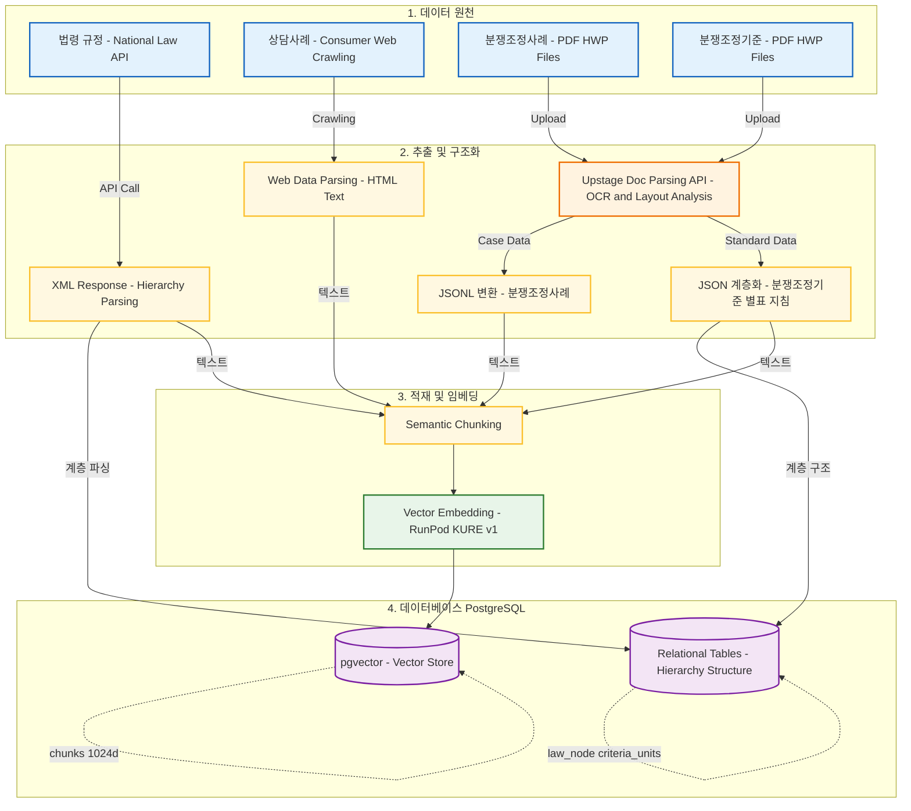
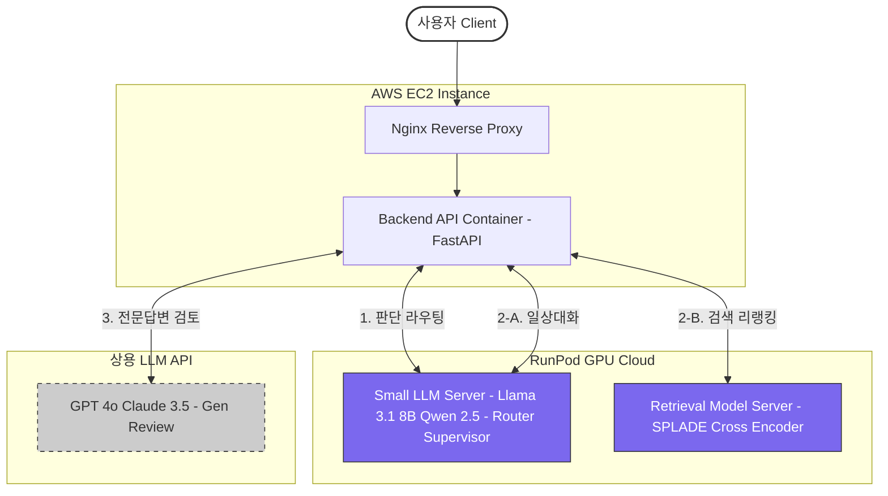
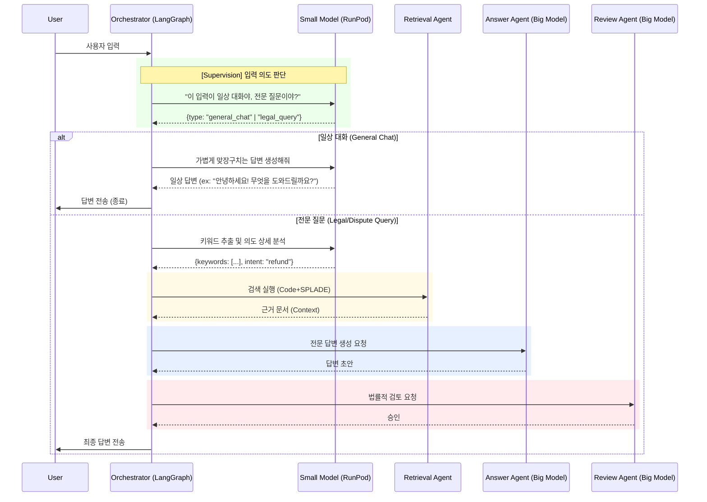

# 시스템 아키텍처 (System Architecture)

본 문서는 '똑소리' 프로젝트의 **데이터 관리, 인프라 구조, Multi-Agent System (MAS)** 설계를 시각화한 자료입니다.

## 1. 데이터 관리 파이프라인 (Data Pipeline)
법령(API), 상담사례(Web), 분쟁조정사례/기준(PDF)의 수집 및 가공 흐름입니다.

## 2. Frontend - Backend 인프라 구조
오케스트레이터의 라우팅 모델(Small LLM)과 검색 모델(SPLADE)을 활용하는 하이브리드 인프라입니다.

## 3. Backend MAS (Multi-Agent System) 상세 로직
오케스트레이터가 Small Model을 사용하여 능동적으로 라우팅(일상대화 vs 전문상담)하는 흐름입니다.

