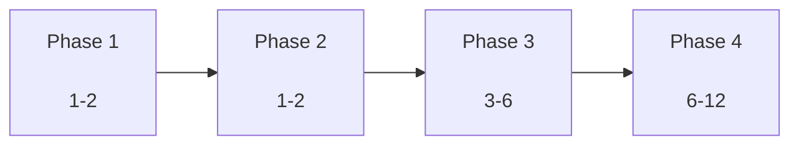

# RAG   

****: 2026-01-07  
****: Multi-Agent System Product Manager  
** **:    
****: v1.0  
** **:  (3)

---

## Executive Summary

    RAG     .      ,   ,   ,       .

###  
-  ** **: Recall@10 70% → 85% 
-  ** **:   4.0/5.0 
-  ** **:  5 → 3 
-  ** **: 100K  → 1M  

---

## 1.   

### 1.1 

|  |   |  |
|------|-----------|------|
| ** ** | Dense Vector + Keyword Search +  |   |
| ** ** | Law/Criteria/Case Retriever  |   |
| ** ** | 20K , 99.95%   |   |
| **DB ** |  85.91ms   |   |

### 1.2 

|  |  |  |  |
|------|--------|--------|----------|
| **** |   0% |  |   |
| **** | judgment    |  |   |
| **** |     |  |   |
| ** RAG** |     |  |   |

### 1.3  

|  |  |   |
|------|------|-----------|
| **Query Augmentation** | HyDE, Multi-Query  | Recall +10% |
| **Cross-Encoder Reranking** | klue/roberta-large  | Precision +15% |
| **Semantic Chunking** |    |   +20% |
| **Graph RAG** |    |   +30% |

---

## 2.  

### 2.1 Phase 



### 2.2 

| Phase |  |   |   |
|-------|------|-----------|-----------|
| **Phase 1** | 1-2 |   |  100%,   |
| **Phase 2** | 1-2 |    | Recall@10 +15% |
| **Phase 3** | 3-6 |   |   +20% |
| **Phase 4** | 6-12 |    | 1M   |

---

## 3. Phase 1:   (1-2)

### 3.1     ( )

#### 
- documents.metadata keywords   (0%)
- Hybrid Search   

#### 
```bash
cd /home/maroco/ddoksori_demo/backend/scripts/metadata_extraction
conda run -n ddoksori python run_all_extractions.py
```

####  
- keywords  80%  
-    +10%

####  
- : 30-60
- : 30
- ** 1.5**

---

### 3.2    ( )

#### 
- 13  1  
-   

#### 
1.    
2.    
3. DB 

```python
# backend/scripts/data_processing/data_transform_pipeline.py 
# process_law_data()   doc_id 
```

####  
-  13  
-    +20%

####  
-  : 2
- : 30
- ** 2.5**

---

### 3.3     ( )

#### 
- table1 ( ), table3 (), table4 () 
- table2 () 

#### 
1.    
2.    

```bash
# table1, table3, table4 JSONL   
cd /home/maroco/ddoksori_demo/backend/data/criteria
#    data_transform_pipeline.py 
```

####  
-   4 
-     +25%

####  
-  : 4 ( )
- : 1
- ** 5**

---

**Phase 1   **: 9 ( 1.5)

---

## 4. Phase 2:   (1-2)

### 4.1 Query Augmentation ( )

#### 
      Recall 

####  

**1. HyDE (Hypothetical Document Embeddings)**

```python
# backend/app/rag/query_augmentation.py

def generate_hypothetical_document(query: str) -> str:
    """
       
    """
    prompt = f"""
         :
    
    : {query}
    
     (200 , ):
    """
    
    llm_response = get_llm_response(prompt)
    return llm_response

#  
query_embedding = embed(query)
hyde_embedding = embed(generate_hypothetical_document(query))
combined_results = search(query_embedding) + search(hyde_embedding)
```

****: Recall +10%

**2. Multi-Query Rewriting**

```python
def rewrite_queries(query: str, num_variants: int = 3) -> List[str]:
    """
       
    """
    prompt = f"""
      {num_variants}   :
    
    : {query}
    
     (  ):
    """
    
    llm_response = get_llm_response(prompt)
    variants = llm_response.strip().split('\n')
    return [query] + variants[:num_variants]

#  
variants = rewrite_queries(query)
results = []
for variant in variants:
    results.extend(search(variant, top_k=5))
# 
reranked = rerank(results, original_query=query)
```

****: Recall +5%, Precision +3%

####  
- HyDE : 1
- Multi-Query : 1
-   : 2
- ** 4**

---

### 4.2 Cross-Encoder Reranking ( )

#### 
      

####  

```python
# backend/app/rag/cross_encoder_reranker.py

from sentence_transformers import CrossEncoder

model = CrossEncoder('klue/roberta-large', max_length=512)

def cross_encoder_rerank(query: str, documents: List[Dict], top_k: int = 10) -> List[Dict]:
    """
    Cross-Encoder 
    """
    # -  
    pairs = [(query, doc['content']) for doc in documents]
    
    #  
    scores = model.predict(pairs)
    
    #  
    for doc, score in zip(documents, scores):
        doc['cross_encoder_score'] = float(score)
    
    documents.sort(key=lambda x: x['cross_encoder_score'], reverse=True)
    
    return documents[:top_k]
```

****: Precision@5 +15%, MRR +20%

####  
-    : 1
-   : 2
-  : 1
- ** 4**

---

### 4.3 Semantic Chunking ( )

#### 
   →    

####  

```python
# backend/scripts/data_processing/semantic_chunker.py

from langchain.text_splitter import SemanticChunker
from sentence_transformers import SentenceTransformer

model = SentenceTransformer('nlpai-lab/KURE-v1')

chunker = SemanticChunker(
    embeddings=model,
    breakpoint_threshold_type="percentile",
    breakpoint_threshold_amount=95  #  5%   
)

def semantic_chunk(document_text: str, min_chunk_size: int = 100) -> List[str]:
    """
       
    """
    chunks = chunker.split_text(document_text)
    
    #    
    merged_chunks = []
    buffer = ""
    
    for chunk in chunks:
        if len(buffer) + len(chunk) < min_chunk_size:
            buffer += " " + chunk
        else:
            if buffer:
                merged_chunks.append(buffer.strip())
            buffer = chunk
    
    if buffer:
        merged_chunks.append(buffer.strip())
    
    return merged_chunks
```

****:   +20%,   +8%

####  
-   : 3
-  : 1
- ** 4**

---

**Phase 2   **: 12 ( 2.4)

---

## 5. Phase 3:   (3-6)

### 5.1 Graph RAG  ( )

#### 
       

####  

1. ** **
   - , ,  
   - Named Entity Recognition (NER) 

2. ** **
   -  →  ( )
   -  →  ( )
   -  →  ( )

3. ** **
   - Neo4j  chunk_relations  
   -   +  

4. **Graph **
   - 2-hop, 3-hop  
   -    

****:
```
: "     ?"

Graph :
 () 
  →  table2 ()
  →  17 ()
  → KCA  #1234 ()
```

****:    +30%

####  
-   : 2
-  : 2
- Graph  : 3
-   : 2
- ** 9**

---

### 5.2    Custom Reranker ( )

#### 
    

####  

1. **  **
   -   (/)
   -  
   - 500-1000  (,  ) 

2. ** **
   - klue/roberta-base 
   - Contrastive Learning

3. ****
   - FastAPI 
   -   

****: Precision@5 +20%,  

####  
-  : 4 (  )
-  : 2
-   A/B : 2
- ** 8**

---

### 5.3    ( )

#### 
     Few-Shot 

####  

1. **  **
   -   (v1, v2, ...)
   - A/B 

2. **Few-Shot Examples  **
   -   
   -  3   

3. **CoT (Chain-of-Thought) **
   ```
   : {query}
   
    :
   1.   ?
   2.  / ?
   3.    ?
   4.  ?
   
   :
   ...
   ```

****:   +15%,   +0.5

####  
-  : 3
- Few-Shot : 2
- A/B : 2
- ** 7**

---

**Phase 3   **: 24 ( 6)

---

## 6. Phase 4:    (6-12)

### 6.1  

|   |  |  |  |
|-------------|------|------|------|
| **** |  | 1,000 |    |
| **FAQ** |  | 500 |    |
| ** ** | 2023 | 2026 |   |
| **KCDRC ** |  | 500 |    |

** **:     8

---

### 6.2  

#### 
100K → 1M  

#### 

1. **DB **
   - doc_type  
   -   20-30% 

2. **HNSW  **
   - IVFFlat → HNSW
   -   2-5 

3. **Read Replica **
   - Primary: Write
   - Replica 1-2: Read
   - 100+   

** **:   6

---

### 6.3  

####  

```python
# backend/app/rag/cache.py

from functools import lru_cache
import redis

redis_client = redis.Redis(host='localhost', port=6379, db=0)

@lru_cache(maxsize=1000)
def cached_search(query: str, top_k: int):
    """
      
    """
    cache_key = f"search:{hash(query)}:{top_k}"
    cached = redis_client.get(cache_key)
    
    if cached:
        return json.loads(cached)
    
    results = hybrid_search(query, top_k)
    redis_client.setex(cache_key, 3600, json.dumps(results))  # 1 
    
    return results
```

****:   50%  (  )

** **:    2

---

**Phase 4   **: 16 ( 4)

---

## 7.   

### 7.1 Phase 

|  |  | Phase 1 | Phase 2 | Phase 3 | Phase 4 |
|------|------|---------|---------|---------|---------|
| **Recall@10** | 45% | 50% | 65% | 75% | 85% |
| **Precision@5** | 60% | 65% | 75% | 85% | 90% |
| **MRR** | 0.35 | 0.40 | 0.55 | 0.70 | 0.80 |
| ** ** | 5s | 4s | 3s | 2.5s | 2s |
| ** ** | - | 3.5 | 4.0 | 4.3 | 4.5 |

### 7.2  

- ** **: Golden Dataset (30 → 100 )
- ** **:   (/)
- **A/B **:   vs  

---

## 8.   

### 8.1  

|  |  |  |   |
|--------|------|------|-----------|
| LLM API   |  |  | ,   |
| Graph RAG  |  |  | POC ,   |
|    |  |  |    |

### 8.2  

|  |  |  |   |
|--------|------|------|-----------|
|     |  |  | Read Replica,   |
|    |  |  |    |

---

## 9.    (ROI)

### 9.1 Phase ROI

| Phase |  (·) |   | ROI |
|-------|------------------|-----------|-----|
| Phase 1 | 1.5 | Recall +5%,   |   |
| Phase 2 | 2.4 | Recall +15%, Precision +10% |   |
| Phase 3 | 6 |   +20% |   |
| Phase 4 | 4 |   |   ( ) |

### 9.2  

1. **Phase 1** ():   
2. **Phase 2** (): 1   
3. **Phase 3** ():    
4. **Phase 4** ():    

---

## 10. 

### 10.1  

> "    "

 RAG  **   **,       ** **  .

### 10.2    

1.  **  ** (1.5)
2.  **  ** (2.5)
3.  **   ** (5)

**  **: 1.5 → **    **

### 10.3   

- Phase 1  (100%)
- Phase 2  (Query Augmentation, Cross-Encoder)
- Golden Dataset 100 
-    

---

****: Multi-Agent System Product Manager  
** **: 2026-01-07  
** **: 2026-04-07 (3 )  
** **:
- [`___.md`](./___.md)
- [`___.md`](../technical/___.md)
- [`vector_db___.md`](../technical/vector_db___.md)
