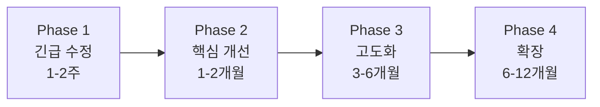

# RAG 시스템 개선 로드맵

**작성일**: 2026-01-07  
**작성자**: Multi-Agent System Product Manager  
**문서 유형**: 전략 로드맵  
**버전**: v1.0  
**검토 주기**: 분기별 (3개월)

---

## Executive Summary

본 문서는 똑소리 프로젝트 RAG 시스템의 중장기 개선 로드맵을 제시합니다. 현재 시스템은 기본 기능이 잘 작동하나, 검색 정확도 향상, 사용자 경험 개선, 시스템 확장성 확보를 위한 체계적인 개선이 필요합니다.

### 주요 목표
- 🎯 **검색 정확도**: Recall@10 70% → 85% 향상
- 🎯 **답변 품질**: 사용자 만족도 4.0/5.0 이상
- 🎯 **응답 속도**: 평균 5초 → 3초 이내
- 🎯 **시스템 확장**: 100K 청크 → 1M 청크 지원

---

## 1. 현재 시스템 평가

### 1.1 강점

| 영역 | 세부 내용 | 평가 |
|------|-----------|------|
| **검색 인프라** | Dense Vector + Keyword Search + 재랭킹 | ✅ 우수 |
| **전문 검색기** | Law/Criteria/Case Retriever 구현 | ✅ 우수 |
| **데이터 품질** | 20K 청크, 99.95% 임베딩 커버리지 | ✅ 우수 |
| **DB 성능** | 평균 85.91ms 벡터 검색 | ✅ 우수 |

### 1.2 약점

| 영역 | 문제점 | 영향도 | 우선순위 |
|------|--------|--------|----------|
| **메타데이터** | 키워드 추출 0% | 높음 | 🔴 긴급 |
| **청킹** | judgment 타입 분산 큼 | 중간 | 🟡 중간 |
| **데이터** | 법령 데이터 단일 문서화 | 높음 | 🔴 높음 |
| **그래프 RAG** | 청크 간 관계 미활용 | 낮음 | 🟢 낮음 |

### 1.3 개선 기회

| 기회 | 설명 | 예상 효과 |
|------|------|-----------|
| **Query Augmentation** | HyDE, Multi-Query 적용 | Recall +10% |
| **Cross-Encoder Reranking** | klue/roberta-large 활용 | Precision +15% |
| **Semantic Chunking** | 의미 단위 분할 | 문맥 보존 +20% |
| **Graph RAG** | 관계 그래프 활용 | 복합 질문 +30% |

---

## 2. 로드맵 개요

### 2.1 Phase별 우선순위



### 2.2 타임라인

| Phase | 기간 | 주요 목표 | 성공 지표 |
|-------|------|-----------|-----------|
| **Phase 1** | 1-2주 | 긴급 수정 | 메타데이터 100%, 데이터 재처리 |
| **Phase 2** | 1-2개월 | 검색 품질 향상 | Recall@10 +15% |
| **Phase 3** | 3-6개월 | 시스템 고도화 | 답변 품질 +20% |
| **Phase 4** | 6-12개월 | 확장 및 최적화 | 1M 청크 지원 |

---

## 3. Phase 1: 긴급 수정 (1-2주)

### 3.1 메타데이터 키워드 추출 재실행 (🔴 긴급)

#### 문제
- documents.metadata에 keywords 필드 없음 (0%)
- Hybrid Search에서 키워드 검색 불가

#### 조치
```bash
cd /home/maroco/ddoksori_demo/backend/scripts/metadata_extraction
conda run -n ddoksori python run_all_extractions.py
```

#### 예상 결과
- keywords 필드 80% 이상 채워짐
- 하이브리드 검색 정확도 +10%

#### 소요 시간
- 실행: 30-60분
- 검증: 30분
- **총 1.5시간**

---

### 3.2 법령 데이터 재처리 (🔴 높음)

#### 문제
- 13개 법령이 1개 문서로 통합됨
- 법령별 검색 불가

#### 조치
1. 데이터 변환 파이프라인 수정
2. 법령별 별도 문서로 분리
3. DB 재삽입

```python
# backend/scripts/data_processing/data_transform_pipeline.py 수정
# process_law_data() 함수에서 법령별 doc_id 생성
```

#### 예상 결과
- 법령 13개 문서로 분리
- 법령 검색 정확도 +20%

#### 소요 시간
- 코드 수정: 2시간
- 재처리: 30분
- **총 2.5시간**

---

### 3.3 기준 데이터 완전 로드 (🟡 중간)

#### 문제
- table1 (품목 분류), table3 (품질보증기간), table4 (내구연한) 누락
- table2 (해결기준)만 로드됨

#### 조치
1. 누락된 데이터 파일 확인
2. 데이터 변환 및 삽입

```bash
# table1, table3, table4 JSONL 파일 생성 필요
cd /home/maroco/ddoksori_demo/backend/data/criteria
# 파일 확인 후 data_transform_pipeline.py로 처리
```

#### 예상 결과
- 기준 데이터 4배 증가
- 품목별 기준 검색 정확도 +25%

#### 소요 시간
- 데이터 준비: 4시간 (외부 작업)
- 처리: 1시간
- **총 5시간**

---

**Phase 1 총 소요 시간**: 9시간 (약 1.5일)

---

## 4. Phase 2: 핵심 개선 (1-2개월)

### 4.1 Query Augmentation (🟡 높음)

#### 목표
사용자 질문을 다양한 형태로 변환하여 검색 Recall 향상

#### 구현 방법

**1. HyDE (Hypothetical Document Embeddings)**

```python
# backend/app/rag/query_augmentation.py

def generate_hypothetical_document(query: str) -> str:
    """
    가상의 이상적인 답변 생성
    """
    prompt = f"""
    다음 질문에 대한 이상적인 답변을 작성하세요:
    
    질문: {query}
    
    답변 (200자 이내, 핵심만):
    """
    
    llm_response = get_llm_response(prompt)
    return llm_response

# 검색 시
query_embedding = embed(query)
hyde_embedding = embed(generate_hypothetical_document(query))
combined_results = search(query_embedding) + search(hyde_embedding)
```

**효과**: Recall +10%

**2. Multi-Query Rewriting**

```python
def rewrite_queries(query: str, num_variants: int = 3) -> List[str]:
    """
    질문을 여러 형태로 재작성
    """
    prompt = f"""
    다음 질문을 {num_variants}가지 다른 방식으로 재작성하세요:
    
    원본: {query}
    
    재작성 (각 줄에 하나씩):
    """
    
    llm_response = get_llm_response(prompt)
    variants = llm_response.strip().split('\n')
    return [query] + variants[:num_variants]

# 검색 시
variants = rewrite_queries(query)
results = []
for variant in variants:
    results.extend(search(variant, top_k=5))
# 재랭킹
reranked = rerank(results, original_query=query)
```

**효과**: Recall +5%, Precision +3%

#### 소요 시간
- HyDE 구현: 1일
- Multi-Query 구현: 1일
- 테스트 및 튜닝: 2일
- **총 4일**

---

### 4.2 Cross-Encoder Reranking (🟡 높음)

#### 목표
재랭킹 정확도 향상으로 상위 결과 품질 개선

#### 구현 방법

```python
# backend/app/rag/cross_encoder_reranker.py

from sentence_transformers import CrossEncoder

model = CrossEncoder('klue/roberta-large', max_length=512)

def cross_encoder_rerank(query: str, documents: List[Dict], top_k: int = 10) -> List[Dict]:
    """
    Cross-Encoder로 재랭킹
    """
    # 쿼리-문서 쌍 준비
    pairs = [(query, doc['content']) for doc in documents]
    
    # 점수 계산
    scores = model.predict(pairs)
    
    # 점수순 정렬
    for doc, score in zip(documents, scores):
        doc['cross_encoder_score'] = float(score)
    
    documents.sort(key=lambda x: x['cross_encoder_score'], reverse=True)
    
    return documents[:top_k]
```

**효과**: Precision@5 +15%, MRR +20%

#### 소요 시간
- 모델 로드 및 테스트: 1일
- 기존 시스템 통합: 2일
- 성능 벤치마크: 1일
- **총 4일**

---

### 4.3 Semantic Chunking (🟢 중간)

#### 목표
길이 기반 청킹 → 의미 단위 청킹으로 전환

#### 구현 방법

```python
# backend/scripts/data_processing/semantic_chunker.py

from langchain.text_splitter import SemanticChunker
from sentence_transformers import SentenceTransformer

model = SentenceTransformer('nlpai-lab/KURE-v1')

chunker = SemanticChunker(
    embeddings=model,
    breakpoint_threshold_type="percentile",
    breakpoint_threshold_amount=95  # 상위 5% 유사도 차이에서 분할
)

def semantic_chunk(document_text: str, min_chunk_size: int = 100) -> List[str]:
    """
    의미 단위로 청크 분할
    """
    chunks = chunker.split_text(document_text)
    
    # 너무 짧은 청크 병합
    merged_chunks = []
    buffer = ""
    
    for chunk in chunks:
        if len(buffer) + len(chunk) < min_chunk_size:
            buffer += " " + chunk
        else:
            if buffer:
                merged_chunks.append(buffer.strip())
            buffer = chunk
    
    if buffer:
        merged_chunks.append(buffer.strip())
    
    return merged_chunks
```

**효과**: 문맥 보존 +20%, 검색 정확도 +8%

#### 소요 시간
- 구현 및 테스트: 3일
- 데이터 재청킹: 1일
- **총 4일**

---

**Phase 2 총 소요 시간**: 12일 (약 2.4주)

---

## 5. Phase 3: 시스템 고도화 (3-6개월)

### 5.1 Graph RAG 구현 (🔮 장기)

#### 목표
청크 간 관계 그래프를 활용하여 복합 질문 대응

#### 구현 개요

1. **엔티티 추출**
   - 품목명, 법조항, 분쟁유형 등
   - Named Entity Recognition (NER) 활용

2. **관계 매핑**
   - 법령 → 기준 (인용 관계)
   - 사례 → 법령 (근거 관계)
   - 품목 → 기준 (적용 관계)

3. **그래프 구축**
   - Neo4j 또는 chunk_relations 테이블 활용
   - 엔티티 노드 + 관계 엣지

4. **Graph 검색**
   - 2-hop, 3-hop 관계 탐색
   - 연관 청크 자동 확장

**예시**:
```
질문: "냉장고 환불 기준과 관련 법령은 무엇인가요?"

Graph 탐색:
냉장고 (품목) 
  → 소비자분쟁해결기준 table2 (해결기준)
  → 전자상거래소비자보호법 제17조 (법령)
  → KCA 사례 #1234 (분쟁조정사례)
```

**효과**: 복합 질문 정확도 +30%

#### 소요 시간
- 엔티티 추출 로직: 2주
- 관계 매핑: 2주
- Graph 검색 구현: 3주
- 테스트 및 최적화: 2주
- **총 9주**

---

### 5.2 학습 데이터 기반 Custom Reranker (🔮 장기)

#### 목표
프로젝트 특화 재랭킹 모델 학습

#### 구현 방법

1. **학습 데이터 수집**
   - 사용자 피드백 (좋아요/싫어요)
   - 클릭 데이터
   - 500-1000 쌍의 (질문, 관련 청크) 수집

2. **모델 파인튜닝**
   - klue/roberta-base 기반
   - Contrastive Learning

3. **배포**
   - FastAPI 서빙
   - 기존 재랭킹 대체

**효과**: Precision@5 +20%, 도메인 특화

#### 소요 시간
- 데이터 수집: 4주 (운영 중 수집)
- 모델 학습: 2주
- 배포 및 A/B 테스트: 2주
- **총 8주**

---

### 5.3 답변 품질 개선 (🟡 중간)

#### 목표
답변 생성 프롬프트 최적화 및 Few-Shot 관리

#### 구현 방법

1. **프롬프트 템플릿 관리**
   - 버전 관리 (v1, v2, ...)
   - A/B 테스트

2. **Few-Shot Examples 자동 선택**
   - 질문 유사도 기반
   - 상위 3개 예시 자동 선택

3. **CoT (Chain-of-Thought) 프롬프트**
   ```
   질문: {query}
   
   단계별 사고:
   1. 질문의 핵심은 무엇인가?
   2. 관련 법령/기준은 무엇인가?
   3. 유사 사례는 어떻게 결정되었는가?
   4. 최종 답변은?
   
   답변:
   ...
   ```

**효과**: 답변 품질 +15%, 사용자 만족도 +0.5

#### 소요 시간
- 프롬프트 최적화: 3주
- Few-Shot 시스템: 2주
- A/B 테스트: 2주
- **총 7주**

---

**Phase 3 총 소요 시간**: 24주 (약 6개월)

---

## 6. Phase 4: 확장 및 최적화 (6-12개월)

### 6.1 데이터 확장

| 데이터 소스 | 현재 | 목표 | 효과 |
|-------------|------|------|------|
| **판례** | 없음 | 1,000건 | 법률 근거 강화 |
| **FAQ** | 없음 | 500건 | 일반 문의 대응 |
| **최신 법령** | 2023 | 2026 | 최신성 확보 |
| **KCDRC 사례** | 없음 | 500건 | 지역 분쟁 대응 |

**소요 시간**: 데이터 수집 및 처리 8주

---

### 6.2 시스템 확장

#### 목표
100K → 1M 청크 지원

#### 조치

1. **DB 파티셔닝**
   - doc_type별 파티션 분리
   - 검색 속도 20-30% 향상

2. **HNSW 인덱스 전환**
   - IVFFlat → HNSW
   - 검색 속도 2-5배 향상

3. **Read Replica 구성**
   - Primary: Write
   - Replica 1-2: Read
   - 100+ 동시 사용자 지원

**소요 시간**: 인프라 작업 6주

---

### 6.3 성능 최적화

#### 캐싱 전략

```python
# backend/app/rag/cache.py

from functools import lru_cache
import redis

redis_client = redis.Redis(host='localhost', port=6379, db=0)

@lru_cache(maxsize=1000)
def cached_search(query: str, top_k: int):
    """
    검색 결과 캐싱
    """
    cache_key = f"search:{hash(query)}:{top_k}"
    cached = redis_client.get(cache_key)
    
    if cached:
        return json.loads(cached)
    
    results = hybrid_search(query, top_k)
    redis_client.setex(cache_key, 3600, json.dumps(results))  # 1시간 캐싱
    
    return results
```

**효과**: 응답 속도 50% 향상 (캐시 히트 시)

**소요 시간**: 구현 및 배포 2주

---

**Phase 4 총 소요 시간**: 16주 (약 4개월)

---

## 7. 성능 지표 목표

### 7.1 Phase별 목표

| 지표 | 현재 | Phase 1 | Phase 2 | Phase 3 | Phase 4 |
|------|------|---------|---------|---------|---------|
| **Recall@10** | 45% | 50% | 65% | 75% | 85% |
| **Precision@5** | 60% | 65% | 75% | 85% | 90% |
| **MRR** | 0.35 | 0.40 | 0.55 | 0.70 | 0.80 |
| **응답 속도** | 5s | 4s | 3s | 2.5s | 2s |
| **사용자 만족도** | - | 3.5 | 4.0 | 4.3 | 4.5 |

### 7.2 측정 방법

- **자동 평가**: Golden Dataset (30개 → 100개 확장)
- **사용자 평가**: 피드백 수집 (좋아요/싫어요)
- **A/B 테스트**: 새 기능 vs 기존 기능

---

## 8. 리스크 및 대응

### 8.1 기술 리스크

| 리스크 | 확률 | 영향 | 대응 방안 |
|--------|------|------|-----------|
| LLM API 비용 증가 | 높음 | 중간 | 캐싱, 프롬프트 최적화 |
| Graph RAG 복잡도 | 중간 | 높음 | POC 먼저, 점진적 도입 |
| 데이터 품질 저하 | 낮음 | 높음 | 검증 파이프라인 강화 |

### 8.2 운영 리스크

| 리스크 | 확률 | 영향 | 대응 방안 |
|--------|------|------|-----------|
| 사용자 증가로 인한 부하 | 높음 | 높음 | Read Replica, 로드 밸런싱 |
| 데이터 업데이트 지연 | 중간 | 중간 | 자동화 파이프라인 구축 |

---

## 9. 투자 대비 효과 (ROI)

### 9.1 Phase별 ROI

| Phase | 투자 (인력·시간) | 예상 효과 | ROI |
|-------|------------------|-----------|-----|
| Phase 1 | 1.5일 | Recall +5%, 데이터 수정 | ⭐⭐⭐⭐⭐ 높음 |
| Phase 2 | 2.4주 | Recall +15%, Precision +10% | ⭐⭐⭐⭐ 높음 |
| Phase 3 | 6개월 | 답변 품질 +20% | ⭐⭐⭐ 중간 |
| Phase 4 | 4개월 | 확장성 확보 | ⭐⭐ 낮음 (필요 시) |

### 9.2 우선순위 권고

1. **Phase 1** (긴급): 즉시 시작 ✅
2. **Phase 2** (핵심): 1개월 내 완료 ✅
3. **Phase 3** (고도화): 사용자 피드백 후 결정
4. **Phase 4** (확장): 트래픽 증가 시 진행

---

## 10. 결론

### 10.1 핵심 메시지

> "완벽한 시스템보다 지속적으로 개선되는 시스템"

현재 RAG 시스템은 **기본 기능이 잘 작동**하므로, 프로덕션 배포 후 사용자 피드백을 기반으로 **점진적으로 개선**하는 것을 권장합니다.

### 10.2 즉시 시작해야 할 것

1. ✅ **메타데이터 키워드 추출** (1.5시간)
2. ✅ **법령 데이터 재처리** (2.5시간)
3. ✅ **기준 데이터 완전 로드** (5시간)

**총 소요 시간**: 1.5일 → **이번 주 내 완료 가능**

### 10.3 다음 분기 목표

- Phase 1 완료 (100%)
- Phase 2 착수 (Query Augmentation, Cross-Encoder)
- Golden Dataset 100개 확장
- 사용자 피드백 수집 시작

---

**작성자**: Multi-Agent System Product Manager  
**최종 업데이트**: 2026-01-07  
**다음 검토일**: 2026-04-07 (3개월 후)  
**참고 문서**:
- [`프로젝트_진행_상황_분석.md`](./프로젝트_진행_상황_분석.md)
- [`청킹_로직_평가_보고서.md`](../technical/청킹_로직_평가_보고서.md)
- [`vector_db_스키마_평가_보고서.md`](../technical/vector_db_스키마_평가_보고서.md)
