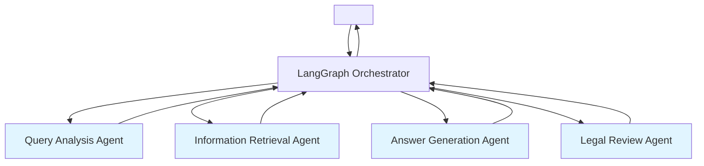

# Multi-Agent System (MAS)   

****: 2026-01-07  
****: Multi-Agent System Product Manager  
** **:      
****: v1.0

---

## Executive Summary

    Multi-Agent System  ,   (README   vs PR4  )      .

###  
-  **Phase 1 **: PR4   MVP  (   )
-  **Phase 2 **: README    ( )
-  ****: Jurisdiction Agent → Precedent Agent → Consultation Agent  

---

## 1.   

### 1.1 README  ( MAS)

####  



#### 4 

|  |  |  |  |
|----------|------|------|------|
| **Query Analysis Agent** |    |   | query_type, keywords, metadata |
| **Information Retrieval Agent** |    |  +   |    +  |
| **Answer Generation Agent** |    |  +   |   +   |
| **Legal Review Agent** |    |   |       |

#### 
-  **  **:     (SRP) 
-  ****:    
-  ****:     
-  ** **: Legal Review Agent  
-  ****:    

#### 
-  **  **: 4  + Orchestrator  
-  **  **:     
-  **    **:   

---

### 1.2 PR4  (  )

####  

```mermaid
graph TB
    User[ ] --> Sup[Supervisor]
    
    Sup --> JA[Jurisdiction Agent]
    JA --> | | Sup
    
    Sup --> PA[Precedent Agent]
    PA --> |  | Sup
    
    PA --> | | CA[Consultation Agent]
    CA --> || Sup
    
    Sup --> Final[  ]
    Final --> User
    
    style JA fill:#ffe1e1
    style PA fill:#e1f5ff
    style CA fill:#e1ffe1
```

#### 3  + 

|  |  |   |  |
|----------|------|-------------|----------|
| **Jurisdiction Agent** |    |  +  |  |
| **Precedent Agent** |   | KCA/ECMC/KCDRC  |  |
| **Consultation Agent** |   (Fallback) | consumer.go.kr  |  (Fallback) |

#### 

```
 
    ↓
Supervisor (  + )
    ↓
Jurisdiction Agent
       ( )
       ()
    →   
    ↓
Precedent Agent ( )
      →   
      → Consultation Agent (Fallback)
        →   →   
```

#### 
-  ** **:      
-  ** **: 3  MVP  
-  **   **:      
-  **  **:  >  >  > 
-  **Fallback **:     

#### 
-  ** **:     
-  ** **:   
-  **  **: Legal Review Agent 

---

### 1.3   

|   | README  | PR4  |  |
|-----------|-------------|----------|------|
| **  ** |  (4 agents) |  (3 agents) |  PR4 |
| ** ** |  () |  () |  PR4 |
| **** |  |  |  README |
| **** |  ( ) |  |  README |
| **  ** |  |  ( ) |  PR4 |
| ** ** |  |  |  PR4 |
| ** ** |  ( ) |  |  README |
| ** ** |  |  |  README |

---

## 2.   

### 2.1 Phase 1: PR4   MVP  (2-3)

#### 
    ** **  

####  

**Week 1: Jurisdiction Agent**
-   
-   
-    
-  ( 10 +  10 )

**Week 2: Precedent Agent + Supervisor**
-   ( Hybrid Retriever )
- LangGraph Supervisor 
-  
-  (   20)

**Week 3: Consultation Agent + **
-   (Fallback)
-   
- E2E  (  30)
-  

####   

```
backend/app/mas/
 __init__.py
 state.py                    # LangGraph State 
 supervisor.py               # Supervisor (Orchestrator)
 agents/
    __init__.py
    jurisdiction_agent.py   #   
    precedent_agent.py      #  
    consultation_agent.py   #   (Fallback)
 prompts/
    jurisdiction_prompt.txt
    precedent_prompt.txt
    consultation_prompt.txt
 utils/
     llm_client.py           # OpenAI/Claude API 
     response_formatter.py   #  
```

#### State  (LangGraph)

```python
from typing import TypedDict, List, Dict, Optional

class MASState(TypedDict):
    # 
    query: str
    user_id: Optional[str]
    
    # Query Analysis
    query_type: str  # LEGAL, PRACTICAL, PRODUCT_SPECIFIC, GENERAL
    extracted_items: List[str]  # 
    extracted_articles: List[str]  # 
    dispute_types: List[str]  # , ,  
    
    # Jurisdiction Agent 
    applicable_laws: List[Dict]  #  
    applicable_criteria: List[Dict]  #  
    jurisdiction: Optional[str]  #   (KCA, ECMC, KCDRC)
    
    # Precedent Agent 
    precedent_cases: List[Dict]  # 
    precedent_found: bool
    
    # Consultation Agent  (Fallback)
    consultation_cases: List[Dict]  # 
    
    #  
    answer: str
    sources: List[Dict]
    confidence: float
    
    # 
    processing_time: float
    agent_logs: List[Dict]
```

---

### 2.2 Phase 2: README   (1-2 )

#### 
  ,     

####  

**Step 1: Query Analysis Agent **
- PR4 Supervisor    →  
- LLM    (  → GPT-4o-mini)
-   ,  

**Step 2: Information Retrieval Agent **
- Jurisdiction / Precedent / Consultation Agent →  IR Agent
-   "  " 
- Self-RAG  (     )

**Step 3: Answer Generation Agent **
-    
- Few-Shot Examples  
- CoT (Chain-of-Thought) 
-    

**Step 4: Legal Review Agent **
- Citation Verification (   )
- Hallucination Detection (  )
- Tone Adjustment (  →   )
-   

####   

```
backend/app/mas_v2/
 orchestrator.py             # LangGraph Orchestrator
 state.py                    #  State
 agents/
    query_analysis_agent.py
    information_retrieval_agent.py
    answer_generation_agent.py
    legal_review_agent.py
 strategies/                 #   
    consumer_dispute_strategy.py
    contract_strategy.py ( )
    labor_strategy.py ( )
 prompts/
     templates/
```

---

## 3.   

### 3.1 Jurisdiction Agent (  )

#### 
   **   **

#### 
-  
- Query Analysis  (, )

####  

```python
def jurisdiction_agent(state: MASState) -> MASState:
    query = state['query']
    extracted_items = state['extracted_items']
    dispute_types = state['dispute_types']
    
    # 1.  
    laws = law_retriever.search(
        query=query,
        top_k=5,
        filters={'doc_type': 'law'}
    )
    
    # 2.  
    criteria = criteria_retriever.search(
        query=query,
        item_names=extracted_items,
        dispute_types=dispute_types,
        top_k=5
    )
    
    # 3.   
    jurisdiction = determine_jurisdiction(
        laws=laws,
        criteria=criteria,
        dispute_types=dispute_types
    )
    # :
    # - "" or "" in dispute_types → ECMC
    # - "" or  in query → KCDRC
    # -  → KCA
    
    state['applicable_laws'] = laws
    state['applicable_criteria'] = criteria
    state['jurisdiction'] = jurisdiction
    
    return state
```

####  

```
     .

      :

: {query}
: {extracted_items}
: {dispute_types}

 :
{laws}

 :
{criteria}

  :
- KCA ():   
- ECMC (): ,  
- KCDRC ():   

    :
{
  "jurisdiction": "KCA | ECMC | KCDRC",
  "reasoning": "  ",
  "confidence": 0.0-1.0
}
```

#### 
- `applicable_laws`:   
- `applicable_criteria`:   
- `jurisdiction`: "KCA" | "ECMC" | "KCDRC"
- `confidence`:   (0.0-1.0)

---

### 3.2 Precedent Agent ( )

#### 
  ** ** 

#### 
-  
- `jurisdiction` ( )
- Query Analysis 

####  

```python
def precedent_agent(state: MASState) -> MASState:
    query = state['query']
    jurisdiction = state['jurisdiction']
    
    #   (  )
    cases = case_retriever.search(
        query=query,
        top_k=10,
        filters={
            'doc_type': 'mediation_case',
            'source_org': jurisdiction  # KCA, ECMC, KCDRC
        },
        chunk_types=['decision', 'judgment', 'reasoning']  #  
    )
    
    # 
    reranked_cases = reranker.rerank(
        query=state['query'],
        results=cases,
        query_analysis=state
    )
    
    state['precedent_cases'] = reranked_cases[:5]  #  5
    state['precedent_found'] = len(reranked_cases) > 0
    
    return state
```

####  

```python
def should_use_consultation(state: MASState) -> str:
    """   Fallback"""
    if state['precedent_found'] and state['precedent_cases']:
        return "generate_answer"  #  
    else:
        return "consultation_agent"  #  
```

#### 
- `precedent_cases`:   ( 5)
- `precedent_found`: boolean (  )

---

### 3.3 Consultation Agent (  - Fallback)

#### 
   ** ** Fallback

#### 
-  
- Query Analysis 

####  

```python
def consultation_agent(state: MASState) -> MASState:
    query = state['query']
    
    #  
    cases = case_retriever.search(
        query=query,
        top_k=10,
        filters={
            'doc_type': 'counsel_case',
            'source_org': 'consumer.go.kr'
        }
    )
    
    # 
    reranked_cases = reranker.rerank(
        query=query,
        results=cases,
        query_analysis=state
    )
    
    state['consultation_cases'] = reranked_cases[:5]
    
    return state
```

#### 
-  **  **   
-   :
  > "     ,    . 
  >       ."

#### 
- `consultation_cases`:   ( 5)

---

### 3.4 Answer Generation (  )

#### 
-  State (, ,  )

####  

```
      .

: {query}

 :
{applicable_laws}

 :
{applicable_criteria}

 :
{precedent_cases or consultation_cases}

 : {jurisdiction}

    :

1.     
2.      
3.     (: "100%   " )
4.  "  ~ "  
5.    
6.     

 :
[  ]
...

[ ]
...

[]
...

[ ]
...

[ ]
      ,    .
   {jurisdiction}   .
```

#### 
- `answer`:   ( )
- `sources`:   
- `confidence`:  

---

## 4. LangGraph Orchestrator 

### 4.1 Graph 

```python
from langgraph.graph import StateGraph, END

def build_mas_graph():
    graph = StateGraph(MASState)
    
    #  
    graph.add_node("query_analysis", query_analysis_node)
    graph.add_node("jurisdiction_agent", jurisdiction_agent)
    graph.add_node("precedent_agent", precedent_agent)
    graph.add_node("consultation_agent", consultation_agent)
    graph.add_node("generate_answer", generate_answer_node)
    
    #  
    graph.set_entry_point("query_analysis")
    
    graph.add_edge("query_analysis", "jurisdiction_agent")
    graph.add_edge("jurisdiction_agent", "precedent_agent")
    
    #   (   ,   )
    graph.add_conditional_edges(
        "precedent_agent",
        should_use_consultation,
        {
            "generate_answer": "generate_answer",
            "consultation_agent": "consultation_agent"
        }
    )
    
    graph.add_edge("consultation_agent", "generate_answer")
    graph.add_edge("generate_answer", END)
    
    return graph.compile()
```

### 4.2  

```python
from backend.app.mas import build_mas_graph

# Graph 
mas_graph = build_mas_graph()

#  
initial_state = {
    "query": "   1    .  ?",
    "user_id": "user123"
}

# 
result = mas_graph.invoke(initial_state)

print(result['answer'])
print(f": {result['confidence']}")
print(f": {result['jurisdiction']}")
print(f" : {result['processing_time']}s")
```

---

## 5.   

### 5.1   

     :

```
[ ]
 {}.

[ ]
  : {task}

[ ]
{input_data}

[ ]
- {constraint_1}
- {constraint_2}
...

[ ]
{output_format}

[]
: {example_input}
: {example_output}
```

### 5.2 Few-Shot Examples 

    3-5 :

```python
# backend/app/mas/prompts/few_shot_examples.py

JURISDICTION_EXAMPLES = [
    {
        "input": {
            "query": "    .",
            "extracted_items": [""],
            "dispute_types": ["", ""]
        },
        "output": {
            "jurisdiction": "ECMC",
            "reasoning": "   (ECMC) ",
            "confidence": 0.95
        }
    },
    # ...   
]
```

### 5.3   

```
backend/app/mas/prompts/
 v1/
    jurisdiction_prompt.txt
    precedent_prompt.txt
    consultation_prompt.txt
 v2/
    ( )
 active_version.txt (   )
```

---

## 6.    Fallback 

### 6.1  

|   |   |
|-----------|-----------|
| LLM API  |  3 →    |
| DB   |    →   |
|    | Fallback Agent →    |
|  (> 30) |    +   |

### 6.2 Fallback 

```
1: Precedent Agent ()
    ↓  
2: Consultation Agent ()
    ↓  
3: Generic Answer ( )
    ".     .
     (1372)  24   ."
```

---

## 7.   Observability

### 7.1 LangSmith 

```python
from langsmith import Client

langsmith_client = Client()

# Trace 
with langsmith_client.trace(
    name="MAS Pipeline",
    project_name="ddoksori_mas",
    run_type="chain"
):
    result = mas_graph.invoke(initial_state)
```

### 7.2  

```python
state['agent_logs'].append({
    "agent": "jurisdiction_agent",
    "timestamp": datetime.now().isoformat(),
    "input": {"query": state['query']},
    "output": {"jurisdiction": state['jurisdiction']},
    "processing_time": 0.523,
    "status": "success"
})
```

---

## 8.  

### 8.1   (Agent)

```python
# tests/unit/test_jurisdiction_agent.py

def test_jurisdiction_agent_ecmc():
    """  ECMC   """
    state = {
        'query': '   ',
        'extracted_items': [''],
        'dispute_types': ['']
    }
    
    result = jurisdiction_agent(state)
    
    assert result['jurisdiction'] == 'ECMC'
    assert result['confidence'] > 0.8
```

### 8.2   ()

```python
# tests/integration/test_mas_workflow.py

def test_full_workflow():
    """ MAS  """
    query = "   ?"
    
    result = mas_graph.invoke({"query": query})
    
    assert 'answer' in result
    assert len(result['sources']) > 0
    assert result['jurisdiction'] in ['KCA', 'ECMC', 'KCDRC']
```

### 8.3 E2E  ( )

Golden Dataset 30  :
-  (  )
-   (Recall@5, Precision@5)
-   ( )
-   (< 5 )

---

## 9.  

### 9.1  

     :

```python
import asyncio

async def jurisdiction_agent_async(state):
    #  
    laws_task = asyncio.create_task(law_retriever.search_async(...))
    criteria_task = asyncio.create_task(criteria_retriever.search_async(...))
    
    laws, criteria = await asyncio.gather(laws_task, criteria_task)
    
    # ...  
```

### 9.2 

  / :

```python
from functools import lru_cache

@lru_cache(maxsize=100)
def get_law_by_article(article_no: str):
    """    ()"""
    return law_retriever.search(article_no=article_no)
```

### 9.3  

```python
import asyncio

async def run_agent_with_timeout(agent_func, state, timeout=10):
    try:
        return await asyncio.wait_for(agent_func(state), timeout=timeout)
    except asyncio.TimeoutError:
        return fallback_response(state)
```

---

## 10.   

### 10.1  

1. **Phase 1 (2-3)**: PR4   MVP 
   - Jurisdiction / Precedent / Consultation Agent
   - LangGraph Supervisor
   -    Fallback 

2. **Phase 2 (1-2 )**: README   
   - Query Analysis / Information Retrieval / Answer Generation / Legal Review Agent
   -   
   -   

3. ****:
   -  ****: Jurisdiction Agent (   )
   -  ****: Precedent Agent ( )
   -  ****: Consultation Agent (Fallback)

### 10.2  

|  |  |   |
|------|------|-----------|
|    | > 90% | Golden Dataset  |
|  Recall@5 | > 70% |     |
|    | < 5 |    |
|   | > 4.0/5.0 |   |

### 10.3  

1. **Week 1**: Jurisdiction Agent   
2. **Week 2**: Precedent Agent + Supervisor 
3. **Week 3**: Consultation Agent +  
4. **Week 4**: E2E    

---

****: Multi-Agent System Product Manager  
** **: 2026-01-07  
** **: 
- [`README.md`](../../README.md) -  MAS 
- [`docs/PR4_README.md`](../../docs/PR4_README.md) -  MAS 
- [`docs/rag_architecture_expert_view.md`](../../docs/rag_architecture_expert_view.md) - RAG 
