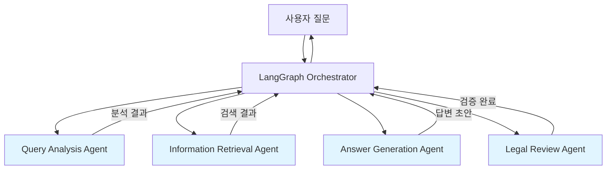
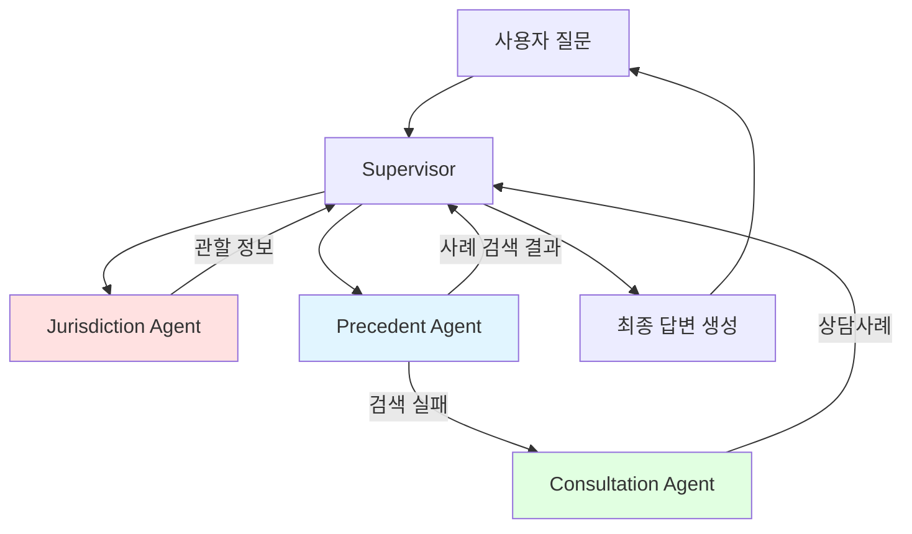

# Multi-Agent System (MAS) 아키텍처 평가 보고서

**작성일**: 2026-01-07  
**작성자**: Multi-Agent System Product Manager  
**문서 유형**: 기술 검토 및 권고사항  
**버전**: v1.0

---

## Executive Summary

본 문서는 똑소리 프로젝트의 Multi-Agent System 아키텍처를 평가하고, 두 가지 설계안(README 범용 설계 vs PR4 특화 설계)을 비교 분석하여 최적의 구현 방향을 제시합니다.

### 주요 결론
- ✅ **Phase 1 권고**: PR4 특화 설계로 MVP 구현 (소비자 분쟁 도메인 최적화)
- ✅ **Phase 2 권고**: README 범용 설계로 리팩토링 (확장성 확보)
- ✅ **우선순위**: Jurisdiction Agent → Precedent Agent → Consultation Agent 순서 구현

---

## 1. 아키텍처 설계안 비교

### 1.1 README 설계 (범용 MAS)

#### 아키텍처 개요



#### 4가지 에이전트

| 에이전트 | 역할 | 입력 | 출력 |
|----------|------|------|------|
| **Query Analysis Agent** | 질의 분석 전문가 | 사용자 질문 | query_type, keywords, metadata |
| **Information Retrieval Agent** | 정보 검색 전문가 | 질문 + 분석 결과 | 검색된 청크 리스트 + 메타데이터 |
| **Answer Generation Agent** | 답변 생성 전문가 | 질문 + 검색 결과 | 답변 초안 + 출처 정보 |
| **Legal Review Agent** | 법률 검토 전문가 | 답변 초안 | 검증된 최종 답변 또는 재생성 요청 |

#### 장점
- ✅ **명확한 책임 분리**: 각 에이전트가 단일 책임 원칙(SRP) 준수
- ✅ **확장성**: 새로운 에이전트 추가 용이
- ✅ **범용성**: 다양한 법률 도메인에 적용 가능
- ✅ **검증 레이어**: Legal Review Agent로 품질 보장
- ✅ **유지보수성**: 에이전트별 독립적 수정 가능

#### 단점
- ❌ **초기 구현 복잡도**: 4개 에이전트 + Orchestrator 구현 필요
- ❌ **도메인 특화 부족**: 소비자 분쟁 특수성 반영 어려움
- ❌ **관할 조정위원회 판단 로직 부재**: 별도 처리 필요

---

### 1.2 PR4 설계 (소비자 분쟁 특화)

#### 아키텍처 개요



#### 3가지 에이전트 + 워크플로우

| 에이전트 | 역할 | 데이터 소스 | 우선순위 |
|----------|------|-------------|----------|
| **Jurisdiction Agent** | 관할 조정위원회 판단 | 법령 + 분쟁조정기준 | 최우선 |
| **Precedent Agent** | 분쟁조정사례 검색 | KCA/ECMC/KCDRC 사례 | 높음 |
| **Consultation Agent** | 상담사례 검색 (Fallback) | consumer.go.kr 피해구제사례 | 낮음 (Fallback) |

#### 워크플로우

```
사용자 질문
    ↓
Supervisor (질문 분석 + 라우팅)
    ↓
Jurisdiction Agent
    ├─ 법령 검색 (관련 법조항)
    └─ 기준 검색 (분쟁조정기준)
    → 관할 조정위원회 판단
    ↓
Precedent Agent (분쟁조정사례 검색)
    ├─ 성공 → 최종 답변 생성
    └─ 실패 → Consultation Agent (Fallback)
        → 상담사례 검색 → 최종 답변 생성
```

#### 장점
- ✅ **도메인 최적화**: 소비자 분쟁 조정 프로세스 그대로 반영
- ✅ **구현 간소화**: 3개 에이전트로 MVP 구현 가능
- ✅ **관할 조정위원회 자동 판단**: 한국 소비자 분쟁 해결 절차 준수
- ✅ **데이터 우선순위 명확**: 법령 > 기준 > 분쟁사례 > 상담사례
- ✅ **Fallback 전략**: 분쟁사례 없을 때 상담사례로 대체

#### 단점
- ❌ **확장성 제한**: 다른 법률 도메인 적용 어려움
- ❌ **범용성 부족**: 소비자 분쟁에만 특화
- ❌ **법률 검토 부재**: Legal Review Agent 없음

---

### 1.3 비교 분석 매트릭스

| 평가 기준 | README 설계 | PR4 설계 | 권고 |
|-----------|-------------|----------|------|
| **초기 구현 복잡도** | 높음 (4 agents) | 보통 (3 agents) | ⭐ PR4 |
| **도메인 적합성** | 보통 (범용) | 우수 (특화) | ⭐ PR4 |
| **확장성** | 우수 | 제한적 | ⭐ README |
| **유지보수성** | 우수 (책임 분리) | 보통 | ⭐ README |
| **한국 법률 준수** | 보통 | 우수 (관할 판단) | ⭐ PR4 |
| **개발 속도** | 느림 | 빠름 | ⭐ PR4 |
| **테스트 용이성** | 우수 (단위 테스트) | 보통 | ⭐ README |
| **프로덕션 준비성** | 높음 | 보통 | ⭐ README |

---

## 2. 권장 구현 전략

### 2.1 Phase 1: PR4 특화 설계로 MVP 구현 (2-3주)

#### 목표
소비자 분쟁 도메인에 최적화된 **작동하는 시스템** 빠르게 구축

#### 구현 순서

**Week 1: Jurisdiction Agent**
- 법령 검색 로직
- 기준 검색 로직
- 관할 조정위원회 판단 알고리즘
- 테스트 (법령 10개 + 기준 10개 질문)

**Week 2: Precedent Agent + Supervisor**
- 분쟁조정사례 검색 (기존 Hybrid Retriever 활용)
- LangGraph Supervisor 구현
- 워크플로우 연결
- 테스트 (사례 기반 질문 20개)

**Week 3: Consultation Agent + 통합**
- 상담사례 검색 (Fallback)
- 전체 파이프라인 통합
- E2E 테스트 (실전 질문 30개)
- 프롬프트 최적화

#### 핵심 구현 파일

```
backend/app/mas/
├── __init__.py
├── state.py                    # LangGraph State 정의
├── supervisor.py               # Supervisor (Orchestrator)
├── agents/
│   ├── __init__.py
│   ├── jurisdiction_agent.py   # 관할 조정위원회 판단
│   ├── precedent_agent.py      # 분쟁조정사례 검색
│   └── consultation_agent.py   # 상담사례 검색 (Fallback)
├── prompts/
│   ├── jurisdiction_prompt.txt
│   ├── precedent_prompt.txt
│   └── consultation_prompt.txt
└── utils/
    ├── llm_client.py           # OpenAI/Claude API 래퍼
    └── response_formatter.py   # 답변 포맷팅
```

#### State 스키마 (LangGraph)

```python
from typing import TypedDict, List, Dict, Optional

class MASState(TypedDict):
    # 입력
    query: str
    user_id: Optional[str]
    
    # Query Analysis
    query_type: str  # LEGAL, PRACTICAL, PRODUCT_SPECIFIC, GENERAL
    extracted_items: List[str]  # 품목명
    extracted_articles: List[str]  # 조문번호
    dispute_types: List[str]  # 환불, 교환, 수리 등
    
    # Jurisdiction Agent 결과
    applicable_laws: List[Dict]  # 관련 법령
    applicable_criteria: List[Dict]  # 관련 기준
    jurisdiction: Optional[str]  # 관할 조정위원회 (KCA, ECMC, KCDRC)
    
    # Precedent Agent 결과
    precedent_cases: List[Dict]  # 분쟁조정사례
    precedent_found: bool
    
    # Consultation Agent 결과 (Fallback)
    consultation_cases: List[Dict]  # 상담사례
    
    # 최종 답변
    answer: str
    sources: List[Dict]
    confidence: float
    
    # 메타데이터
    processing_time: float
    agent_logs: List[Dict]
```

---

### 2.2 Phase 2: README 설계로 리팩토링 (1-2개월 후)

#### 목표
범용성과 확장성 확보, 다른 법률 도메인 지원 준비

#### 리팩토링 계획

**Step 1: Query Analysis Agent 독립**
- PR4의 Supervisor 내 분석 로직 → 독립 에이전트화
- LLM 기반 고급 분석 (패턴 매칭 → GPT-4o-mini)
- 다중 의도 감지, 질문 명확화

**Step 2: Information Retrieval Agent 통합**
- Jurisdiction / Precedent / Consultation Agent → 단일 IR Agent
- 도메인별 전략을 "검색 전략 플러그인"으로 추상화
- Self-RAG 도입 (검색 결과 자체 평가 및 재검색)

**Step 3: Answer Generation Agent 구현**
- 프롬프트 템플릿 관리 시스템
- Few-Shot Examples 자동 선택
- CoT (Chain-of-Thought) 프롬프트
- 출처 정보 자동 포맷팅

**Step 4: Legal Review Agent 구현**
- Citation Verification (출처 일치 여부 검증)
- Hallucination Detection (사실 관계 확인)
- Tone Adjustment (법률 용어 → 이해하기 쉬운 표현)
- 재생성 요청 로직

#### 리팩토링 후 구조

```
backend/app/mas_v2/
├── orchestrator.py             # LangGraph Orchestrator
├── state.py                    # 확장된 State
├── agents/
│   ├── query_analysis_agent.py
│   ├── information_retrieval_agent.py
│   ├── answer_generation_agent.py
│   └── legal_review_agent.py
├── strategies/                 # 도메인별 검색 전략
│   ├── consumer_dispute_strategy.py
│   ├── contract_strategy.py (미래 확장)
│   └── labor_strategy.py (미래 확장)
└── prompts/
    └── templates/
```

---

## 3. 에이전트별 상세 설계

### 3.1 Jurisdiction Agent (관할 조정위원회 판단)

#### 역할
법령과 분쟁조정기준을 검색하여 **적절한 관할 조정위원회를 판단**

#### 입력
- 사용자 질문
- Query Analysis 결과 (품목명, 분쟁유형)

#### 처리 로직

```python
def jurisdiction_agent(state: MASState) -> MASState:
    query = state['query']
    extracted_items = state['extracted_items']
    dispute_types = state['dispute_types']
    
    # 1. 법령 검색
    laws = law_retriever.search(
        query=query,
        top_k=5,
        filters={'doc_type': 'law'}
    )
    
    # 2. 기준 검색
    criteria = criteria_retriever.search(
        query=query,
        item_names=extracted_items,
        dispute_types=dispute_types,
        top_k=5
    )
    
    # 3. 관할 조정위원회 판단
    jurisdiction = determine_jurisdiction(
        laws=laws,
        criteria=criteria,
        dispute_types=dispute_types
    )
    # 로직:
    # - "전자상거래" or "온라인" in dispute_types → ECMC
    # - "지역" or 지역명 in query → KCDRC
    # - 기본 → KCA
    
    state['applicable_laws'] = laws
    state['applicable_criteria'] = criteria
    state['jurisdiction'] = jurisdiction
    
    return state
```

#### 프롬프트 예시

```
당신은 한국의 소비자 분쟁 조정 전문가입니다.

다음 정보를 바탕으로 적절한 관할 조정위원회를 판단해주세요:

질문: {query}
품목명: {extracted_items}
분쟁유형: {dispute_types}

관련 법령:
{laws}

관련 기준:
{criteria}

관할 조정위원회 옵션:
- KCA (한국소비자원): 일반 소비자 분쟁
- ECMC (전자거래분쟁조정위원회): 전자상거래, 온라인 거래
- KCDRC (지역분쟁조정위원회): 지역별 소비자 분쟁

판단 결과를 다음 형식으로 출력하세요:
{
  "jurisdiction": "KCA | ECMC | KCDRC",
  "reasoning": "판단 근거 설명",
  "confidence": 0.0-1.0
}
```

#### 출력
- `applicable_laws`: 관련 법령 리스트
- `applicable_criteria`: 관련 기준 리스트
- `jurisdiction`: "KCA" | "ECMC" | "KCDRC"
- `confidence`: 판단 신뢰도 (0.0-1.0)

---

### 3.2 Precedent Agent (분쟁조정사례 검색)

#### 역할
관할 조정위원회의 **유사 분쟁조정사례** 검색

#### 입력
- 사용자 질문
- `jurisdiction` (관할 조정위원회)
- Query Analysis 결과

#### 처리 로직

```python
def precedent_agent(state: MASState) -> MASState:
    query = state['query']
    jurisdiction = state['jurisdiction']
    
    # 하이브리드 검색 (기존 시스템 활용)
    cases = case_retriever.search(
        query=query,
        top_k=10,
        filters={
            'doc_type': 'mediation_case',
            'source_org': jurisdiction  # KCA, ECMC, KCDRC
        },
        chunk_types=['decision', 'judgment', 'reasoning']  # 중요 섹션만
    )
    
    # 재랭킹
    reranked_cases = reranker.rerank(
        query=state['query'],
        results=cases,
        query_analysis=state
    )
    
    state['precedent_cases'] = reranked_cases[:5]  # 상위 5개만
    state['precedent_found'] = len(reranked_cases) > 0
    
    return state
```

#### 조건부 라우팅

```python
def should_use_consultation(state: MASState) -> str:
    """분쟁조정사례가 없으면 상담사례로 Fallback"""
    if state['precedent_found'] and state['precedent_cases']:
        return "generate_answer"  # 답변 생성으로
    else:
        return "consultation_agent"  # 상담사례 검색으로
```

#### 출력
- `precedent_cases`: 분쟁조정사례 리스트 (최대 5개)
- `precedent_found`: boolean (사례 발견 여부)

---

### 3.3 Consultation Agent (상담사례 검색 - Fallback)

#### 역할
분쟁조정사례가 없을 때 **피해구제 상담사례**로 Fallback

#### 입력
- 사용자 질문
- Query Analysis 결과

#### 처리 로직

```python
def consultation_agent(state: MASState) -> MASState:
    query = state['query']
    
    # 상담사례 검색
    cases = case_retriever.search(
        query=query,
        top_k=10,
        filters={
            'doc_type': 'counsel_case',
            'source_org': 'consumer.go.kr'
        }
    )
    
    # 재랭킹
    reranked_cases = reranker.rerank(
        query=query,
        results=cases,
        query_analysis=state
    )
    
    state['consultation_cases'] = reranked_cases[:5]
    
    return state
```

#### 주의사항
- 상담사례는 **법적 효력이 없음**을 답변에 명시해야 함
- 면책 조항 필수:
  > "본 답변은 과거 상담사례를 참고한 것으로, 법적 효력을 갖지 않습니다. 
  > 정확한 판단을 위해서는 공식 분쟁조정위원회에 신청하시기 바랍니다."

#### 출력
- `consultation_cases`: 상담사례 리스트 (최대 5개)

---

### 3.4 Answer Generation (최종 답변 생성)

#### 입력
- 전체 State (법령, 기준, 사례 등)

#### 프롬프트 구조

```
당신은 한국 소비자 분쟁 조정 전문 상담사입니다.

질문: {query}

관련 법령:
{applicable_laws}

관련 분쟁조정기준:
{applicable_criteria}

유사 사례:
{precedent_cases or consultation_cases}

관할 조정위원회: {jurisdiction}

다음 지침에 따라 답변을 작성하세요:

1. 관련 법령과 기준을 명확히 인용하세요
2. 유사 사례의 결정 내용을 참고하여 설명하세요
3. 법적 판단을 내리지 마세요 (예: "100% 환불받을 수 있습니다" 금지)
4. 대신 "유사한 사례에서는 ~로 결정되었습니다" 형식 사용
5. 관할 조정위원회 정보를 제공하세요
6. 마지막에 반드시 면책 조항을 포함하세요

답변 형식:
[법령 및 기준]
...

[유사 사례]
...

[권고사항]
...

[관할 조정위원회]
...

[면책 조항]
본 답변은 제공된 정보를 바탕으로 한 참고용이며, 법적 효력을 갖지 않습니다.
정확한 판단을 위해서는 {jurisdiction}에 분쟁조정을 신청하시기 바랍니다.
```

#### 출력
- `answer`: 최종 답변 (마크다운 형식)
- `sources`: 출처 정보 리스트
- `confidence`: 답변 신뢰도

---

## 4. LangGraph Orchestrator 구현

### 4.1 Graph 구조

```python
from langgraph.graph import StateGraph, END

def build_mas_graph():
    graph = StateGraph(MASState)
    
    # 노드 추가
    graph.add_node("query_analysis", query_analysis_node)
    graph.add_node("jurisdiction_agent", jurisdiction_agent)
    graph.add_node("precedent_agent", precedent_agent)
    graph.add_node("consultation_agent", consultation_agent)
    graph.add_node("generate_answer", generate_answer_node)
    
    # 엣지 정의
    graph.set_entry_point("query_analysis")
    
    graph.add_edge("query_analysis", "jurisdiction_agent")
    graph.add_edge("jurisdiction_agent", "precedent_agent")
    
    # 조건부 엣지 (분쟁사례 있으면 답변 생성, 없으면 상담사례 검색)
    graph.add_conditional_edges(
        "precedent_agent",
        should_use_consultation,
        {
            "generate_answer": "generate_answer",
            "consultation_agent": "consultation_agent"
        }
    )
    
    graph.add_edge("consultation_agent", "generate_answer")
    graph.add_edge("generate_answer", END)
    
    return graph.compile()
```

### 4.2 실행 예시

```python
from backend.app.mas import build_mas_graph

# Graph 초기화
mas_graph = build_mas_graph()

# 질문 실행
initial_state = {
    "query": "냉장고를 구매한 지 1개월이 지났는데 냉동실이 작동하지 않습니다. 환불 가능한가요?",
    "user_id": "user123"
}

# 실행
result = mas_graph.invoke(initial_state)

print(result['answer'])
print(f"신뢰도: {result['confidence']}")
print(f"관할: {result['jurisdiction']}")
print(f"처리 시간: {result['processing_time']}s")
```

---

## 5. 프롬프트 엔지니어링 전략

### 5.1 프롬프트 구조 표준화

모든 에이전트 프롬프트는 다음 구조를 따름:

```
[역할 정의]
당신은 {역할}입니다.

[작업 설명]
다음 작업을 수행하세요: {task}

[입력 데이터]
{input_data}

[제약 조건]
- {constraint_1}
- {constraint_2}
...

[출력 형식]
{output_format}

[예시]
입력: {example_input}
출력: {example_output}
```

### 5.2 Few-Shot Examples 관리

각 에이전트별로 대표 예시 3-5개 준비:

```python
# backend/app/mas/prompts/few_shot_examples.py

JURISDICTION_EXAMPLES = [
    {
        "input": {
            "query": "온라인으로 구매한 화장품이 알레르기를 유발했습니다.",
            "extracted_items": ["화장품"],
            "dispute_types": ["환불", "피해보상"]
        },
        "output": {
            "jurisdiction": "ECMC",
            "reasoning": "온라인 거래에 해당하므로 전자거래분쟁조정위원회(ECMC) 관할",
            "confidence": 0.95
        }
    },
    # ... 더 많은 예시
]
```

### 5.3 프롬프트 버전 관리

```
backend/app/mas/prompts/
├── v1/
│   ├── jurisdiction_prompt.txt
│   ├── precedent_prompt.txt
│   └── consultation_prompt.txt
├── v2/
│   └── (개선된 프롬프트)
└── active_version.txt (현재 사용 중인 버전)
```

---

## 6. 에러 핸들링 및 Fallback 전략

### 6.1 에러 시나리오

| 에러 상황 | 대응 전략 |
|-----------|-----------|
| LLM API 실패 | 재시도 3회 → 기본 답변 반환 |
| DB 연결 실패 | 캐시된 데이터 사용 → 에러 메시지 |
| 검색 결과 없음 | Fallback Agent → 일반 안내 메시지 |
| 타임아웃 (> 30초) | 부분 결과 반환 + 경고 메시지 |

### 6.2 Fallback 계층

```
1순위: Precedent Agent (분쟁조정사례)
    ↓ 실패 시
2순위: Consultation Agent (상담사례)
    ↓ 실패 시
3순위: Generic Answer (일반 안내)
    "죄송합니다. 관련 사례를 찾을 수 없습니다.
     한국소비자원(1372) 또는 소비자24를 통해 상담받으시기 바랍니다."
```

---

## 7. 로깅 및 Observability

### 7.1 LangSmith 연동

```python
from langsmith import Client

langsmith_client = Client()

# Trace 로깅
with langsmith_client.trace(
    name="MAS Pipeline",
    project_name="ddoksori_mas",
    run_type="chain"
):
    result = mas_graph.invoke(initial_state)
```

### 7.2 커스텀 로그

```python
state['agent_logs'].append({
    "agent": "jurisdiction_agent",
    "timestamp": datetime.now().isoformat(),
    "input": {"query": state['query']},
    "output": {"jurisdiction": state['jurisdiction']},
    "processing_time": 0.523,
    "status": "success"
})
```

---

## 8. 테스트 전략

### 8.1 단위 테스트 (Agent별)

```python
# tests/unit/test_jurisdiction_agent.py

def test_jurisdiction_agent_ecmc():
    """온라인 거래는 ECMC 관할로 판단해야 함"""
    state = {
        'query': '온라인으로 구매한 제품이 불량입니다',
        'extracted_items': ['제품'],
        'dispute_types': ['환불']
    }
    
    result = jurisdiction_agent(state)
    
    assert result['jurisdiction'] == 'ECMC'
    assert result['confidence'] > 0.8
```

### 8.2 통합 테스트 (워크플로우)

```python
# tests/integration/test_mas_workflow.py

def test_full_workflow():
    """전체 MAS 파이프라인 테스트"""
    query = "냉장고 환불 기준이 무엇인가요?"
    
    result = mas_graph.invoke({"query": query})
    
    assert 'answer' in result
    assert len(result['sources']) > 0
    assert result['jurisdiction'] in ['KCA', 'ECMC', 'KCDRC']
```

### 8.3 E2E 테스트 (실전 시나리오)

Golden Dataset 30개 질문으로 평가:
- 정확도 (관할 판단 정확도)
- 검색 품질 (Recall@5, Precision@5)
- 답변 품질 (사람 평가)
- 응답 속도 (< 5초 목표)

---

## 9. 성능 최적화

### 9.1 병렬 처리

법령 검색과 기준 검색을 병렬로 수행:

```python
import asyncio

async def jurisdiction_agent_async(state):
    # 병렬 검색
    laws_task = asyncio.create_task(law_retriever.search_async(...))
    criteria_task = asyncio.create_task(criteria_retriever.search_async(...))
    
    laws, criteria = await asyncio.gather(laws_task, criteria_task)
    
    # ... 나머지 로직
```

### 9.2 캐싱

자주 조회되는 법령/기준은 캐싱:

```python
from functools import lru_cache

@lru_cache(maxsize=100)
def get_law_by_article(article_no: str):
    """조문 번호로 법령 조회 (캐싱)"""
    return law_retriever.search(article_no=article_no)
```

### 9.3 타임아웃 설정

```python
import asyncio

async def run_agent_with_timeout(agent_func, state, timeout=10):
    try:
        return await asyncio.wait_for(agent_func(state), timeout=timeout)
    except asyncio.TimeoutError:
        return fallback_response(state)
```

---

## 10. 결론 및 권고사항

### 10.1 최종 권고

1. **Phase 1 (2-3주)**: PR4 특화 설계로 MVP 구현
   - Jurisdiction / Precedent / Consultation Agent
   - LangGraph Supervisor
   - 기본 프롬프트 및 Fallback 전략

2. **Phase 2 (1-2개월 후)**: README 범용 설계로 리팩토링
   - Query Analysis / Information Retrieval / Answer Generation / Legal Review Agent
   - 도메인별 전략 플러그인화
   - 고급 프롬프트 엔지니어링

3. **우선순위**:
   - 🔴 **최우선**: Jurisdiction Agent (관할 판단은 핵심 기능)
   - 🟡 **높음**: Precedent Agent (분쟁조정사례 검색)
   - 🟢 **보통**: Consultation Agent (Fallback)

### 10.2 성공 지표

| 지표 | 목표 | 측정 방법 |
|------|------|-----------|
| 관할 판단 정확도 | > 90% | Golden Dataset 평가 |
| 검색 Recall@5 | > 70% | 유사 사례 검색 평가 |
| 답변 생성 속도 | < 5초 | 평균 응답 시간 |
| 사용자 만족도 | > 4.0/5.0 | 피드백 수집 |

### 10.3 다음 단계

1. **Week 1**: Jurisdiction Agent 구현 및 테스트
2. **Week 2**: Precedent Agent + Supervisor 구현
3. **Week 3**: Consultation Agent + 전체 통합
4. **Week 4**: E2E 테스트 및 프롬프트 최적화

---

**작성자**: Multi-Agent System Product Manager  
**최종 업데이트**: 2026-01-07  
**참고 문서**: 
- [`README.md`](../../README.md) - 범용 MAS 설계
- [`docs/PR4_README.md`](../../docs/PR4_README.md) - 특화 MAS 설계
- [`docs/rag_architecture_expert_view.md`](../../docs/rag_architecture_expert_view.md) - RAG 아키텍처
